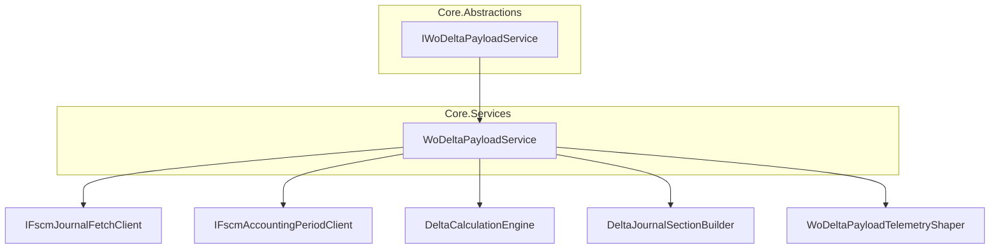
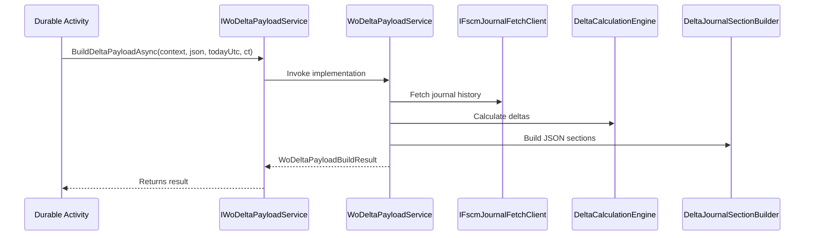

# Work Order Delta Payload Service Feature Documentation

## Overview

The **Work Order Delta Payload Service** defines a contract for generating delta payloads of work orders. It accepts an incoming Field Service Accelerator (FSA) work order payload as JSON and computes the changes (deltas) by comparing against historical journal data. The result is a JSON payload ready for posting to the Financial Supply Chain Management (FSCM) system.

By encapsulating delta calculation logic behind an interface, the application ensures:

- Separation of concerns between orchestration and calculation.
- Testability by mocking the payload service.
- Consistency across different entry points (full runs, single-WO runs, cancellation scenarios).

## Architecture Overview

## Component Structure

### 1. Abstractions Layer

#### **IWoDeltaPayloadService** (`src/Rpc.AIS.Accrual.Orchestrator.Application/Ports/Common/Abstractions/IWoDeltaPayloadService.cs`)

- **Purpose:** Defines the contract for building a work-order delta payload.
- **Method:**- `BuildDeltaPayloadAsync(RunContext context, string fsaWoPayloadJson, DateTime todayUtc, CancellationToken ct)`- **Description:** Processes the incoming FSA work order JSON and returns a delta payload result.
- **Return Type:** `Task<WoDeltaPayloadBuildResult>`

### 2. Domain Models

#### **WoDeltaPayloadBuildResult** (`same file`)

- **Purpose:** Immutable record carrying details of the delta build operation.
- **Properties:**

| Property | Type | Description |
| --- | --- | --- |
| DeltaPayloadJson | string | JSON string of the computed delta payload |
| WorkOrdersInInput | int | Number of work orders received in the FSA payload |
| WorkOrdersInOutput | int | Number of work orders included in the delta payload |
| TotalDeltaLines | int | Total lines added or modified in the delta payload |
| TotalReverseLines | int | Number of reversal lines in the delta payload |
| TotalRecreateLines | int | Number of recreate lines in the delta payload |

### 3. Dependencies

- **RunContext**: Carries metadata for the run (IDs, timestamps, correlation).
- **System.Threading.Tasks**: Asynchronous programming model.
- **System.Threading**: Cancellation support.
- **System**: Date/time types.

## Design Patterns

- **Asynchronous Service**: The single method returns a `Task<T>`, enabling non-blocking I/O and cancellation.
- **Immutable Record**: `WoDeltaPayloadBuildResult` is a C# record, ensuring thread-safe, value-based results.

## Key Classes Reference

| Class | Location | Responsibility |
| --- | --- | --- |
| IWoDeltaPayloadService | `src/Rpc.AIS.Accrual.Orchestrator.Application/Ports/Common/Abstractions/IWoDeltaPayloadService.cs` | Defines the delta payload build contract. |
| WoDeltaPayloadBuildResult | same file | Carries the outcome of delta payload generation. |

## Sequence Diagram

## Error Handling

- **Argument Validation:** Throws `ArgumentNullException` if `context` is null; `ArgumentException` if payload JSON is empty.
- **JSON Parsing Errors:** Upstream components should catch and log parsing issues.

## Testing Considerations

- **Mocking IWoDeltaPayloadService:** Consumers can supply a fake implementation to simulate delta outputs.
- **Validating Record Values:** Unit tests should verify each property in `WoDeltaPayloadBuildResult`.

---

This documentation covers all elements defined in the `IWoDeltaPayloadService` abstraction and its result record. It illustrates how the interface fits into the core orchestration of delta payload generation within the application.