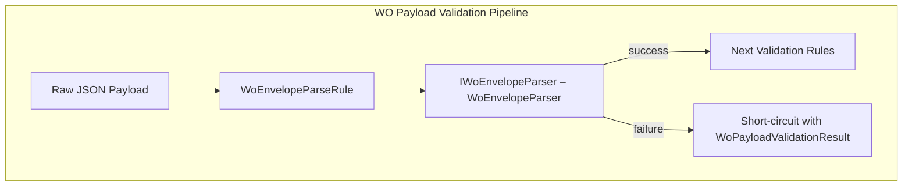
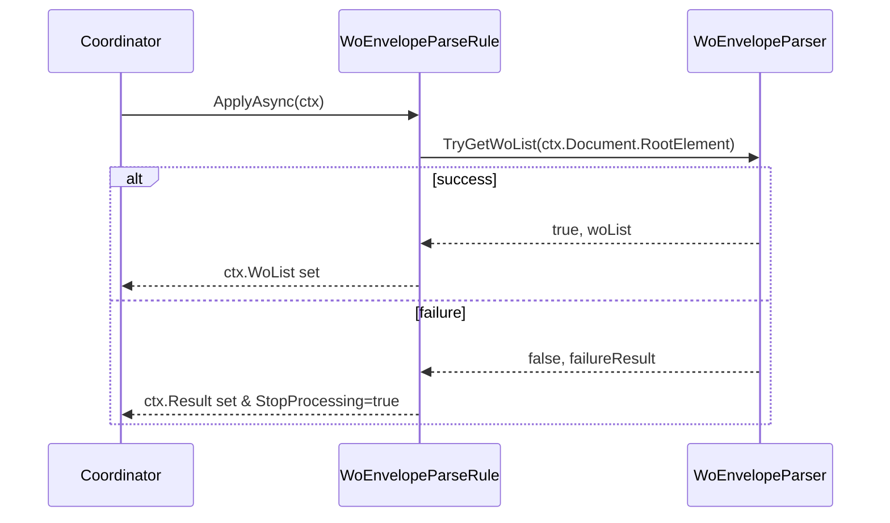

# Work Order Envelope Parsing Feature Documentation

## Overview

This feature extracts the `WOList` array from an incoming Work Order payload JSON envelope. It supports common envelope shapes (`_request`, `request` or root‐level `WOList`) and logs any missing elements. By validating the envelope early, downstream rules can focus on per‐order validation and filtering.

## Architecture Overview



## Component Structure

### 1. Abstraction Layer

#### **IWoEnvelopeParser** (`src/Rpc.AIS.Accrual.Orchestrator.Application/Ports/Common/Abstractions/IWoEnvelopeParser.cs`)

Defines the contract for parsing a JSON envelope and extracting the `WOList` array.

- **TryGetWoList**

```csharp
  bool TryGetWoList(
      RunContext context,
      JournalType journalType,
      JsonElement root,
      out JsonElement woList,
      out WoPayloadValidationResult? failureResult);
```

- Returns `true` and outputs `woList` if parsing succeeds.
- Returns `false` and outputs a failure result if envelope or `WOList` is missing.

### 2. Service Implementation

#### **WoEnvelopeParser** (`src/Rpc.AIS.Accrual.Orchestrator.Application/Features/Validation/Services/WoPayloadValidationPipeline/WoEnvelopeParser.cs`)

Implements `IWoEnvelopeParser`. It examines the JSON root for:

- `_request` or `request` object containing `WOList`
- Or direct `WOList` at the root

Logs warnings and constructs a `WoPayloadValidationResult` on failure.

**Key Logic:**

- Detect envelope shape
- Validate `WOList` exists and is an array
- Log `AIS_PAYLOAD_MISSING_REQUEST` or `AIS_PAYLOAD_MISSING_WOLIST`
- Build a failure result with empty filtered payload

### 3. Validation Rule

#### **WoEnvelopeParseRule** (`src/Rpc.AIS.Accrual.Orchestrator.Application/Features/Validation/Services/WoPayloadValidationRules/WoEnvelopeParseRule.cs`)

Integrates the parser into the validation pipeline.

- Short‐circuits processing if the JSON document is null or parsing fails.
- Sets `ctx.WoList` on success.

### 4. Validation Context

#### **WoPayloadRuleContext** (`src/Rpc.AIS.Accrual.Orchestrator.Application/Ports/Common/Abstractions/WoPayloadRuleContext.cs`)

Carries shared state across rules, including:

- `JsonDocument? Document`
- `JsonElement WoList`
- `WoPayloadValidationResult? Result`
- `bool StopProcessing`
- Failure and work‐order collections

## Sequence Flow



## Key Classes Reference

| Class | Location | Responsibility |
| --- | --- | --- |
| **IWoEnvelopeParser** | Ports/Common/Abstractions/IWoEnvelopeParser.cs | Contract for extracting `WOList` from JSON envelope. |
| **WoEnvelopeParser** | Features/Validation/Services/WoPayloadValidationPipeline/WoEnvelopeParser.cs | Implements envelope parsing and failure logging. |
| **WoEnvelopeParseRule** | Features/Validation/Services/WoPayloadValidationRules/WoEnvelopeParseRule.cs | Applies envelope parsing rule in validation pipeline. |
| **WoPayloadRuleContext** | Ports/Common/Abstractions/WoPayloadRuleContext.cs | Holds JSON document, `WoList`, and rule results. |
| **WoPayloadValidationResult** | Core/Domain/Validation/WoPayloadValidationResult.cs | Represents overall validation outcome and filtered JSON. |


## Dependencies

- **System.Text.Json** for JSON processing
- **Microsoft.Extensions.Logging** for structured logging
- **Rpc.AIS.Accrual.Orchestrator.Core.Domain** types: `RunContext`, `JournalType`
- **Rpc.AIS.Accrual.Orchestrator.Core.Domain.Validation** types: `WoPayloadValidationResult`, `WoPayloadValidationFailure`

## Testing Considerations

- Payload missing `_request` and `request` → expect failure code `AIS_PAYLOAD_MISSING_REQUEST`
- Payload with `_request` but no `WOList` array → expect failure code `AIS_PAYLOAD_MISSING_WOLIST`
- Valid envelope shapes (`_request`, `request`, direct `WOList`) → success and proper `woList` extraction
- Logging of run-level identifiers (`RunId`, `CorrelationId`, `JournalType`, failure code)

This documentation covers all the abstractions, services, and rules involved in parsing a Work Order payload envelope prior to deeper validation steps.