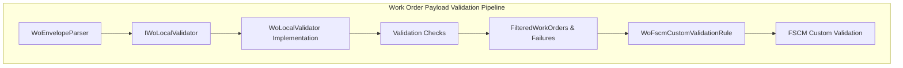

# Work Order Local Validation Abstraction Documentation

## Overview

The **IWoLocalValidator** interface defines a contract for performing AIS-side (local) validation of Work Order (WO) payloads before calling upstream FSCM endpoints.

This validation step enforces schema, required fields, and basic business rules without making remote calls.

It integrates into a synchronous validation pipeline that produces lists of valid, retryable, and invalid work orders for further processing.

## Architecture Overview



## Component Structure

### Interface Definition

#### **IWoLocalValidator** (`src/Rpc.AIS.Accrual.Orchestrator.Application/Ports/Common/Abstractions/IWoLocalValidator.cs`)

- **Purpose**: Synchronous contract for local payload validation of multiple Work Orders.
- **Location**: Rpc.AIS.Accrual.Orchestrator.Core.Abstractions
- **Signature**:

```csharp
  public interface IWoLocalValidator
  {
      void ValidateLocally(
          FscmEndpointType endpoint,
          JournalType journalType,
          JsonElement woList,
          List<WoPayloadValidationFailure> invalidFailures,
          List<WoPayloadValidationFailure> retryableFailures,
          List<FilteredWorkOrder> validWorkOrders,
          List<FilteredWorkOrder> retryableWorkOrders,
          CancellationToken ct);
  }
```

#### Method: ValidateLocally

| Parameter | Type | Description |
| --- | --- | --- |
| `endpoint` | FscmEndpointType | Indicates which FSCM endpoint type (e.g., Item, Expense, Hour) this validation targets. |
| `journalType` | JournalType | Business journal category driving section selection and field requirements. |
| `woList` | JsonElement | JSON array of work orders to validate. |
| `invalidFailures` | List\<WoPayloadValidationFailure> | Accumulates non-retryable validation failures. |
| `retryableFailures` | List\<WoPayloadValidationFailure> | Accumulates failures that may succeed upon retry. |
| `validWorkOrders` | List\<FilteredWorkOrder> | Collects work orders passing all local checks. |
| `retryableWorkOrders` | List\<FilteredWorkOrder> | Collects work orders deferred for remote or retryable checks. |
| `ct` | CancellationToken | Allows cooperative cancellation of processing. |


---

### Collaborating Types

- **FscmEndpointType**: Enum distinguishing which FSCM service endpoint will receive the payload.
- **JournalType**: Enum selecting journal-specific validation rules (Item, Expense, Hour).
- **JsonElement**: .NET representation of the JSON payload for enumeration and property extraction.
- **WoPayloadValidationFailure**: Domain model capturing the details of a single validation error (code, message, disposition).
- **FilteredWorkOrder**: Domain model representing a work order and its validated subset of journal lines.
- **CancellationToken**: Standard .NET token to cancel long-running validation loops.

### Relationships

- **IWoLocalValidator** is injected into **WoLocalValidationRule**, which bridges the synchronous validation into an asynchronous pipeline (`IWoPayloadRule`).
- After local validation, valid and retryable work orders may proceed to **WoFscmCustomValidationRule** for remote FSCM-based checks.

## Error Handling

- **Non-retryable failures** (e.g., missing WorkOrderGUID) are added to `invalidFailures` with `Disposition = Invalid`.
- **Retryable failures** (e.g., transient parsing failures) are added to `retryableFailures`.
- The implementation honors `CancellationToken` to halt processing promptly.

## Dependencies

- **Core.Abstractions**: Exposes the validation contract without implementation details.
- **Core.Domain** & **Core.Domain.Validation**: Provide the domain types `FilteredWorkOrder` and `WoPayloadValidationFailure`.
- **System.Text.Json**: Used for payload parsing.
- **System.Threading**: Supports cancellation.

---

**Card Block of Key Takeaway**

```card
{
    "title": "Local Validation Gatekeeper",
    "content": "IWoLocalValidator defines the boundary between JSON contract checks and remote FSCM validation."
}
```

---

*Documentation generated against IWoLocalValidator definition .*