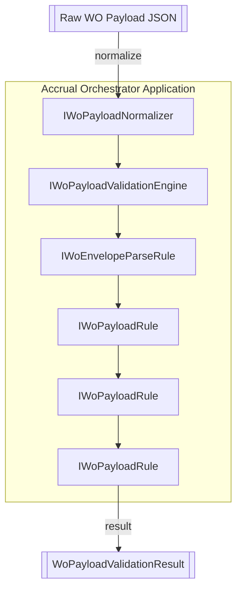
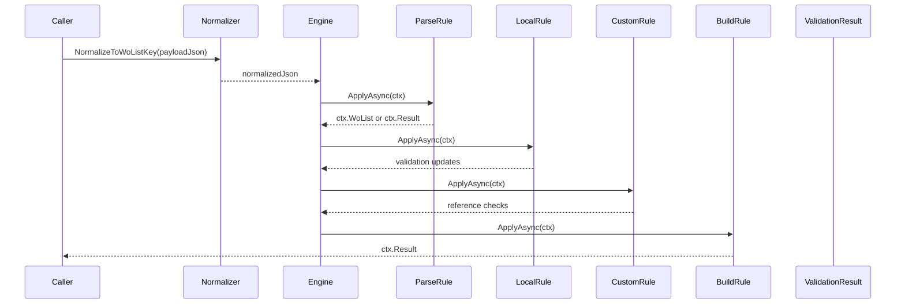

# Work Order Payload Rule Interface Feature Documentation

## Overview

The work order payload rule interface defines a pluggable contract for validating AIS work order JSON payloads. Each rule executes deterministically and remains side-effect free, apart from logging. These rules participate in a validation pipeline that ensures payload integrity before data is posted to FSCM.

This abstraction promotes:

- Consistent validation across payloads
- Clear separation of responsibilities
- Easy extension by adding new rules without modifying existing code

## Architecture Overview



## Component Structure

### Core Abstractions

#### **IWoPayloadRule** (`src/Rpc.AIS.Accrual.Orchestrator.Application/Ports/Common/Abstractions/IWoPayloadRule.cs`)

```csharp
using System.Threading;
using System.Threading.Tasks;

namespace Rpc.AIS.Accrual.Orchestrator.Core.Abstractions;

/// <summary>
/// Pluggable rule for Work Order payload validation.
/// Rules should be deterministic and side-effect free (except logging).
/// </summary>
public interface IWoPayloadRule
{
    /// <summary>
    /// Apply the rule to the validation context.
    /// Rules may short-circuit by setting Result and StopProcessing.
    /// </summary>
    Task ApplyAsync(WoPayloadRuleContext ctx, CancellationToken ct);
}
```

This interface defines a single method that applies a validation step to the shared context. Rules may halt further execution by updating `ctx.Result` and `ctx.StopProcessing` .

### Validation Context

#### **WoPayloadRuleContext** (`src/Rpc.AIS.Accrual.Orchestrator.Application/Ports/Common/Abstractions/WoPayloadRuleContext.cs`)

- **Purpose:** Carries mutable state across rule executions.
- **Key Properties:**

| Property | Type | Description |
| --- | --- | --- |
| RunContext | RunContext | Execution metadata (RunId, CorrelationId) |
| JournalType | JournalType | Target journal type |
| PayloadJson | string | Original JSON payload |
| Document | JsonDocument? | Parsed JSON document |
| WoList | JsonElement | Extracted work order array |
| InvalidFailures | List<WoPayloadValidationFailure> | Failures marked invalid |
| RetryableFailures | List<WoPayloadValidationFailure> | Failures marked retryable |
| ValidWorkOrders | List<FilteredWorkOrder> | Orders approved for posting |
| RetryableWorkOrders | List<FilteredWorkOrder> | Orders flagged for retry |
| Result | WoPayloadValidationResult? | Final validation result |
| StopProcessing | bool | Flag to halt the pipeline |


This context supports parsing, filtering, and result construction .

### Validation Pipeline Implementations

The pipeline applies these rules in order:

| Rule | Location | Responsibility |
| --- | --- | --- |
| WoEnvelopeParseRule | Application/Features/Validation/.../WoEnvelopeParseRule.cs | Extracts `WOList` array; short-circuits on envelope errors |
| WoLocalValidationRule | Application/Features/Validation/.../WoLocalValidationRule.cs | Performs AIS-side schema and data checks |
| WoFscmCustomValidationRule | Application/Features/Validation/.../WoFscmCustomValidationRule.cs | Invokes FSCM custom reference validations |
| WoBuildResultRule | Application/Features/Validation/.../WoBuildResultRule.cs | Builds final `WoPayloadValidationResult` |


## Feature Flow

### Validation Pipeline Sequence



## Key Classes Reference

| Class | Location | Responsibility |
| --- | --- | --- |
| IWoPayloadRule | Ports/Common/Abstractions/IWoPayloadRule.cs | Defines rule contract |
| WoPayloadRuleContext | Ports/Common/Abstractions/WoPayloadRuleContext.cs | Shared mutable state |
| IWoPayloadValidationEngine | Ports/Common/Abstractions/IWoPayloadValidationEngine.cs | Orchestrates rule execution |
| IWoEnvelopeParser | Ports/Common/Abstractions/IWoEnvelopeParser.cs | Parses JSON envelope |
| IWoLocalValidator | Ports/Common/Abstractions/IWoLocalValidator.cs | Validates work orders locally |
| IFscmReferenceValidator | Core/Services/WoPayloadValidationRules/WoFscmCustomValidationRule.cs | Performs remote FSCM checks |
| IWoValidationResultBuilder | Ports/Common/Abstractions/IWoValidationResultBuilder.cs | Constructs final result object |
| IWoPayloadNormalizer | Infrastructure/Adapters/Fscm/Clients/Posting/IWoPayloadNormalizer.cs | Normalizes JSON payload shape |
| WoPayloadJsonToolkit | Application/Features/Shared/Utilities/WoPayloadJsonToolkit.cs | JSON key normalization and cleanup utilities |
| FilteredWorkOrder | Core/Domain/Validation/FilteredWorkOrder.cs | Represents a filtered WO entry |
| WoPayloadValidationResult | Core/Domain/Validation/WoPayloadValidationResult.cs | Encapsulates filtered payload and failures |


## Error Handling

- Each rule may short-circuit processing by setting:- **`ctx.Result`**: Final `WoPayloadValidationResult`
- **`ctx.StopProcessing`**: Halts further rule executions
- Parsers raise structured failures for missing envelopes .

## Dependencies

- System.Threading
- System.Threading.Tasks
- System.Text.Json
- Microsoft.Extensions.Logging
- Core domain types (`RunContext`, `JournalType`, validation models)

## Testing Considerations

- **Rule Isolation:** Each rule should be tested independently with controlled `WoPayloadRuleContext`.
- **Short-Circuit Scenarios:** Validate that rules halt pipeline correctly when `StopProcessing` is set.
- **End-to-End Pipeline:** Verify complete validation flow from normalization to result building with mixed valid/invalid entries.