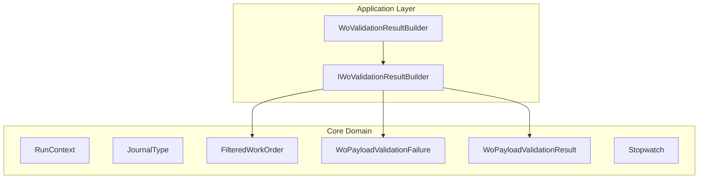

# IWoValidationResultBuilder Interface Documentation

## Overview

The **IWoValidationResultBuilder** interface defines a contract for constructing a comprehensive validation result for AIS work order payloads. It abstracts the logic that aggregates validated work orders, filters payload JSON, and composes the final `WoPayloadValidationResult`.

This interface enables a pluggable design in the work order validation pipeline, improving testability and separation of concerns. It decouples result-building from validation rules, allowing custom implementations where needed .

## Architecture Overview



## Component Structure

### Application Layer

#### **IWoValidationResultBuilder** (`src/Rpc.AIS.Accrual.Orchestrator.Core.Abstractions/IWoValidationResultBuilder.cs`)

- **Purpose and responsibilities**- Defines a single method to build a final validation result for work order payloads.
- Standardizes how counts, filtered JSON, and failure lists are aggregated.

- **Key Method**

| Method | Description | Returns |
| --- | --- | --- |
| BuildResult | Aggregates valid and retryable work orders, composes filtered payload JSON, logs execution summary, then returns a `WoPayloadValidationResult`. | `WoPayloadValidationResult` |


- **Method Signature**

```csharp
  WoPayloadValidationResult BuildResult(
      RunContext context,
      JournalType journalType,
      int workOrdersBefore,
      List<FilteredWorkOrder> validWorkOrders,
      List<FilteredWorkOrder> retryableWorkOrders,
      List<WoPayloadValidationFailure> invalidFailures,
      List<WoPayloadValidationFailure> retryableFailures,
      Stopwatch stopwatch);
```

### Integration Point

#### **WoValidationResultBuilder**

Implements `IWoValidationResultBuilder` to provide concrete behavior:

- **Location:**

`src/Rpc.AIS.Accrual.Orchestrator.Application/Features/Validation/Services/WoPayloadValidationPipeline/WoValidationResultBuilder.cs`

- **Responsibilities:**- Uses `WoPayloadJsonBuilder` to generate JSON for valid and retryable orders.
- Stops the stopwatch and logs a summary including counts and elapsed time.
- Constructs the `WoPayloadValidationResult` with filtered payloads and failure lists.

## Integration Points

- **WoBuildResultRule**

Invokes the builder at the end of the validation pipeline to set the final result and halt further rule processing .

## Related Domain Models

- **RunContext**

Carries execution metadata (RunId, CorrelationId, etc.) through the pipeline.

- **JournalType**

Enum specifying the type of journal being processed.

- **FilteredWorkOrder**

Represents a work order JSON element stripped to only valid lines.

- **WoPayloadValidationFailure**

Details of invalid or retryable work order lines, including error code and disposition.

- **WoPayloadValidationResult**

Holds filtered JSON payloads, counts before/after, and failure collections for both invalid and retryable cases.

- **Stopwatch**

Tracks elapsed time for the validation operation.

## Key Classes Reference

| Class | Location | Responsibility |
| --- | --- | --- |
| **IWoValidationResultBuilder** | `src/Rpc.AIS.Accrual.Orchestrator.Core.Abstractions/IWoValidationResultBuilder.cs` | Contract to build the work order validation result. |
| **WoValidationResultBuilder** | `src/Rpc.AIS.Accrual.Orchestrator.Application/Features/Validation/Services/WoPayloadValidationPipeline/WoValidationResultBuilder.cs` | Concrete implementation aggregating JSON, failures, counts, and logging. |
| **WoPayloadJsonBuilder** | `src/Rpc.AIS.Accrual.Orchestrator.Core.Services.WoPayloadValidationPipeline/WoPayloadJsonBuilder.cs` | Utility to generate filtered payload JSON from `FilteredWorkOrder` collections. |
| **WoBuildResultRule** | `src/Rpc.AIS.Accrual.Orchestrator.Application/Features/Validation/Services/WoPayloadValidationRules/WoBuildResultRule.cs` | Pipeline rule that applies the builder and stops further processing. |


## Dependencies

- **Framework & Packages**- `System.Collections.Generic`
- `System.Diagnostics`
- `Microsoft.Extensions.Logging` & `Microsoft.Extensions.Options`

- **Core Domain & Validation**- `Rpc.AIS.Accrual.Orchestrator.Core.Domain.RunContext`
- `Rpc.AIS.Accrual.Orchestrator.Core.Domain.JournalType`
- `Rpc.AIS.Accrual.Orchestrator.Core.Domain.Validation.FilteredWorkOrder`
- `Rpc.AIS.Accrual.Orchestrator.Core.Domain.Validation.WoPayloadValidationFailure`
- `Rpc.AIS.Accrual.Orchestrator.Core.Domain.Validation.WoPayloadValidationResult`

## Testing Considerations

- The interface can be mocked in unit tests to verify rule pipeline behavior without invoking the actual JSON-building logic.
- Implementations may be validated by injecting a test `ILogger` and `PayloadValidationOptions`, then asserting the properties of the returned `WoPayloadValidationResult`.