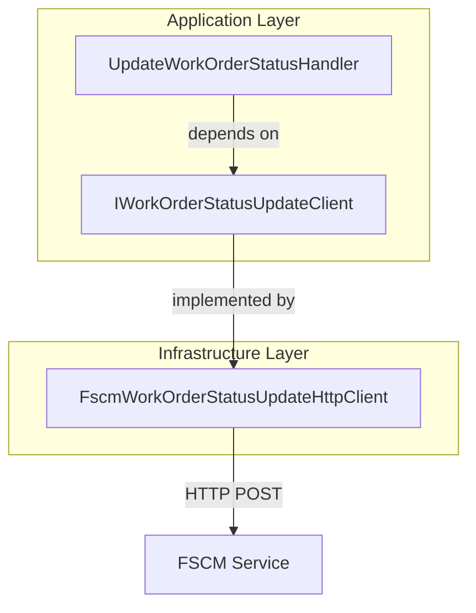
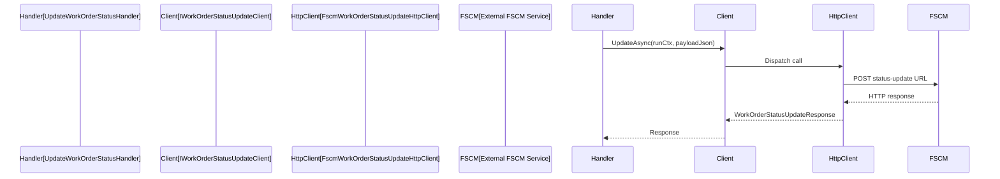

# Work Order Status Update Client Feature Documentation

## Overview

The **Work Order Status Update Client** provides an abstraction for sending raw JSON payloads to the FSCM system to synchronize work-order posting statuses. It ensures that status changes originating from the Durable Functions orchestration are reliably forwarded to the external FSCM endpoint.

This feature separates the application’s orchestration logic from the details of HTTP communication, promoting testability and allowing multiple implementations (e.g., a back-compat stub or a fully configured HTTP client).

## Architecture Overview



## Component Structure

### 1. Application Ports

#### **IWorkOrderStatusUpdateClient**

`src/Rpc.AIS.Accrual.Orchestrator.Core.Abstractions/IWorkOrderStatusUpdateClient.cs`

- **Purpose:** Defines a contract for sending work-order status update payloads to FSCM, forwarding raw JSON unchanged.
- **Methods:**

| Method Signature | Description | Returns |
| --- | --- | --- |
| `Task<WorkOrderStatusUpdateResponse> UpdateAsync(string rawJsonBody, CancellationToken ct)` | Sends a raw JSON payload without context for backward compatibility. | Status update response |
| `Task<WorkOrderStatusUpdateResponse> UpdateAsync(RunContext context, string rawJsonBody, CancellationToken ct)` | Sends a raw JSON payload along with execution context (RunContext). | Status update response |


```csharp
/// Client abstraction for sending a work-order status update payload to FSCM.
/// Payload is forwarded unchanged (raw JSON).
public interface IWorkOrderStatusUpdateClient
{
    Task<WorkOrderStatusUpdateResponse> UpdateAsync(string rawJsonBody, CancellationToken ct);
    // NEW (preferred)
    Task<WorkOrderStatusUpdateResponse> UpdateAsync(RunContext context, string rawJsonBody, CancellationToken ct);
}
```

### 2. Infrastructure Adapters

#### **FscmWorkOrderStatusUpdateHttpClient**

`src/Rpc.AIS.Accrual.Orchestrator.Infrastructure/Adapters/Fscm/Clients/FscmWorkOrderStatusUpdateHttpClient.cs`

- **Purpose:** Implements the interface by performing an HTTP POST to the configured FSCM status-update endpoint.
- **Key Behaviors:**- Resolves base URL from unified or legacy configuration.
- Builds request URL by combining base URL and path.
- Propagates `x-run-id` and `x-correlation-id` headers.
- Logs request/response details and timing.
- Throws exceptions on unauthorized (401/403) or transient (429, ≥500) responses.
- Returns a `WorkOrderStatusUpdateResponse` for 4xx client errors and success codes.

```csharp
public sealed class FscmWorkOrderStatusUpdateHttpClient : IWorkOrderStatusUpdateClient
{
    public Task<WorkOrderStatusUpdateResponse> UpdateAsync(string rawJsonBody, CancellationToken ct)
    {
        var ctx = new RunContext(/* generate fallback context */);
        return UpdateAsync(ctx, rawJsonBody, ct);
    }

    public async Task<WorkOrderStatusUpdateResponse> UpdateAsync(RunContext context, string rawJsonBody, CancellationToken ct)
    {
        var baseUrl = ResolveBaseUrl(_opt.WorkOrderStatusUpdateBaseUrlOverride, "WorkOrderStatusUpdateBaseUrlOverride");
        if (string.IsNullOrWhiteSpace(_opt.WorkOrderStatusUpdatePath))
            return new WorkOrderStatusUpdateResponse(false, 500, "{\"error\":\"Configuration missing...\"}");

        var url = BuildUrl(baseUrl, _opt.WorkOrderStatusUpdatePath);
        using var req = new HttpRequestMessage(HttpMethod.Post, url);
        // ... header propagation, logging, SendAsync, response handling ...
    }

    private string ResolveBaseUrl(string? legacyBaseUrl, string legacyName) { /* ... */ }
    private static string BuildUrl(string baseUrl, string path) { /* ... */ }
    private static string Trim(string? s) { /* ... */ }
}
```

### 3. Durable Functions Activity Handler

#### **UpdateWorkOrderStatusHandler**

`src/Rpc.AIS.Accrual.Orchestrator.Functions/Services/Handlers/UpdateWorkOrderStatusHandler.cs`

- **Purpose:** Acts as a Durable Functions activity that orchestrates the status update call using the client abstraction.
- **Flow:**1. Begins a scoped log context.
2. Reads raw JSON from input DTO.
3. Calls `_woStatus.UpdateAsync(runCtx, body, ct)`.
4. Logs success details via `IAisLogger.InfoAsync`.
5. On exception, logs via `IAisLogger.ErrorAsync` and rethrows to trigger Durable retry policy.

```csharp
public sealed class UpdateWorkOrderStatusHandler : ActivitiesHandlerBase
{
    public async Task<WorkOrderStatusUpdateResponse> HandleAsync(
        WorkOrderStatusUpdateInputDto input,
        RunContext runCtx,
        CancellationToken ct)
    {
        using var scope = BeginScope(_logger, runCtx, "UpdateWorkOrderStatus", input.DurableInstanceId);
        try
        {
            var resp = await _woStatus.UpdateAsync(runCtx, input.RawJsonBody ?? string.Empty, ct)
                         ?? new WorkOrderStatusUpdateResponse(false, 500, "{\"error\":\"Null response\"}");
            await _ais.InfoAsync(...);
            return resp;
        }
        catch (Exception ex)
        {
            await _ais.ErrorAsync(...);
            throw;
        }
    }
}
```

### 4. Domain Models

#### **WorkOrderStatusUpdateResponse**

`src/Rpc.AIS.Accrual.Orchestrator.Core.Domain/WorkOrderStatusUpdateResponse.cs`

- **Description:** Encapsulates the outcome of the FSCM status update call.
- **Properties:**

| Property | Type | Description |
| --- | --- | --- |
| `IsSuccess` | bool | Indicates HTTP 2xx status (true) or not. |
| `StatusCode` | int | Numeric HTTP status code returned. |
| `ResponseBody` | string? | Raw response payload, or error details. |


```csharp
public sealed record WorkOrderStatusUpdateResponse(bool IsSuccess, int StatusCode, string? ResponseBody);
```

## Sequence Flow



## Error Handling

- **Unauthorized (401/403):** Logs error and throws `UnauthorizedAccessException`.
- **Transient (429, ≥500):** Logs warning and throws `HttpRequestException` to trigger retry policies.
- **Client errors (4xx other than 401/403):** Returns `IsSuccess = false` with the response body unchanged.

## Configuration

- **FscmOptions.WorkOrderStatusUpdateBaseUrlOverride:** Optional per-endpoint override.
- **FscmOptions.BaseUrl:** Preferred unified host URL.
- **FscmOptions.WorkOrderStatusUpdatePath:** Path segment for the status-update endpoint. Missing path yields a 500 error response.

## Key Classes Reference

| Class | Location | Responsibility |
| --- | --- | --- |
| IWorkOrderStatusUpdateClient | `Core.Abstractions/IWorkOrderStatusUpdateClient.cs` | Defines client contract for status updates |
| FscmWorkOrderStatusUpdateHttpClient | `Infrastructure/Adapters/Fscm/Clients/FscmWorkOrderStatusUpdateHttpClient.cs` | HTTP implementation of the status-update client |
| UpdateWorkOrderStatusHandler | `Functions/Services/Handlers/UpdateWorkOrderStatusHandler.cs` | Durable Functions activity orchestrating update |
| WorkOrderStatusUpdateResponse | `Core.Domain/WorkOrderStatusUpdateResponse.cs` | Result model for status-update operations |
