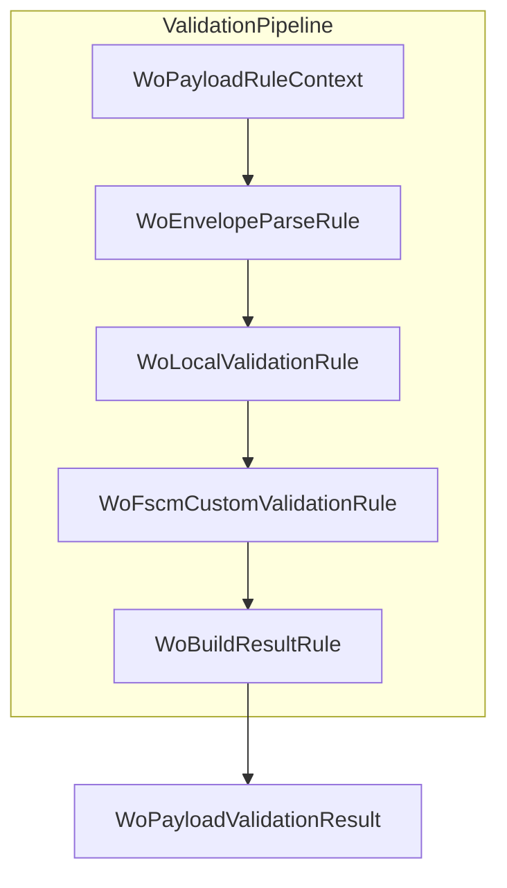
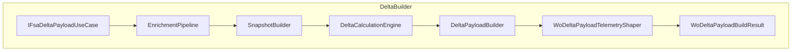

# WO Payload Validation Feature

## Overview

This feature validates AIS Work Order (WO) payloads before posting to FSCM. It ensures payload shape, extracts WO lists, applies local (AIS-side) validations, invokes FSCM custom validations, and builds a final result. By filtering invalid or retryable orders, it improves data quality and reduces failed postings.

## Architecture Overview



## Component Structure

### 1. Context 📦

#### **WoPayloadRuleContext** (`src/Rpc.AIS.Accrual.Orchestrator.Application/Ports/Common/Abstractions/WoPayloadRuleContext.cs`)

Holds mutable state across rules: input JSON, parsed document, WO list, failures, filtered payloads, and final result .

| Property | Type | Description |
| --- | --- | --- |
| RunContext | RunContext | Correlation and run metadata |
| JournalType | JournalType | Target journal category |
| PayloadJson | string | Original WO payload JSON |
| Logger | ILogger | Logging interface |
| Options | PayloadValidationOptions | AIS validation flags |
| JournalPolicyResolver | IJournalTypePolicyResolver | Resolves per-journal section key |
| FscmCustomValidator | IFscmCustomValidationClient? | Optional FSCM custom validator |
| Document | JsonDocument? | Parsed JSON document |
| WoList | JsonElement | Extracted WOList array |
| Stopwatch | Stopwatch | Elapsed time tracking |
| InvalidFailures | List<WoPayloadValidationFailure> | Collected invalid failures |
| RetryableFailures | List<WoPayloadValidationFailure> | Collected retryable failures |
| ValidWorkOrders | List<FilteredWorkOrder> | WO lines approved |
| RetryableWorkOrders | List<FilteredWorkOrder> | WO lines marked retryable |
| WorkOrdersBefore | int | Count before filtering |
| FilteredPayloadJson | string | JSON of valid WOs |
| Result | WoPayloadValidationResult? | Final validation outcome |
| StopProcessing | bool | Short-circuit flag |
| Endpoint | FscmEndpointType | FSCM endpoint under test |


### 2. Interfaces 🔌

| Interface | Method(s) | Responsibility |
| --- | --- | --- |
| IWoPayloadRule | ApplyAsync(ctx, ct) | Unit of validation logic |
| IWoPayloadValidationEngine | ValidateAndFilterAsync(...) | Orchestrates rule pipeline |
| IWoValidationResultBuilder | BuildResult(...) | Constructs final result |
| IWoEnvelopeParser | TryGetWoList(...) | Extracts WOList from JSON envelope |
| IWoLocalValidator | ValidateLocally(...) | Applies AIS-side synchronous checks |


*All core interfaces reside under* `Rpc.AIS.Accrual.Orchestrator.Core.Abstractions` .

### 3. Options & Defaults ⚙️

- **PayloadValidationOptions** (`.../Core/Options/PayloadValidationOptions.cs`): Controls AIS-side validation behavior.
- **WoPayloadValidationDefaults** (`.../Domain/Validation/WoPayloadValidationDefaults.cs`): Provides `EmptyResult()` for safe defaults .

### 4. Validation Rules ✅

#### **WoEnvelopeParseRule**

Parses JSON envelope and extracts `WOList`. On missing envelope or malformed array, sets a default empty result and stops processing .

```csharp
public Task ApplyAsync(WoPayloadRuleContext ctx, CancellationToken ct)
{
  if (ctx.Document is null) { ... }
  if (!_parser.TryGetWoList(..., out var woList, out var failure)) { ... }
  ctx.WoList = woList;
  return Task.CompletedTask;
}
```

#### **WoLocalValidationRule**

Bridges async pipeline to sync `IWoLocalValidator`. Skips if `StopProcessing` true or `WoList` is not an array .

#### **WoFscmCustomValidationRule**

Invokes FSCM reference validator for each WO set, appending remote failures or retryables .

#### **WoBuildResultRule**

Calls `IWoValidationResultBuilder.BuildResult(...)`, populates `ctx.Result`, and halts further rules .

### 5. Utilities 🛠️

- **WoEnvelopeParser** (`.../Services/WoPayloadValidationPipeline/WoEnvelopeParser.cs`): Implements loose envelope parsing logic .
- **WoPayloadShapeGuard** (`.../Infrastructure/Adapters/Fscm/Clients/Posting/IWoPayloadShapeGuard.cs`): Validates minimum JSON schema, throws on failure .
- **FscmWoPayloadValidationClient**: HTTP client adapter calling FSCM validation endpoint and parsing response.
- **WoPayloadJsonBuilder**: Generates filtered payload JSON from `FilteredWorkOrder` list.

### 6. Domain Models 📄

| Model | Description |
| --- | --- |
| WoPayloadValidationFailure | Single validation error record |
| ValidationDisposition | Strategies: Valid, Invalid, Retryable, FailFast |
| FilteredWorkOrder | WO JSON + section key + selected lines |
| WoPayloadValidationResult | Outcome: filtered JSON, counts, failure lists |


---

# WO Delta Payload Feature

## Overview

Builds a “delta-only” WO payload by comparing FSA payload lines against FSCM journal history. This minimizes posting traffic by emitting only changed or reversal lines. It enriches, snapshots, calculates deltas, and shapes telemetry.

## Architecture Overview



## Component Structure

### Interfaces 🔌

| Interface | Method |
| --- | --- |
| IWoDeltaPayloadService | BuildDeltaPayloadAsync(context, json, ct) |
| IWoDeltaPayloadServiceV2 | BuildDeltaPayloadAsync(..., options, ct) |
| IFsaDeltaPayloadUseCase | BuildFullFetchAsync / BuildSingleWoAsync |


*(Core abstractions)* .

### Services & Helpers 🏗️

- **FsaDeltaPayloadUseCase**: Orchestrates full-fetch and single-WO delta building.
- **WoDeltaPayloadTelemetryShaper**: Logs payload summaries and optional bodies with SHA256 hashes .
- **WoDeltaPayloadClassifier**: Extracts WO array from various JSON shapes .
- **DeltaCalculationEngine**: Delegates to `DeltaMathEngine` for line-level delta decisions .

### Domain Record

#### **EnrichmentContext** (`.../Features/Delta/FsaDeltaPayload/Services/EnrichmentPipeline/EnrichmentContext.cs`)

Carries payload JSON, IDs, action, and lookup maps for enrichment steps.

---

This comprehensive documentation covers all uploaded components, their responsibilities, interactions, and key implementation details.