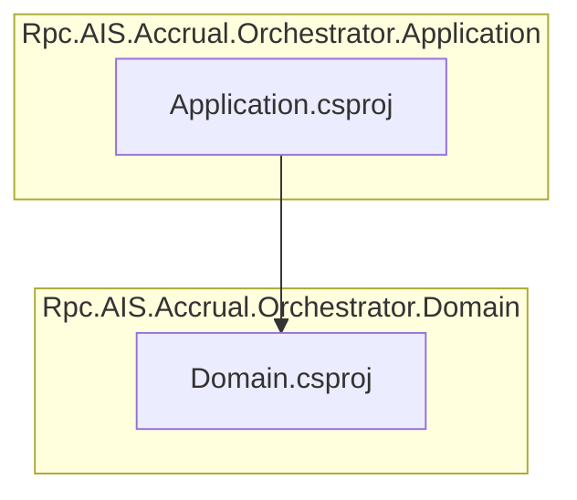

# Rpc.AIS.Accrual.Orchestrator.Application Project Documentation

## Overview

The **Rpc.AIS.Accrual.Orchestrator.Application** project implements the application layer of the Accrual Orchestrator solution. It defines the core use-case interfaces, DTOs, and services that coordinate domain models and bridge them to downstream infrastructure components. By depending on the domain abstractions, this layer centralizes business workflows, logging, and diagnostic concerns.

This project is *non-packable* and is consumed by higher layers (infrastructure and functions) to execute orchestrations, payload transformations, and enrichment pipelines. It offers a clean separation between domain logic and external integrations.

## Architecture Overview



The diagram shows that the Application project depends on the Domain project. Higher layers (Infrastructure and Functions) in turn depend on this Application layer to implement concrete behaviors.

## Project Configuration

- **SDK**: `Microsoft.NET.Sdk`
- **IsPackable**: `false`

Prevents this project from being packaged as a NuGet library.

```xml
<Project Sdk="Microsoft.NET.Sdk">
  <PropertyGroup>
    <IsPackable>false</IsPackable>
  </PropertyGroup>
  <!-- ... -->
</Project>
```

## Project References

| Reference | Path |
| --- | --- |
| Domain Layer Project | `..\Rpc.AIS.Accrual.Orchestrator.Domain\Rpc.AIS.Accrual.Orchestrator.Domain.csproj` |


The Application layer relies on domain entities, value objects, and validation rules defined in the **Domain** project.

## NuGet Package Dependencies

This project brings in fundamental logging and diagnostic abstractions to support observability within use-case implementations:

| Package | Version | Purpose |
| --- | --- | --- |
| Microsoft.Extensions.Diagnostics.Abstractions | 10.0.3 | Abstractions for activity tracing and diagnostic instrumentation |
| Microsoft.Extensions.Logging | 10.0.3 | Core logging interfaces and extensions |


## Integration Points

- **Domain Layer**

Defines all core domain models, interfaces, and validation logic consumed here.

- **Infrastructure Layer**

Implements HTTP clients, caching, resilience policies, and hooks into the Application-level services.

- **Functions Layer**

Hosts Azure Functions orchestrations and triggers that invoke Application-level use cases.

## Key Characteristics

```card
{
    "title": "Non-Packable Project",
    "content": "IsPackable is set to false, so this project does not produce a NuGet package."
}
```

- Designed as a pure application/use-case layer.
- Centralizes logging and diagnostics through Microsoft.Extensions abstractions.
- Does **not** produce an independent NuGet artifact.

## Dependencies

- **.NET SDK**: `Microsoft.NET.Sdk`
- **Project Reference**: `Rpc.AIS.Accrual.Orchestrator.Domain`
- **NuGet**:- `Microsoft.Extensions.Diagnostics.Abstractions` (10.0.3)
- `Microsoft.Extensions.Logging` (10.0.3)

This minimal set of dependencies ensures that the Application layer focuses solely on orchestrating domain workflows without coupling to specific infrastructure concerns.