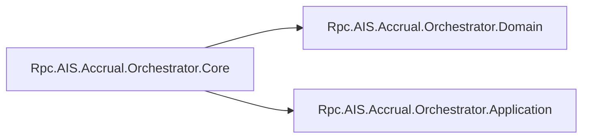

# Accrual Orchestrator Core Project Configuration

## Overview

The **Rpc.AIS.Accrual.Orchestrator.Core** project defines the central abstractions, options, and core services used by the Accrual Orchestrator. It encapsulates business-critical interfaces and use-case logic without external dependencies. This library depends on the Domain and Application layers to access domain models and foundational services, and is consumed by the Functions and Infrastructure layers to implement durable workflows and HTTP clients.

## Architecture Overview



This diagram shows that the Core layer depends on:

- **Domain**: for domain entities and value objects
- **Application**: for application-level services and diagnostics

## Build Configuration

### SDK

- **Sdk**: `Microsoft.NET.Sdk`

The project uses the standard .NET SDK to compile C# libraries .

### Packaging

- **IsPackable**: `false`

Prevents this project from being published as a standalone NuGet package .

## Project References

The Core project includes the following references to other solution modules:

| Reference Layer | Project Path |
| --- | --- |
| Domain Layer | `..\Rpc.AIS.Accrual.Orchestrator.Domain\Rpc.AIS.Accrual.Orchestrator.Domain.csproj` |
| Application Layer | `..\Rpc.AIS.Accrual.Orchestrator.Application\Rpc.AIS.Accrual.Orchestrator.Application.csproj` |


Each reference grants access to domain models (e.g., `RunContext`, `JournalType`) and application services (e.g., `IAisLogger`, `ProcessingOptions`) .

## Dependencies

- No external NuGet packages are referenced directly in this project.
- Core relies only on the two internal projects listed above .

## Integration Points

Although not declared here, the Core assembly exposes:

- **Abstractions** (`Rpc.AIS.Accrual.Orchestrator.Core.Abstractions`)
- **Options** (`Rpc.AIS.Accrual.Orchestrator.Core.Options`)
- **Services** (`Rpc.AIS.Accrual.Orchestrator.Core.Services`)
- **Use-Cases** (`Rpc.AIS.Accrual.Orchestrator.Core.UseCases`)

These are consumed by:

- The **Functions** project (durable orchestrations, activities, HTTP handlers)
- The **Infrastructure** project (HTTP clients, resilience policies, logging)

## Key Configuration Snippet

```xml
<Project Sdk="Microsoft.NET.Sdk">
  <PropertyGroup>
    <IsPackable>false</IsPackable>
  </PropertyGroup>
  <ItemGroup>
    <ProjectReference Include="..\Rpc.AIS.Accrual.Orchestrator.Domain\Rpc.AIS.Accrual.Orchestrator.Domain.csproj" />
    <ProjectReference Include="..\Rpc.AIS.Accrual.Orchestrator.Application\Rpc.AIS.Accrual.Orchestrator.Application.csproj" />
  </ItemGroup>
</Project>
```

*Excerpted from Rpc.AIS.Accrual.Orchestrator.Core.csproj *

## Summary of Roles

| Concern | Responsibility |
| --- | --- |
| **Abstractions** | Defines interfaces for telemetry, email notifications, FSCM clients, delta payload enrichment. |
| **Options** | Holds configuration classes such as `ProcessingOptions`, `NotificationOptions`, `FsOptions`. |
| **Services** | Implements core engines: delta calculation, journal reversal planning, invoice attribute sync. |
| **Use-Cases** | Encapsulates domain workflows: `FsaDeltaPayloadUseCase`, payload validation, staging pipelines. |


---

This documentation covers all elements present in the Core project file and explains how it connects to the broader Accrual Orchestrator solution.