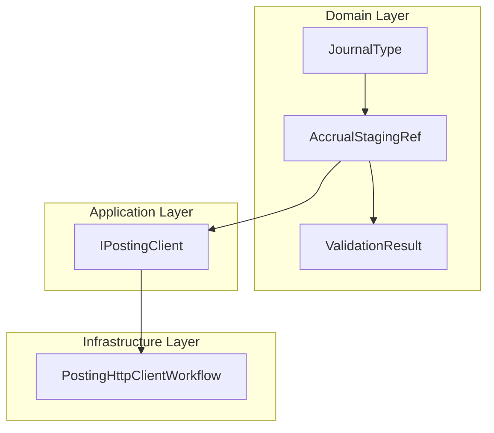

# Accrual Staging Reference Feature Documentation

## Overview

The **AccrualStagingRef** record defines the core domain model for staging journal entries before posting to the FSCM (Financial Supply Chain Management) system. It encapsulates the minimal metadata—staging identifier, journal classification, and a source key—required to group and submit accrual records efficiently.

By abstracting staging details into a lightweight record, the orchestration layer can validate, batch, and post accrual entries in a consistent, type-safe manner. This aligns with the broader accrual orchestration workflow, where JSON payloads from Field Service (FSA) are transformed into domain models, validated, and then handed off to posting clients.

## Architecture Overview



## Component Structure

### 🗃️ Data Models

#### **AccrualStagingRef** (`src/Rpc.AIS.Accrual.Orchestrator.Domain/Domain/AccrualStagingRef.cs`)

- **Purpose:** Represents a single staging reference for an accrual journal entry.
- **Responsibilities:**- Carry the **staging ID** returned by FSCM.
- Indicate the **journal type** (Item, Expense, Hour).
- Preserve a **source key** to correlate back to the original work order line.

```csharp
namespace Rpc.AIS.Accrual.Orchestrator.Core.Domain;

/// <summary>
/// Carries accrual staging ref data.
/// </summary>
public sealed record AccrualStagingRef(
    string StagingId,
    JournalType JournalType,
    string SourceKey);
```

| Property | Type | Description |
| --- | --- | --- |
| StagingId | string | Unique identifier returned by the FSCM staging service. |
| JournalType | JournalType | Classification of the journal (Item, Expense, Hour). |
| SourceKey | string | Correlation key from the originating work order or payload. |


#### **JournalType** (`src/Rpc.AIS.Accrual.Orchestrator.Domain/Domain/JournalType.cs`)

- **Purpose:** Enumerates supported journal categories.
- **Values:**

| Member | Value | Description |
| --- | --- | --- |
| Item | 1 | Inventory journal |
| Expense | 2 | Expense journal |
| Hour | 3 | Hour journal |


```csharp
namespace Rpc.AIS.Accrual.Orchestrator.Core.Domain;

/// <summary>
/// Defines journal type values.
/// </summary>
public enum JournalType
{
    Item = 1,
    Expense = 2,
    Hour = 3
}
```

### 🔗 Integration Points

- **Posting Client**

The `IPostingClient.PostAsync` method batches a list of `AccrualStagingRef` records per journal type to post them to FSCM  .

- **Validation Pipeline**

Each `ValidationResult` links back to an `AccrualStagingRef`, enabling clear error reporting and filtering of invalid staging records before posting  .

```card
{
    "title": "Core Domain Record",
    "content": "AccrualStagingRef encapsulates FSCM staging metadata and journal classification in the Domain Layer."
}
```

## Key Classes Reference

| Class | Location | Responsibility |
| --- | --- | --- |
| AccrualStagingRef | Domain/AccrualStagingRef.cs | Encapsulates staging ID, journal type, and source key. |
| JournalType | Domain/JournalType.cs | Enumerates the three supported journal categories. |
| ValidationResult | Domain/ValidationResult.cs | Associates validation outcomes with an AccrualStagingRef. |
| IPostingClient | Core.Abstractions/IPostingClient.cs | Defines contract for posting staging records to FSCM. |
| PostingHttpClientWorkflow | Infrastructure/Clients/Posting/PostingHttpClientWorkflow.cs | Implements the orchestration of payload preparation and HTTP posting. |
