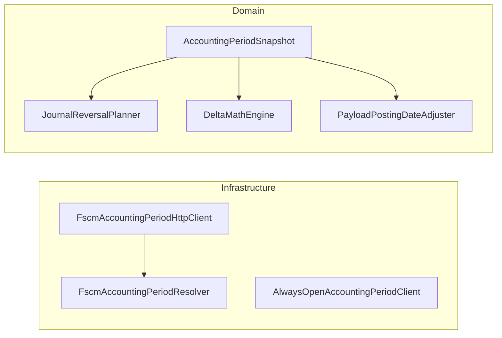

# Accounting Period Context Feature Documentation

## Overview

The **AccountingPeriodSnapshot** encapsulates the fiscal calendar context needed for correct reversal dating rules. It provides the start date of the current open period, a strategy describing how to date reversals in closed periods, and legacy snapshot bounds. Business logic and posting pipelines use it to:

- Determine if an operation date falls in a closed period
- Resolve the effective transaction date when periods are closed

This ensures that reversal and non-reversal journal lines carry valid dates according to FSCM period status .

## Architecture Overview



## Component Structure

### 1. Domain Model

#### **AccountingPeriodSnapshot** (`src/Rpc.AIS.Accrual.Orchestrator.Domain/Domain/Delta/AccountingPeriodSnapshot.cs`)

| Property | Type |
| --- | --- |
| CurrentOpenPeriodStartDate | DateTime — first date of the open period |
| ClosedReversalDateStrategy | string — name of the closed‐period reversal strategy |
| SnapshotMinDate | DateTime — earliest period date in the snapshot (legacy) |
| SnapshotMaxDate | DateTime — latest period date in the snapshot (legacy) |
| IsDateInClosedPeriodAsync | Func<DateTime, CancellationToken, ValueTask<bool>> — async closed‐period check |
| ResolveTransactionDateUtcAsync | Func<DateTime, CancellationToken, ValueTask<DateTime>> — async date resolver |


- **Purpose:** Holds accounting period metadata and delegates for period checks and date resolution.
- **Key Properties:
- **Key Methods:**- `IsDateInClosedPeriod(DateTime)` synchronously invokes `IsDateInClosedPeriodAsync`
- `ResolveTransactionDateUtc(DateTime)` synchronously invokes `ResolveTransactionDateUtcAsync`

### 2. Integration Interfaces

#### **IFscmAccountingPeriodClient**

Defines how to fetch the snapshot.

```csharp
Task<AccountingPeriodSnapshot> GetSnapshotAsync(RunContext context, CancellationToken ct);
```

(Central contract for all implementations.)

### 3. Infrastructure Adapters

#### **FscmAccountingPeriodHttpClient**

Implements `IFscmAccountingPeriodClient` by delegating to `FscmAccountingPeriodResolver`.

#### **AlwaysOpenAccountingPeriodClient** (Test Double)

Used in tests to return a snapshot where no date is ever closed and transaction date equals operation date .

### 4. Domain Consumers

- **JournalReversalPlanner**

Uses `IsDateInClosedPeriodAsync` and `CurrentOpenPeriodStartDate` to split reversal quantities by period status.

- **DeltaMathEngine**

Calls `ResolveTransactionDateUtcAsync` to set correct transaction dates for delta lines in closed periods.

- **PayloadPostingDateAdjuster**

Adjusts outgoing WO payloads’ `TransactionDate` based on the snapshot, preserving original `RPCWorkingDate` for diagnostics.

## Dependencies

- .NET Standard libraries: `System`, `System.Threading`, `System.Threading.Tasks`
- Relies on `ValueTask` delegates for asynchronous period logic.

## Testing Considerations

- Inject `AlwaysOpenAccountingPeriodClient` when tests require open‐period behavior.
- Realistic period scenarios are validated via `FscmAccountingPeriodResolver` tests.

## Key Classes Reference

| Class | Location | Responsibility |
| --- | --- | --- |
| AccountingPeriodSnapshot | Domain/Delta/AccountingPeriodSnapshot.cs | Encapsulates period context and provides synchronous wrappers. |
| IFscmAccountingPeriodClient | Application/Ports/Common/Abstractions/IFscmAccountingPeriodClient.cs | Contract for fetching the accounting period snapshot. |
| FscmAccountingPeriodHttpClient | Infrastructure/Adapters/Fscm/Clients/FscmAccountingPeriodHttpClient.cs | HTTP client facade for period snapshot via resolver. |
| AlwaysOpenAccountingPeriodClient | Tests/TestDoubles/AlwaysOpenAccountingPeriodClient.cs | Test double returning always-open snapshot. |


## Error Handling

Exceptions thrown by snapshot delegates or HTTP failures propagate to callers, enabling fail‐open strategies (e.g., posting logic logs warning but proceeds when period lookup fails).

## Caching Strategy

Actual caching logic resides in `FscmAccountingPeriodResolver` (out‐of‐window date cache) to avoid repeated status lookups.

## Integration Points

- **WO Delta Payload Service** uses the snapshot for journal‐section building.
- **Posting Pipeline** applies snapshot rules before sending to FSCM.

## State Management

No internal state beyond constructor‐injected delegates; all period data is immutable within the snapshot record.

## Dependencies

- Interfaces: `IFscmAccountingPeriodClient`, `JournalReversalPlanner`, `DeltaMathEngine`
- Infrastructure: `HttpClient`, `FscmOptions`, logging via `ILogger`

## Testing Considerations

- Simulate closed/open period scenarios by implementing `IsDateInClosedPeriodAsync`.
- Verify date‐resolution logic by mocking `ResolveTransactionDateUtcAsync`.