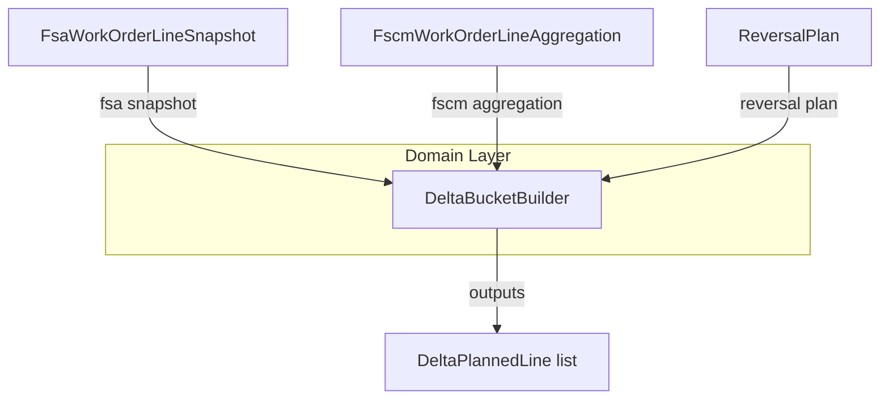

# DeltaBucketBuilder Component Documentation

## Overview 🚀

The **DeltaBucketBuilder** constructs planned delta lines for accrual journal entries. It transforms FSA snapshots and FSCM aggregations into forward‐ and reversal‐oriented entries. This builder ensures unit prices, quantities, and dimensions align with historical and current data.

## Architecture Overview



## Component Structure

### DeltaBucketBuilder (`src/Rpc.AIS.Accrual.Orchestrator.Core.Domain.Delta/DeltaBucketBuilder.cs`)

**Purpose:**

Builds **DeltaPlannedLine** instances for both reversals and positive adjustments based on FSA input and FSCM history.

#### Key Methods 🔍

| Method | Description |
| --- | --- |
| **BuildReversalLinesOnly** | Produces only reversal lines from a full **ReversalPlan**. |
| **BuildReversalLine** | Creates a single reversal line using FSCM history attributes. |
| **BuildPositiveLine** | Constructs a forward (positive) delta line from FSA snapshot. |
| **ComputeExtendedAmount** | Multiplies quantity by unit price, returning `null` if price is missing. |
| **ResolveFscmUnitPriceForReversal** | Chooses the appropriate unit price: bucket, effective, or computed from totals. |
| **GetFscmHistoryAttributes** | Extracts department, product line, warehouse, line property, and price from the first dimension bucket. |


#### Method Details

- **BuildReversalLinesOnly( …)**- Inputs:- `FsaWorkOrderLineSnapshot fsa`
- `FscmWorkOrderLineAggregation fscmAgg`
- `ReversalPlan plan`
- Logic:1. Returns empty list if no reversals.
2. Retrieves historical attributes.
3. Iterates `plan.Reversals` to build lines with `ResolveFscmUnitPriceForReversal`.
- Output: `IReadOnlyList<DeltaPlannedLine>`

- **BuildReversalLine( …)**- Inputs: single reversal parameters plus `fsa` and `fscmAgg`.
- Builds one reversal entry with FSCM history or falls back to aggregation totals.

- **BuildPositiveLine( …)**- Inputs:- `FsaWorkOrderLineSnapshot fsa`
- Date, quantity, flags, reason
- Uses `fsa.CalculatedUnitPrice` and dimensions directly from FSA.

- **ComputeExtendedAmount(decimal quantity, decimal? unitPrice)**

```csharp
  if (!unitPrice.HasValue) return null;
  return quantity * unitPrice.Value;
```

- **ResolveFscmUnitPriceForReversal( …)**1. If bucket price exists, use it.
2. Else if `EffectiveUnitPrice` exists, use it.
3. Else if totals valid, compute `TotalExtendedAmount / TotalQuantity`.
4. Otherwise return `null`.

- **GetFscmHistoryAttributes( …)**- Returns a tuple of `(Department, ProductLine, Warehouse, LineProperty, UnitPrice)`
- Prefers the first entry in `DimensionBuckets` when available.

## Usage Example

```csharp
// Given FSA snapshot, FSCM aggregation, and a planned reversal:
var reversalLines = DeltaBucketBuilder.BuildReversalLinesOnly(
    fsaSnapshot,
    fscmAggregation,
    reversalPlan
);

// Or build a positive adjustment:
var positiveLine = DeltaBucketBuilder.BuildPositiveLine(
    fsaSnapshot,
    DateTime.UtcNow,
    5.0m,
    isReversal: false,
    fromClosedSplit: false,
    lineReason: "Quantity delta"
);
```

## Key Classes Reference 📚

| Class | Location | Responsibility |
| --- | --- | --- |
| DeltaBucketBuilder | `.../Core/Domain/Delta/DeltaBucketBuilder.cs` | Static builder for reversal and positive delta lines |
| FsaWorkOrderLineSnapshot | (Provided elsewhere) | Represents a single FSA work-order line snapshot |
| FscmWorkOrderLineAggregation | (Provided elsewhere) | Aggregates FSCM journal lines by work-order line |
| ReversalPlan | (Provided elsewhere) | Contains planned reversal entries with dates and amounts |
| DeltaPlannedLine | (Provided elsewhere) | Model for a planned journal line (quantity, price, flags) |


## Important Notes ⚠️

```card
{
    "title": "Reversal Pricing",
    "content": "Reversal lines use only FSCM history prices. Missing prices yield null to force validation errors downstream."
}
```

- **Null unit prices** surface errors rather than fallback silently.
- **Extended amounts** are omitted when unit price is not provided.
- History attributes prioritize bucket data, ensuring specificity.