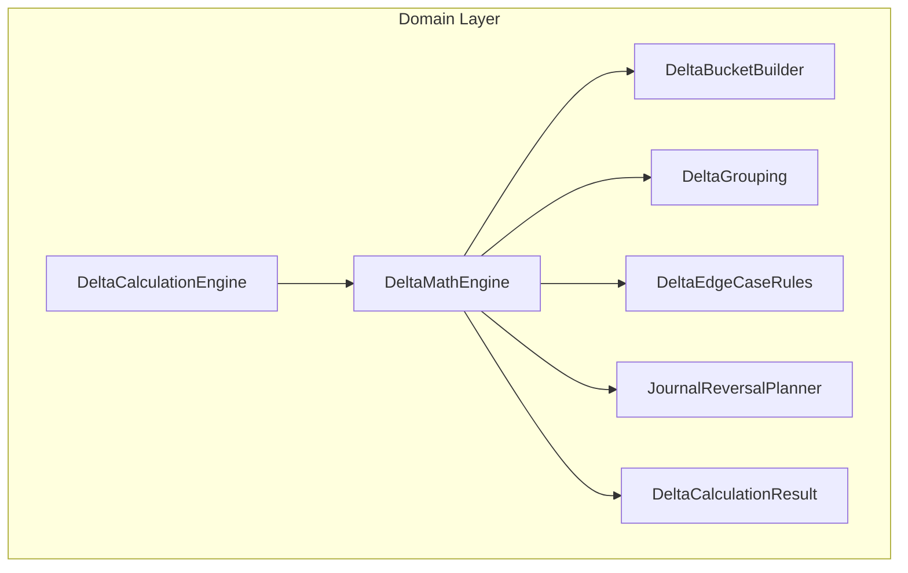

# Delta Calculation Feature Documentation

## Overview

The **Delta Calculation** feature determines how to synchronize incoming FSA (Field Service Architecture) work order line snapshots with existing FSCM (Finance & Supply Chain Management) journal history. It computes a set of “delta” journal lines—reversals, creations, or quantity adjustments—so that FSCM reflects the current FSA state. This ensures accurate accrual postings and preserves historical integrity.

This domain-centric component is part of the Orchestrator Core. It provides a thin façade (`DeltaCalculationEngine`) that delegates to specialized helpers for

- **Reversal planning**
- **Attribute-change detection**
- **Bucket-based line construction**
- **Edge-case rules**

These helpers embody the Single Responsibility Principle and enable clear, testable orchestration of complex business rules.

## Architecture Overview



## Component Structure

### 1. DeltaCalculationEngine (Facade)

**Location:** `src/.../DeltaCalculationEngine.cs`

**Purpose:** Thin façade offering a single entry point for delta computation. It accepts FSA snapshot, FSCM aggregation, period context, and delegates to `DeltaMathEngine`.

| Member | Description |
| --- | --- |
| Constructor | Stores `JournalReversalPlanner`; throws if null. |
| CalculateAsync() | Invokes `DeltaMathEngine.CalculateAsync` with provided inputs. |


```csharp
public sealed class DeltaCalculationEngine {
    private readonly JournalReversalPlanner _reversalPlanner;
    public DeltaCalculationEngine(JournalReversalPlanner reversalPlanner) { ... }
    public Task<DeltaCalculationResult> CalculateAsync(
        FsaWorkOrderLineSnapshot fsa,
        FscmWorkOrderLineAggregation? fscmAgg,
        AccountingPeriodSnapshot period,
        DateTime today,
        CancellationToken ct,
        string? reasonPrefix = null)
        => DeltaMathEngine.CalculateAsync(_reversalPlanner, fsa, fscmAgg, period, today, ct, reasonPrefix);
}
```

<card>

{

"title": "SRP Façade",

"content": "DeltaCalculationEngine delegates logic to specialized helpers for Single Responsibility Principle compliance."

}

</card>

---

### 2. DeltaMathEngine 🧮

**Location:** `src/.../DeltaMathEngine.cs`

**Purpose:** Core orchestration of four decision branches:

1. **No Change** — nothing to post.
2. **Reverse Only** — full reversal for inactive lines.
3. **Reverse & Recreate** — on attribute changes or closed inactive lines.
4. **Quantity Delta** — adjust only quantity when attributes match.

Key steps:

- Validate arguments.
- Determine transaction date via `period.ResolveTransactionDateUtcAsync`.
- Compute total posted quantity.
- Detect field-change and closed-period flags using `DeltaEdgeCaseRules`.
- Plan reversals via `JournalReversalPlanner`.
- Build lines through `DeltaBucketBuilder`.
- Return `DeltaCalculationResult` with reason string.

```csharp
internal static class DeltaMathEngine {
    internal static async Task<DeltaCalculationResult> CalculateAsync(
            JournalReversalPlanner reversalPlanner,
            FsaWorkOrderLineSnapshot fsa,
            FscmWorkOrderLineAggregation? fscmAgg,
            AccountingPeriodSnapshot period,
            DateTime today,
            CancellationToken ct,
            string? reasonPrefix = null)
    {
        if (fsa is null) throw new ArgumentNullException(nameof(fsa));
        if (period is null) throw new ArgumentNullException(nameof(period));

        // ... determine shouldReverseAndRecreate ...
        if (!fsa.IsActive && !inactiveAndClosed) { ... }            // ReverseOnly
        if (shouldReverseAndRecreate) { ... }                       // ReverseAndRecreate
        if (deltaQty == 0m) { ... }                                 // NoChange
        // ... else QuantityDelta
    }
}
```

---

### 3. DeltaCalculationResult & DeltaDecision & DeltaPlannedLine

**Location:** `src/.../DeltaCalculationResult.cs`

**Purpose:** Encapsulates the outcome: decision type, planned lines, and human-readable reason.

#### DeltaDecision (enum)

| Value | Description |
| --- | --- |
| NoChange (0) | No posting required. |
| QuantityDelta (1) | Post a single line adjusting quantity. |
| ReverseAndRecreate (2) | Reverse all history, then post a new positive line. |
| ReverseOnly (3) | Reverse all history only (inactive line scenario). |


#### DeltaPlannedLine (record)

| Property | Type | Description |
| --- | --- | --- |
| TransactionDate | DateTime | Date for the journal line |
| Quantity | decimal | Quantity to post (negative for reversals) |
| CalculatedUnitPrice | decimal? | Effective unit price for this line |
| ExtendedAmount | decimal? | Computed amount = Quantity × UnitPrice |
| LineProperty | string? | Business attribute |
| Department | string? | Business attribute |
| ProductLine | string? | Business attribute |
| Warehouse | string? | Business attribute |
| IsReversal | bool | Marks reversal lines |
| FromClosedPeriodSplit | bool | Flag for closed-period split reversals |
| LineReason | string | Explanation of why line was generated |


#### DeltaCalculationResult (record)

| Property | Type | Description |
| --- | --- | --- |
| WorkOrderId | Guid | FSA work order identifier |
| WorkOrderLineId | Guid | FSA work order line identifier |
| Decision | DeltaDecision | Chosen delta action |
| Lines | IReadOnlyList<DeltaPlannedLine> | Planned journal lines |
| Reason | string | Human-readable decision explanation |


---

### 4. DeltaEdgeCaseRules ⚠️

**Location:** `src/.../DeltaEdgeCaseRules.cs`

**Purpose:** Identify idempotency and attribute-change triggers.

- **HasReversalInEffectiveReversalPeriod**

Returns `true` if a negative journal already exists in the current effective window, preventing duplicate reversals.

- **RequiresReversalDueToFieldChange**

Detects changes in non-price fields (Dept, ProdLine, Warehouse, LineProperty) or explicit price changes only when FSA provided a unit price.

**Key logic:**

- Skip when no history or no dimension buckets.
- Compare current FSA grouping signature against posted buckets.
- Compare explicit prices with posted bucket prices within tolerance.

---

### 5. DeltaGrouping 💡

**Location:** `src/.../DeltaGrouping.cs`

**Purpose:** Normalize and compare FSA vs. FSCM attributes, build grouping signatures and compare prices.

| Method | Description |
| --- | --- |
| BuildFsaSignature(fsa) | Creates a `D=… | PL=… | W=… | LP=… | P=…` signature only for provided fields. |
| Norm(string?) → string | Trim or empty if null. |
| Eq(a, b) → bool | Case-insensitive trimmed equality. |
| NormSig(string?) → string | Remove spaces & trim. |
| PriceEq(a?, b?) → bool | Numeric equality within 0.0001 tolerance. |
| TryParseSignature(sig, out …) | Reverse of `BuildFsaSignature` into individual components. |


---

### 6. DeltaBucketBuilder 📦

**Location:** `src/.../DeltaBucketBuilder.cs`

**Purpose:** Constructs `DeltaPlannedLine` instances for both reversal and positive lines using FSCM history or FSA snapshot.

| Method | Description |
| --- | --- |
| BuildReversalLinesOnly(fsa, fscmAgg, plan) | Creates reversal lines based on FSCM history attributes. |
| BuildPositiveLine(fsa, txDate, qty, isRev, fromClosed, reason) | Builds positive or delta lines using FSA attributes. |
| ComputeExtendedAmount(qty, unitPrice) | Multiplies quantity by unit price when available. |


**Internal helpers:**

- ResolveFscmUnitPriceForReversal: Chooses the most specific price source.
- GetFscmHistoryAttributes: Extracts unit price and dimensions from the first bucket.

---

## Integration Points

- **JournalReversalPlanner**: Generates reversal plans (negative splits) based on date buckets.
- **AccountingPeriodSnapshot**: Determines open/closed period boundaries and transaction dates.
- **FsaWorkOrderLineSnapshot** & **FscmWorkOrderLineAggregation**: Input models representing FSA payload and aggregated FSCM journal history.

---

## Key Classes Reference

| Class | Location | Responsibility |
| --- | --- | --- |
| DeltaCalculationEngine | `Core/Domain/Delta/DeltaCalculationEngine.cs` | Façade for delta computation |
| DeltaMathEngine | `Core/Domain/Delta/DeltaMathEngine.cs` | Orchestration of delta logic |
| DeltaCalculationResult | `Core/Domain/Delta/DeltaCalculationResult.cs` | Carries delta decision, lines, and reason |
| DeltaDecision | `Core/Domain/Delta/DeltaCalculationResult.cs` | Enum of delta outcomes |
| DeltaPlannedLine | `Core/Domain/Delta/DeltaCalculationResult.cs` | Represents a normalized journal line to post |
| DeltaGrouping | `Core/Domain/Delta/DeltaGrouping.cs` | Helpers for signature building and comparisons |
| DeltaEdgeCaseRules | `Core/Domain/Delta/DeltaEdgeCaseRules.cs` | Edge-case reversal and idempotency rules |
| DeltaBucketBuilder | `Core/Domain/Delta/DeltaBucketBuilder.cs` | Constructs planned lines from FSA/FSCM data |


---

## Error Handling

- Null inputs to math engine trigger `ArgumentNullException`.
- FSCM inability to provide unit price results in `null` unit price, surfacing downstream validation.
- Idempotency safeguards avoid duplicate reversals when prior negative entries exist for the same period.

---

## Testing Considerations

- Unit tests should cover each branch in `DeltaMathEngine.CalculateAsync`: NoChange, ReverseOnly, ReverseAndRecreate (with and without history), QuantityDelta.
- Edge-case rules tests for multi-bucket matching and price drift scenarios.

This documentation provides a comprehensive view of the Delta Calculation domain feature, illustrating how it orchestrates complex business rules to maintain synchronization between FSA snapshots and FSCM journal history.