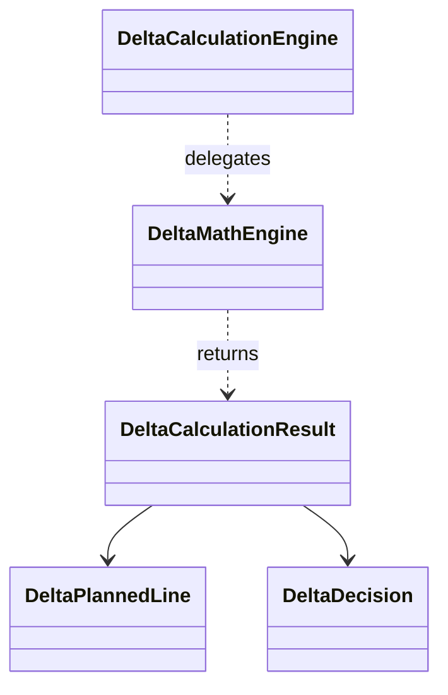

# Delta Calculation Domain Objects

## Overview

The **Delta Calculation** domain handles computing adjustments between two data sources: FSA (Field Service Automation) and FSCM (Finance System).

It determines whether to post new journal lines, reverse history, or leave data unchanged.

Results feed into downstream payload builders for journal processing.

## Architectural Context



- **DeltaCalculationEngine**: Façade entry point.
- **DeltaMathEngine**: Core logic for delta rules.
- **DeltaCalculationResult**: Encapsulates decision and planned lines.
- **DeltaPlannedLine**: Represents a single journal adjustment line.
- **DeltaDecision**: Enum guiding downstream behavior.

## DeltaCalculationResult 📊

The `DeltaCalculationResult` record carries the outcome of a single work-order‐line delta calculation.

```csharp
public sealed record DeltaCalculationResult(
    Guid WorkOrderId,
    Guid WorkOrderLineId,
    DeltaDecision Decision,
    IReadOnlyList<DeltaPlannedLine> Lines,
    string Reason
);
```

- **WorkOrderId** (Guid): Identifier of the work order.
- **WorkOrderLineId** (Guid): Identifier of the specific line.
- **Decision** (DeltaDecision): Action type determined by the engine.
- **Lines** (IReadOnlyList<DeltaPlannedLine>): Planned journal line adjustments.
- **Reason** (string): Human-readable explanation of the decision.

### Usage Example

```csharp
var result = await deltaEngine.CalculateAsync(
    fsaSnapshot,
    fscmAggregation,
    periodSnapshot,
    DateTime.UtcNow,
    cancellationToken
);
// Inspect result.Decision and result.Lines for payload building
```

## DeltaDecision Enum 🔀

Defines the category of adjustment for each work‐order line.

| Value | Numeric | Description |
| --- | --- | --- |
| **NoChange** | 0 | No journal lines required. |
| **QuantityDelta** | 1 | Post a single line for quantity difference. |
| **ReverseAndRecreate** | 2 | Reverse all FSCM history lines, then add a recreated line with updated attributes. |
| **ReverseOnly** | 3 | Reverse all history only (for inactive lines). |


## DeltaPlannedLine 🎯

Represents one atomic journal adjustment to send to FSCM.

```csharp
public sealed record DeltaPlannedLine(
    DateTime TransactionDate,
    decimal Quantity,
    decimal? CalculatedUnitPrice,
    decimal? ExtendedAmount,
    string? LineProperty,
    string? Department,
    string? ProductLine,
    string? Warehouse,
    bool IsReversal,
    bool FromClosedPeriodSplit,
    string LineReason
);
```

| Property | Type | Description |
| --- | --- | --- |
| **TransactionDate** | DateTime | Posting date for the journal line. |
| **Quantity** | decimal | Positive or negative quantity to post. |
| **CalculatedUnitPrice** | decimal? | Unit price for the line, or null if undefined. |
| **ExtendedAmount** | decimal? | Computed `Quantity * CalculatedUnitPrice`, or null. |
| **LineProperty** | string? | Custom property or category for the line. |
| **Department** | string? | Cost center or department code. |
| **ProductLine** | string? | Product line dimension. |
| **Warehouse** | string? | Warehouse dimension. |
| **IsReversal** | bool | Indicates if this line reverses prior history (true) or not (false). |
| **FromClosedPeriodSplit** | bool | Marks reversal from a closed‐period split. |
| **LineReason** | string | Explains why this line was planned. |


## Relationships & Flow

- **DeltaCalculationEngine** calls **DeltaMathEngine.CalculateAsync**.
- **DeltaMathEngine** applies edge-case rules (field changes, inactive lines).
- It returns a **DeltaCalculationResult** with:- A **DeltaDecision** guiding payload behavior.
- One or more **DeltaPlannedLine** entries.
- Downstream builders (e.g., **DeltaBucketBuilder**, payload services) map these lines into JSON payloads.

## Key Takeaways

- Delta decisions optimize journal postings by preventing unnecessary reversals.
- **DeltaCalculationResult** centralizes decision, line data, and reasoning.
- **DeltaPlannedLine** ensures consistent attribute mapping for each adjustment.

Enjoy streamlined and accurate accrual adjustments! 🚀