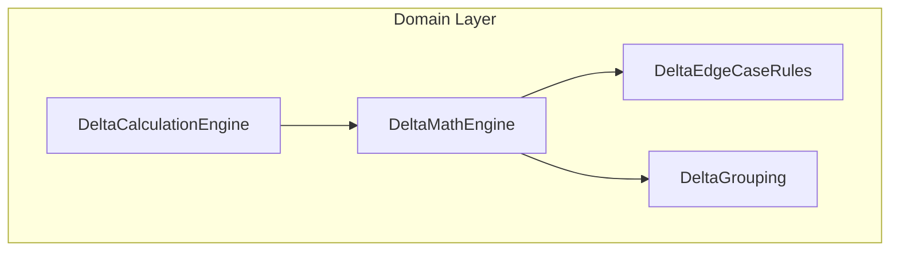
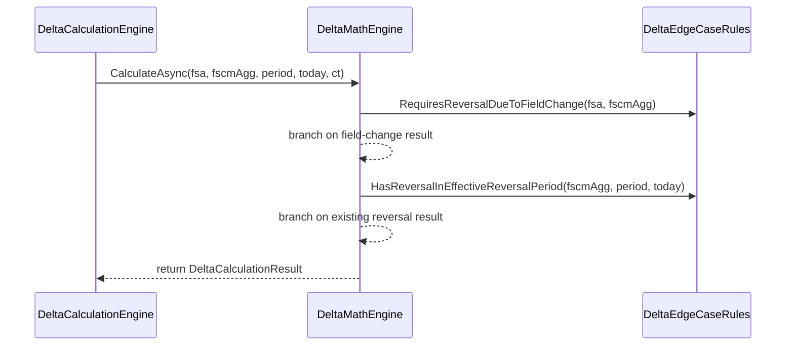

# Delta Edge Case Rules Feature Documentation

## Overview

The **Delta Edge Case Rules** component centralizes business logic for handling special scenarios during delta calculations. It ensures:

- 🔄 **No duplicate reversals**: Detects existing reversals within the effective period to prevent posting redundant reversal entries.
- ⚙️ **Field-change reversals**: Triggers a full reversal and recreation when critical attributes (department, product line, warehouse, line property, or explicit unit price) change.

This static helper class is part of the **Domain Layer** of the Accrual Orchestrator. It is invoked by the `DeltaMathEngine` within the **Delta Calculation Workflow**, ensuring edge-case conditions are evaluated consistently.

## Architecture Overview



## Component Structure

### Business Layer

#### **DeltaEdgeCaseRules** (`src/Rpc.AIS.Accrual.Orchestrator.Domain/Domain/Delta/DeltaEdgeCaseRules.cs`)

- **Purpose**: Implements domain rules for detecting edge cases in delta posting.
- **Responsibilities**:- Prevent duplicate reversals.
- Identify attribute drift requiring full reversal.
- **Dependencies**:- `FscmWorkOrderLineAggregation`
- `FsaWorkOrderLineSnapshot`
- `AccountingPeriodSnapshot`
- `DeltaGrouping`

##### Methods 🔍

| Method | Description | Returns |
| --- | --- | --- |
| `HasReversalInEffectiveReversalPeriod(fscmAgg, period, todayUtc)` | Checks if any FSCM history bucket within the *effective reversal period* has a negative total quantity, indicating a reversal already exists. | `bool` |
| `RequiresReversalDueToFieldChange(fsa, fscmAgg)` | Determines if any of the “reversal-trigger” fields—Department, ProductLine, Warehouse, LineProperty, or explicit UnitPrice—have changed compared to posted FSCM dimension buckets. If so, flags a full reverse-and-recreate action. | `bool` |


###### Method Signatures

```csharp
internal static bool HasReversalInEffectiveReversalPeriod(
    FscmWorkOrderLineAggregation fscmAgg,
    AccountingPeriodSnapshot period,
    DateTime todayUtc)
```

```csharp
internal static bool RequiresReversalDueToFieldChange(
    FsaWorkOrderLineSnapshot fsa,
    FscmWorkOrderLineAggregation? fscmAgg)
```

## Data Models Usage

| Model | Used Properties / Methods | Role in Edge Case Rules |
| --- | --- | --- |
| **FscmWorkOrderLineAggregation** | - `DateBuckets` (`TransactionDate`, `SumQuantity`)<br>- `DimensionBuckets` (`Department`, `ProductLine`, `Warehouse`, `LineProperty`, `CalculatedUnitPrice`)<br>- `TotalQuantity` | Provides historical postings for reversal detection and field drift. |
| **FsaWorkOrderLineSnapshot** | - `Department`, `ProductLine`, `Warehouse`, `LineProperty`<br>- `CalculatedUnitPrice`, `UnitPriceProvided`<br>- `IsActive`<br>- `Quantity` | Represents the incoming FSA payload attributes for comparison. |
| **AccountingPeriodSnapshot** | - `ClosedReversalDateStrategy`<br>- `CurrentOpenPeriodStartDate`<br>- `IsDateInClosedPeriod(DateTime)` | Defines period boundaries and reversal strategy for date calculations. |


## Feature Flows

### Edge Case Evaluation Sequence



## Integration Points

- **DeltaCalculationEngine**

Delegates to `DeltaMathEngine`, which invokes these rules to enforce edge-case logic.

- **DeltaMathEngine**

Applies `HasReversalInEffectiveReversalPeriod` before posting reversals and uses `RequiresReversalDueToFieldChange` to decide on reverse-and-recreate.

- **DeltaGrouping**

Supports normalization and equality checks used in field-change comparisons.

## Key Classes Reference

| Class | Location | Responsibility |
| --- | --- | --- |
| **DeltaEdgeCaseRules** | `src/Rpc.AIS.Accrual.Orchestrator.Domain/Domain/Delta/DeltaEdgeCaseRules.cs` | Encapsulates static rules for edge-case detection in delta calculations. |
| **DeltaMathEngine** | `src/Rpc.AIS.Accrual.Orchestrator.Core.Domain.Delta/DeltaMathEngine.cs` | Orchestrates delta workflow; calls edge-case rules and bucket builders. |
| **DeltaGrouping** | `src/Rpc.AIS.Accrual.Orchestrator.Core.Domain.Delta/DeltaGrouping.cs` | Provides signature normalization and comparison helpers for grouping logic. |
| **JournalReversalPlanner** | (Injected into `DeltaCalculationEngine`) | Plans full reversal lines based on FSCM history buckets. |


## Testing Considerations

- **Reversal Period Tests**- No `DateBuckets` → expect `false`.
- Buckets only before effective start date → `false`.
- At least one bucket on/after start date with negative `SumQuantity` → `true`.
- **Field-Change Tests**- Null or zero `TotalQuantity` → `false`.
- Missing `DimensionBuckets` → `false`.
- Non-price attribute mismatch → `true`.
- Explicit price not provided → `false`.
- Price provided but matches any FSCM bucket → `false`.
- Price provided, comparable buckets exist, none match → `true`.
- **Strategy Variation**- `ClosedReversalDateStrategy = "EffectiveMonthFirst"` vs default period start.

---

*This documentation covers the `DeltaEdgeCaseRules` logic as part of the Accrual Orchestrator’s delta computation feature.*