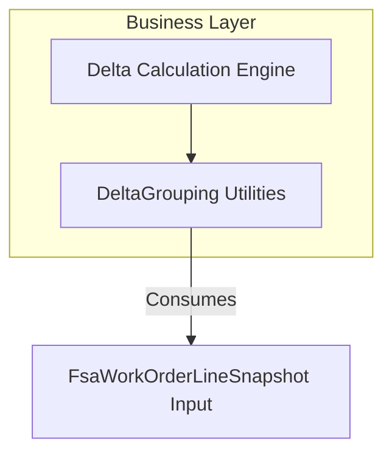

# Delta Grouping Feature Documentation

## Overview

The Delta Grouping feature provides utilities for constructing, normalizing, and comparing field signatures when calculating deltas between Field Service Application (FSA) snapshots and Financial Supply Chain Management (FSCM) journal history. It ensures partial updates from FSA (e.g., only quantity changes) do not trigger unnecessary reversals by:

- Building concise signature strings that reflect only the fields explicitly provided by FSA.
- Normalizing and comparing department, product line, warehouse, line property, and price values.
- Parsing existing signature strings back into their components for drift detection.

This feature underpins deterministic delta calculations in the broader accrual orchestrator, preventing false positives and ensuring correct grouping of WorkOrderLine changes.

## Architecture Overview



## Component Structure

### Business Layer

#### **DeltaGrouping** (`src/Rpc.AIS.Accrual.Orchestrator.Core.Domain.Delta/DeltaGrouping.cs`)

- **Purpose**

Provides internal static methods to:

- Build a compact signature from an FSA snapshot.
- Normalize and compare string and numeric fields.
- Parse existing signature strings into individual components.

- **Responsibilities**- Avoid false reverse-and-recreate decisions when FSA sends partial updates.
- Support grouping logic in the Delta Calculation Engine by supplying reliable equality checks.

##### Methods Reference

| Method | Description | Returns |
| --- | --- | --- |
| `BuildFsaSignature(FsaWorkOrderLineSnapshot fsa)` | Builds a pipe-delimited signature of only the fields FSA explicitly provided (D, PL, W, LP, P). | `string` |
| `Norm(string? s)` | Trims whitespace; returns empty string if `null`. | `string` |
| `Eq(string a, string b)` | Compares two trimmed strings using case-insensitive equality. | `bool` |
| `NormSig(string? s)` | Removes all spaces then trims; useful for signature component normalization. | `string` |
| `PriceEq(decimal? a, decimal? b)` | Compares two nullable decimals within a tolerance of 0.0001 to account for floating-point artifacts. | `bool` |
| `TryParseSignature(string sig, out string dept, out string prod, out string wh, out string lp, out decimal? price)` |
| Parses a signature string into department, product line, warehouse, line property, and price components. | `bool` (success flag) |


##### Code Sample

```csharp
var sig = DeltaGrouping.BuildFsaSignature(fsaSnapshot);
// Example output: "D=Sales|PL=Hardware|W=WH1|LP=LP42|P=123.45"
```

## Integration Points

- **Delta Calculation Engine**

Calls `DeltaGrouping` methods to build and compare FSA signatures during delta computation.

- **FsaWorkOrderLineSnapshot**

Input model representing a snapshot of WorkOrderLine details from FSA; fields like department and unit price are flagged as “provided” or not.

## Error Handling & Validation

- **BuildFsaSignature**

Throws `ArgumentNullException` if the snapshot is `null`.

- **TryParseSignature**

Returns `false` if the input string is `null`, empty, or no valid key-value pairs are found.

- **PriceEq**

Handles `null` values gracefully:

- Both `null` → equal.
- One `null` → not equal.

## Dependencies

- `System`
- `System.Globalization` (for `CultureInfo.InvariantCulture` in price formatting)

## Key Classes Reference

| Class | Location | Responsibility |
| --- | --- | --- |
| DeltaGrouping | src/Rpc.AIS.Accrual.Orchestrator.Core.Domain.Delta/DeltaGrouping.cs | Utilities for building, normalizing, parsing, and comparing signatures for delta grouping. |
