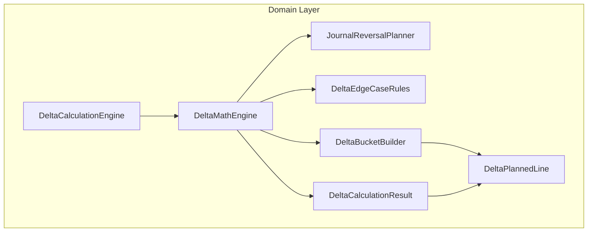
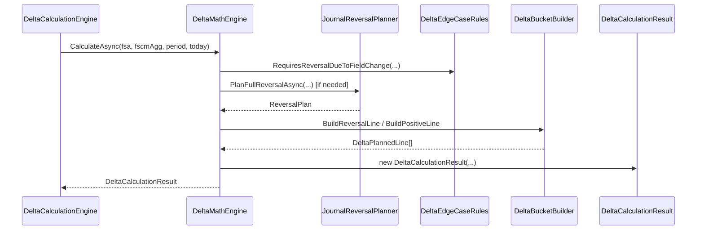

# DeltaMathEngine Feature Documentation

## Overview

The **DeltaMathEngine** orchestrates accrual delta calculations for work order lines by comparing incoming FSA snapshots against FSCM history. It applies business rules to determine whether to reverse, recreate, or adjust quantities, ensuring accurate journal entries. This component underpins the Accrual Orchestrator’s core domain logic.

By centralizing complex decision flows—such as field changes, inactive line handling, and idempotency guards—it simplifies higher-level facades and promotes single-responsibility design. Downstream services consume its output to build payloads for FSCM.

## Architecture Overview



## Component Structure

### Business Layer

#### **DeltaMathEngine** (`src/Rpc.AIS.Accrual.Orchestrator.Domain/Domain/Delta/DeltaMathEngine.cs`)

- **Responsibility:** Coordinates delta calculation workflow and applies business rules.
- **Dependencies:**- `JournalReversalPlanner` – plans full reversal buckets.
- `DeltaEdgeCaseRules` – detects field-change and reversal edge cases.
- `DeltaBucketBuilder` – builds reversal and positive planned lines.
- `AccountingPeriodSnapshot` – resolves transaction dates and closed periods.
- **Key Method:**- `CalculateAsync(...)` – computes a `DeltaCalculationResult` based on FSA and FSCM data.

##### Key Method: CalculateAsync

Orchestrates the full delta decision process in three main phases:

1. **Initialization & Validation**- Validates `fsa` and `period` arguments.
- Resolves transaction date via `period.ResolveTransactionDateUtcAsync`.
2. **Edge-Case Handling**- **ReverseOnly**: Inactive but not in a closed period; plans full reversal.
- **ReverseAndRecreate**: Field changes or inactive in closed period; may reverse and recreate or adjust delta only.
3. **Quantity Delta**- Calculates simple quantity difference when no reversals are required.

```csharp
internal static async Task<DeltaCalculationResult> CalculateAsync(
    JournalReversalPlanner reversalPlanner,
    FsaWorkOrderLineSnapshot fsa,
    FscmWorkOrderLineAggregation? fscmAgg,
    AccountingPeriodSnapshot period,
    DateTime today,
    CancellationToken ct,
    string? reasonPrefix = null)
```

- **Parameters:**- `reversalPlanner`: Plans date-based reversals.
- `fsa`: Snapshot of incoming work order line.
- `fscmAgg`: Aggregated FSCM history (nullable).
- `period`: Accounting period context.
- `today`: Current date fallback.
- `ct`: Cancellation token.
- `reasonPrefix`: Optional log prefix.
- **Returns:**

`DeltaCalculationResult` with decision, planned lines, and reason message.

## Data Models

### DeltaDecision Enum

Defines the action type for a work order line.

| Value | Description |
| --- | --- |
| **NoChange** (0) | No journal lines required. |
| **QuantityDelta** (1) | Only quantity adjustment line. |
| **ReverseAndRecreate** (2) | Reverse history then create updated line. |
| **ReverseOnly** (3) | Reverse all history (inactive scenario). |


### DeltaCalculationResult Record

Encapsulates the outcome of a delta calculation.

| Property | Type | Description |
| --- | --- | --- |
| `WorkOrderId` | `Guid` | Identifier of the work order. |
| `WorkOrderLineId` | `Guid` | Identifier of the work order line. |
| `Decision` | `DeltaDecision` | Chosen delta action. |
| `Lines` | `IReadOnlyList<DeltaPlannedLine>` | Planned reversal/adjustment lines. |
| `Reason` | `string` | Explanation for the decision. |


### DeltaPlannedLine Record

Represents a normalized journal line ready for payload construction.

| Property | Type | Description |
| --- | --- | --- |
| `TransactionDate` | `DateTime` | Date for the journal entry. |
| `Quantity` | `decimal` | Amount to post (positive or negative). |
| `CalculatedUnitPrice` | `decimal?` | Unit price effective for this line. |
| `ExtendedAmount` | `decimal?` | Computed total (Quantity × UnitPrice). |
| `LineProperty` | `string?` | Custom property tag. |
| `Department` | `string?` | Department code. |
| `ProductLine` | `string?` | Product line code. |
| `Warehouse` | `string?` | Warehouse identifier. |
| `IsReversal` | `bool` | Indicates reversal line. |
| `FromClosedPeriodSplit` | `bool` | Indicates split from a closed period reversal. |
| `LineReason` | `string` | Narrative reason for posting. |


## Sequence Diagram: Delta Calculation Flow



## Dependencies

- **JournalReversalPlanner**: Generates date-bucket reversal plans.
- **DeltaEdgeCaseRules**: Evaluates field-change and existing reversal conditions.
- **DeltaBucketBuilder**: Constructs reversal and positive planned lines.
- **AccountingPeriodSnapshot**: Determines open/closed status and maps operation dates to posting dates.
- **FsaWorkOrderLineSnapshot**: Encapsulates incoming FSA payload values and flags.
- **FscmWorkOrderLineAggregation**: Aggregates historical FSCM data, including quantities and buckets.

## Example Usage

```csharp
var engine = new DeltaCalculationEngine(reversalPlanner);
var result = await engine.CalculateAsync(
    fsaSnapshot,
    fscmAggregation,
    accountingPeriod,
    DateTime.UtcNow,
    cancellationToken,
    reasonPrefix: "WO:Item");
```

## Key Classes Reference

| Class | Location | Responsibility |
| --- | --- | --- |
| DeltaMathEngine | `src/Rpc.AIS.Accrual.Orchestrator.Domain/Domain/Delta/DeltaMathEngine.cs` | Orchestrates delta decision workflow. |
| DeltaCalculationResult | `src/Rpc.AIS.Accrual.Orchestrator.Domain/Domain/Delta/DeltaCalculationResult.cs` | Carries decision, planned lines, and reason. |
| DeltaPlannedLine | `src/Rpc.AIS.Accrual.Orchestrator.Domain/Domain/Delta/DeltaCalculationResult.cs` | Models a normalized journal line. |
| DeltaDecision | `src/Rpc.AIS.Accrual.Orchestrator.Domain/Domain/Delta/DeltaCalculationResult.cs` | Enumerates delta action types. |
| JournalReversalPlanner | `…/Core/Domain/Delta/JournalReversalPlanner.cs` | Plans full reversal date buckets. |
| DeltaEdgeCaseRules | `…/Core/Domain/Delta/DeltaEdgeCaseRules.cs` | Defines edge-case reversal rules. |
| DeltaBucketBuilder | `…/Core/Domain/Delta/DeltaBucketBuilder.cs` | Builds planned reversal and positive lines. |
