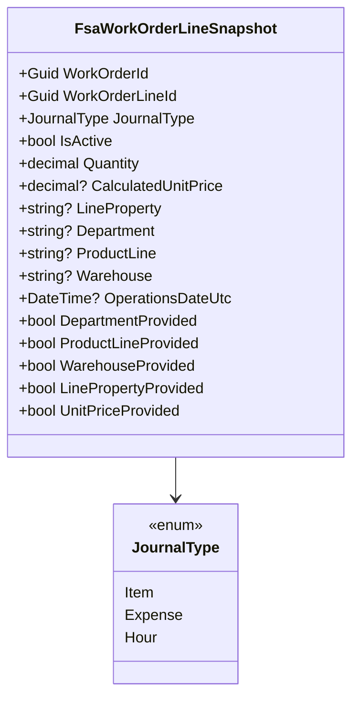

# FSA Work Order Line Snapshot Domain Model Documentation

## Overview

FsaWorkOrderLineSnapshot is a **domain model** that captures a normalized view of a Field Service (FSA) work order line, tailored specifically for delta evaluation and reversal logic. It records only the fields that matter when comparing incoming FSA data against existing FSCM history. Presence flags distinguish between values that are explicitly set to null and those omitted entirely in the payload.

This snapshot enables the delta engine to:

- Detect attribute changes (e.g., department, product line) that trigger journal reversals.
- Calculate quantity deltas for incremental postings.
- Preserve operation dates and unit prices supplied by FSA for accurate accrual processing.

## Architecture Overview

## Component Structure

### Domain Model

#### FsaWorkOrderLineSnapshot (`src/Rpc.AIS.Accrual.Orchestrator.Domain/Domain/Delta/FsaWorkOrderLineSnapshot.cs`)

- **Purpose:** Represents a canonical snapshot of an FSA work order line for delta calculation, including only fields that can trigger delta or reversal actions.
- **Responsibilities:**- Store FSA-supplied values (quantity, unit price, dimensions).
- Track which dimensions were explicitly provided versus omitted.
- Serve as input to the delta engine and bucket builder.

##### Properties

| Property | Type | Description |
| --- | --- | --- |
| WorkOrderId | Guid | Identifier of the parent work order. |
| WorkOrderLineId | Guid | Identifier of the specific work order line. |
| JournalType | JournalType | Type of journal (Item, Expense, Hour) for categorizing postings. |
| IsActive | bool | Indicates if the line is active (`true`) or inactive (`false`). |
| Quantity | decimal | Quantity value from FSA payload. |
| CalculatedUnitPrice | decimal? | Unit price for delta evaluation, combining explicit FSA price or FSCM fallback. |
| LineProperty | string? | FSA line property dimension. |
| Department | string? | FSA department dimension. |
| ProductLine | string? | FSA product line dimension. |
| Warehouse | string? | FSA warehouse dimension (only for Item journals). |
| OperationsDateUtc | DateTime? | FSA-provided operations date in UTC. |
| DepartmentProvided | bool | `true` if **Department** was present in the payload; distinguishes between omitted vs null. |
| ProductLineProvided | bool | `true` if **ProductLine** was present in the payload. |
| WarehouseProvided | bool | `true` if **Warehouse** was present in the payload. |
| LinePropertyProvided | bool | `true` if **LineProperty** was present in the payload. |
| UnitPriceProvided | bool | `true` if **CalculatedUnitPrice** was explicitly supplied by FSA. |

### Usage

- **Instantiation:** Created by `DeltaJournalSectionBuilder` when building per-line FSA snapshots for delta evaluation .
- **Consumption:** Passed into `DeltaCalculationEngine.CalculateAsync` to drive delta decision logic and into `DeltaBucketBuilder` to construct reversal or positive planned lines.

## Key Classes Reference

| Class | Location | Responsibility |
| --- | --- | --- |
| FsaWorkOrderLineSnapshot | `src/Rpc.AIS.Accrual.Orchestrator.Domain/Domain/Delta/FsaWorkOrderLineSnapshot.cs` | Captures FSA payload snapshot of a work order line for delta. |
| JournalType | `src/Rpc.AIS.Accrual.Orchestrator.Domain/Domain/JournalType.cs` | Enumerates supported journal types (Item, Expense, Hour). |
