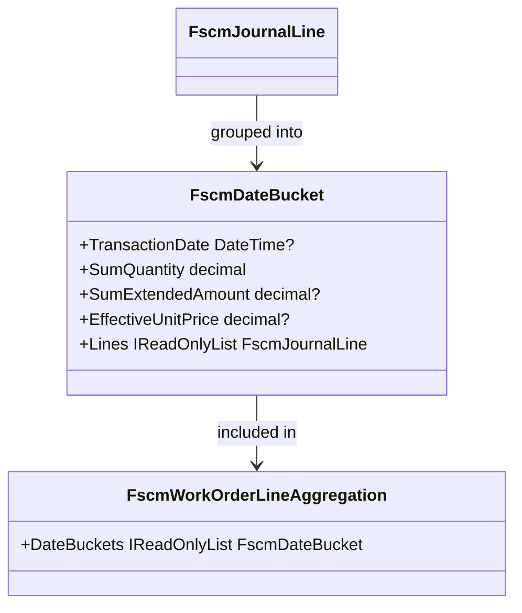

# FscmDateBucket Feature Documentation

## Overview

The **FscmDateBucket** record models a grouping of FSCM journal lines by a single transaction date (date-only). It captures aggregated quantities, amounts, and effective unit prices for all lines posted on that date. This structure underpins reversal planning and delta calculations by enabling the system to split history into date-based buckets for closed/open period processing.

## Architecture Overview 🔍

The diagram below shows how FSCM journal lines flow through aggregation into date buckets, which are then consumed by higher-level delta components.



## Component Structure

### 1. Domain Models

#### **FscmDateBucket** (`src/Rpc.AIS.Accrual.Orchestrator.Domain/Domain/Delta/FscmDateBucket.cs`)

A lightweight immutable container grouping all FSCM journal lines for a specific WorkOrder line and a given date.

- **TransactionDate**

The date (UTC) on which the journal lines were posted. Null if original date is unavailable.

- **SumQuantity**

Total quantity summed across all bucketed lines.

- **SumExtendedAmount**

Total extended amount summed across all bucketed lines, if present.

- **EffectiveUnitPrice**

The unit price derived from FSCM history or calculation, if determinable.

- **Lines**

The original `FscmJournalLine` entries belonging to this date bucket.

```csharp
public sealed record FscmDateBucket(
    DateTime? TransactionDate,
    decimal SumQuantity,
    decimal? SumExtendedAmount,
    decimal? EffectiveUnitPrice,
    IReadOnlyList<FscmJournalLine> Lines
);
```

Each property is auto-implemented by the C# 9 record syntax .

### 2. Aggregation Logic

#### **FscmJournalAggregator** (`.../FscmJournalAggregator.cs`)

- **Purpose:** Collects all `FscmJournalLine` entries for a WorkOrder, groups them first by WorkOrderLineId, then by `TransactionDate?.Date` to produce a list of `FscmDateBucket`.
- **Key Method:**

```csharp
  public static IReadOnlyDictionary<Guid, FscmWorkOrderLineAggregation> GroupByWorkOrderLine(
      IReadOnlyList<FscmJournalLine> journalLines)
```

Within this method, date buckets are built as:

```csharp
  var byDate = g
      .GroupBy(x => x.TransactionDate?.Date)
      .Select(gg => new FscmDateBucket(
          TransactionDate: gg.Key,
          SumQuantity: gg.SumSafeQty(),
          SumExtendedAmount: gg.SumSafeExtAmount(),
          EffectiveUnitPrice: gg.EffectiveUnitPriceOrNull(),
          Lines: gg.ToList()
      ))
      .OrderBy(b => b.TransactionDate ?? DateTime.MinValue)
      .ToList();
```

### 3. Downstream Consumers

- **FscmWorkOrderLineAggregation**

Holds a `DateBuckets` property of type `IReadOnlyList<FscmDateBucket>` for reversal planning and delta workflows .

- **JournalReversalPlanner**

Receives `DateBuckets` to determine how much to reverse per date, respecting closed/open period split rules .

- **DeltaMathEngine & DeltaBucketBuilder**

Leverage `SumQuantity` and `EffectiveUnitPrice` from each bucket to construct reversal and positive delta lines.

## Data Model: FscmDateBucket Properties

| Property | Type | Description |
| --- | --- | --- |
| **TransactionDate** | `DateTime?` | Date-only UTC when lines were posted (null if missing). |
| **SumQuantity** | `decimal` | Aggregated quantity of all lines in this bucket. |
| **SumExtendedAmount** | `decimal?` | Aggregated extended amount, if any lines contain it. |
| **EffectiveUnitPrice** | `decimal?` | Derived or posted unit price for bucketed lines; null if indeterminate. |
| **Lines** | `IReadOnlyList<FscmJournalLine>` | Original journal line entities comprising this date bucket. |


## Class Reference

| Class | Location | Responsibility |
| --- | --- | --- |
| **FscmDateBucket** | `Domain/Delta/FscmDateBucket.cs` | Group FSCM lines by date for delta and reversal planning. |


## Dependencies

- **Rpc.AIS.Accrual.Orchestrator.Core.Domain.FscmJournalLine** – used as the element type for the `Lines` collection.
- **System** and **System.Collections.Generic** – built-in namespaces supporting `DateTime`, `decimal`, and generic collections.

## Testing Considerations

- Ensure `FscmJournalAggregator.GroupByWorkOrderLine` creates the correct number of `FscmDateBucket` instances.
- Verify `SumQuantity`, `SumExtendedAmount`, and `EffectiveUnitPrice` calculations align with expected aggregation logic.

## Caching Strategy

## Error Handling

No explicit validation; missing dates or amounts result in null values, which higher-level components must handle.