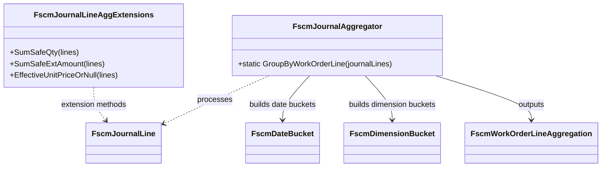

# FSCM Journal Aggregator 📦

## Overview

The **FscmJournalAggregator** class transforms raw FSCM journal lines into structured, per-line aggregations. These aggregations power downstream delta calculations and reversal planning in the accrual orchestrator. By grouping entries by work-order line and summarizing dates, dimensions, and amounts, it provides a deterministic audit trail of financial changes.

This component lives in the **Domain** layer under `Rpc.AIS.Accrual.Orchestrator.Core.Domain.Delta`. It has no external dependencies beyond core domain types and LINQ, ensuring a clean separation of concerns.

---

## Architecture Overview



---

## Component Structure

### 1. Aggregator Class

#### **FscmJournalAggregator** (`src/Rpc.AIS.Accrual.Orchestrator.Domain/Domain/Delta/FscmJournalAggregator.cs`)

- **Purpose:**- Group raw FSCM journal lines by `WorkOrderLineId`.
- Summarize transactions into date-based and dimension-based buckets.
- Compute totals and select a representative snapshot for reversal payloads.

#### Public Method

| Method | Signature | Description |
| --- | --- | --- |
| GroupByWorkOrderLine | `IReadOnlyDictionary<Guid, FscmWorkOrderLineAggregation> GroupByWorkOrderLine(IReadOnlyList<FscmJournalLine> journalLines)` | Validates input, groups by line ID, builds buckets, computes totals, and picks representative snapshot. |


#### Private Helpers

- **GetRepresentativeLine**

Selects the “best” journal line for reversal mapping, preferring one with a `PayloadSnapshot`, and for item journals, one that includes `Warehouse`.

- **BuildSignature**

Generates a string key combining department, product line, warehouse (item only), line property, and unit price. Used to detect dimension changes.

---

### 2. Extension Methods

#### **FscmJournalLineAggExtensions** (same file)

Provides safe aggregation over sequences of `FscmJournalLine`.

| Method | Signature | Description |
| --- | --- | --- |
| SumSafeQty | `decimal SumSafeQty(this IEnumerable<FscmJournalLine> lines)` | Sums `Quantity` across all lines. |
| SumSafeExtAmount | `decimal? SumSafeExtAmount(this IEnumerable<FscmJournalLine> lines)` | Sums non-null `ExtendedAmount`; returns `null` if none present. |
| EffectiveUnitPriceOrNull | `decimal? EffectiveUnitPriceOrNull(this IEnumerable<FscmJournalLine> lines)` | If all non-null prices agree, returns that price; else computes `TotalExtendedAmount/Quantity`. |


---

## Data Models Referenced

| Model | Location | Responsibility |
| --- | --- | --- |
| FscmJournalLine | `Core.Domain.FscmJournalLine` | Raw journal entry fetched from FSCM, with fields like `WorkOrderLineId`, `Quantity`, `Department`, etc. |
| FscmDateBucket | `Core.Domain.Delta.FscmDateBucket` | Groups lines by transaction date; holds summed quantity, extended amount, effective price, and original lines. |
| FscmDimensionBucket | `Core.Domain.Delta.FscmDimensionBucket` | Buckets lines by reversal-triggering attributes: department, product line, warehouse (item only), line property, price. |
| FscmWorkOrderLineAggregation | `Core.Domain.Delta.FscmWorkOrderLineAggregation` | Aggregated view per work-order line; combines totals, signatures, buckets, and a representative snapshot. |


---

## Usage Example

```csharp
using Rpc.AIS.Accrual.Orchestrator.Core.Domain.Delta;

// Suppose `journalLines` is fetched via IFscmJournalFetchClient
IReadOnlyList<FscmJournalLine> journalLines = await client.FetchByWorkOrdersAsync(...);

// Aggregate per work-order line
var aggregations = FscmJournalAggregator.GroupByWorkOrderLine(journalLines);

// Inspect one aggregation
if (aggregations.TryGetValue(someLineId, out var agg))
{
    Console.WriteLine($"Total Qty: {agg.TotalQuantity}, Buckets: {agg.DimensionBuckets.Count}");
}
```

---

## Error Handling

- **Null Input:**

`GroupByWorkOrderLine` throws `ArgumentNullException` if `journalLines` is `null`.

- **Empty List:**

Returns an empty dictionary when `journalLines.Count == 0`.

---

## Dependencies

- **.NET BCL:** LINQ, System collections, `ArgumentNullException`.
- **Domain Types:**

`FscmJournalLine`, `FscmWorkOrderLineAggregation`, `FscmDateBucket`, `FscmDimensionBucket`, and `JournalType`.

---

## Testing Considerations 🧪

- **Null argument** ➔ expect `ArgumentNullException`.
- **Empty list** ➔ expect empty result.
- **Single vs multiple journal lines** ➔ verify correct bucket counts.
- **Multiple prices** ➔ ensure `EffectiveUnitPriceOrNull` returns `null` when divergent.
- **Item vs Expense/Hour journals** ➔ warehouse grouping only for `JournalType.Item`.