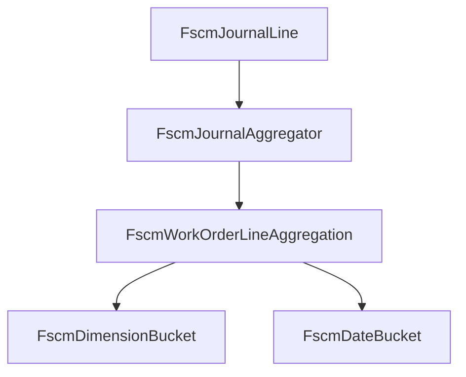

# FSCM Work Order Line Aggregation Feature Documentation

## Overview

This feature defines the domain model for  FSCM (Field Service Common Model) journal history at the work-order-line level. It captures both

- **date-based buckets** for closed vs. open-period reversal planning, and
- **dimension-based buckets** keyed by attributes that trigger reversals.

By grouping journal lines into these buckets, the system can deterministically compute deltas and plan reversals when key attributes (department, product line, line property, unit price) change or when lines become inactive.

## Architecture Overview



## Component Structure

### 1. Data Models

#### FscmDimensionBucket (`src/Rpc.AIS.Accrual.Orchestrator.Domain/Domain/Delta/FscmWorkOrderLineAggregation.cs`)

- **Purpose:** Represents a second-level grouping of FSCM journal lines by reversal-triggering attributes.
- **Key Properties:**

| Property | Type | Description |
| --- | --- | --- |
| Department | string? | Formatted or ID value of the rpc_department |
| ProductLine | string? | Formatted or ID value of the rpc_productline |
| Warehouse | string? | Warehouse identifier (only for Item journals; grouping key) |
| LineProperty | string? | Formatted or ID value of msdyn_lineproperty |
| CalculatedUnitPrice | decimal? | rpc_calculatedunitprice used for grouping |
| SumQuantity | decimal | Total quantity across all lines in this bucket |
| SumExtendedAmount | decimal? | Total extended amount (sum of ExtendedAmount when present) |
| TransactionDates | IReadOnlyList\<DateTime?> | Distinct transaction dates (date-only) for lines in the bucket |


#### FscmWorkOrderLineAggregation (`src/Rpc.AIS.Accrual.Orchestrator.Domain/Domain/Delta/FscmWorkOrderLineAggregation.cs`)

- **Purpose:** Aggregated view of all FSCM journal history for a single work-order line.
- **Key Properties:**

| Property | Type | Description |
| --- | --- | --- |
| WorkOrderLineId | Guid | Unique identifier of the work-order line |
| WorkOrderId | Guid | Identifier of the parent work order |
| JournalType | JournalType | Enum indicating Item, Expense, or Hour journal |
| TotalQuantity | decimal | Net sum of all quantities in journal history |
| TotalExtendedAmount | decimal? | Net sum of all extended amounts |
| EffectiveUnitPrice | decimal? | Computed unit price when a single distinct price exists or derived from totals |
| DimensionSignatures | IReadOnlyList\<string> | Distinct signatures of reversal-triggering attributes (dept, prod line, line property, price) |
| DateBuckets | IReadOnlyList\<FscmDateBucket> | Buckets grouped by transaction date, used for planning reversals by closed vs open period |
| DimensionBuckets | IReadOnlyList\<FscmDimensionBucket> | Second-level buckets by attribute combinations with aggregated sums |
| RepresentativeSnapshot | FscmReversalPayloadSnapshot? | Optional snapshot of a representative journal line for mapping reversal payloads |


### 2. Dependencies

> **Backwards Compatibility:** A secondary constructor omits `DimensionBuckets` and `RepresentativeSnapshot` for legacy call sites.

- **JournalType** (`Rpc.AIS.Accrual.Orchestrator.Core.Domain`): Enum for journal categories.
- **FscmDateBucket** (`FscmDateBucket.cs`): Daily aggregation bucket record.
- **FscmReversalPayloadSnapshot**: Snapshot of FSCM payload fields for reversal mapping.

## Key Classes Reference

| Class | Location | Responsibility |
| --- | --- | --- |
| FscmDimensionBucket | src/Rpc.AIS.Accrual.Orchestrator.Domain/Domain/Delta/FscmWorkOrderLineAggregation.cs | Defines aggregates per attribute combination |
| FscmWorkOrderLineAggregation | src/Rpc.AIS.Accrual.Orchestrator.Domain/Domain/Delta/FscmWorkOrderLineAggregation.cs | Encapsulates full aggregation of FSCM journal lines for one WO line |


## Data Models

##### FscmDimensionBucket Example

```csharp
public sealed record FscmDimensionBucket(
    string? Department,
    string? ProductLine,
    string? Warehouse,
    string? LineProperty,
    decimal? CalculatedUnitPrice,
    decimal SumQuantity,
    decimal? SumExtendedAmount,
    IReadOnlyList<DateTime?> TransactionDates
);
```

##### FscmWorkOrderLineAggregation Example

```csharp
public sealed record FscmWorkOrderLineAggregation(
    Guid WorkOrderLineId,
    Guid WorkOrderId,
    JournalType JournalType,
    decimal TotalQuantity,
    decimal? TotalExtendedAmount,
    decimal? EffectiveUnitPrice,
    IReadOnlyList<string> DimensionSignatures,
    IReadOnlyList<FscmDateBucket> DateBuckets,
    IReadOnlyList<FscmDimensionBucket> DimensionBuckets,
    FscmReversalPayloadSnapshot? RepresentativeSnapshot = null
);
```

## Testing Considerations

- Validate grouping logic by constructing lists of `FscmJournalLine` with varied dates and attributes.
- Ensure that `DimensionSignatures` accurately reflects distinct combinations.
- Confirm fallback constructor populates `DimensionBuckets` as an empty list.

## Caching Strategy

## Error Handling

- No error handling is implemented in these immutable records.
- Null checks and argument validation occur in the aggregator service, not here.

## Integration Points

- **FscmJournalAggregator** calls these records to build aggregation maps.
- **DeltaMathEngine** and **DeltaBucketBuilder** consume `FscmWorkOrderLineAggregation` for reversal and delta computations.

## Dependencies

- .NET System libraries
- Rpc.AIS.Accrual.Orchestrator.Core.Domain namespace types (JournalType, FscmReversalPayloadSnapshot)