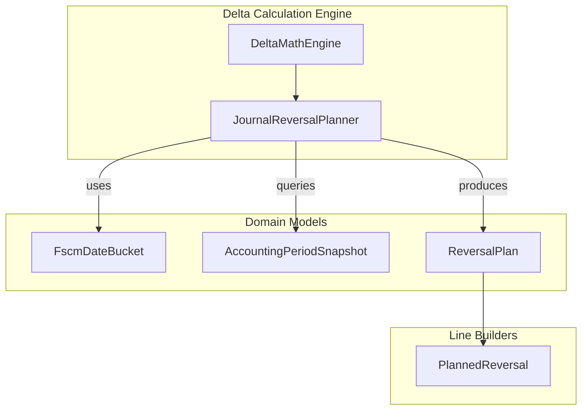
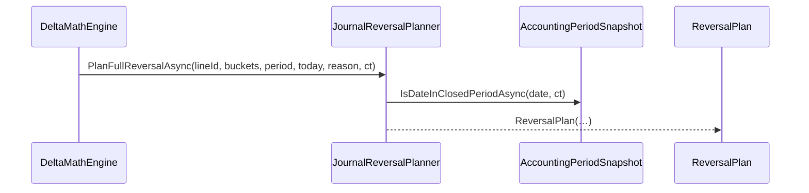
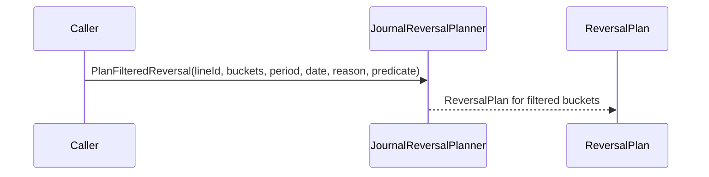

# Journal Reversal Planner Feature Documentation

## Overview 💡

The **JournalReversalPlanner** orchestrates the creation of reversal journal lines for a given work order line based on existing FSCM history. It ensures that closed‐period entries are reversed at the first day of the current open period, while open‐period entries use a caller‐specified date. This planner supports both full and filtered reversals, providing a deterministic way to net out quantities and prevent duplicate postings .

## Architecture Overview 🏛️



## Component Structure

### **JournalReversalPlanner** (`src/Rpc.AIS.Accrual.Orchestrator.Domain/Domain/Delta/JournalReversalPlanner.cs`)

- **Purpose**: Compute reversal plans that zero out net FSCM‐posted quantities, splitting by closed vs. open periods.
- **Responsibilities**:- Aggregate net quantities across date buckets.
- Detect closed‐period activity to adjust reversal dates.
- Provide both full and predicate‐filtered reversal plans.
- **Key Methods**:

| Method | Description | Returns |
| --- | --- | --- |
| PlanFullReversalAsync 📝 | Plan a single reversal to net all historical quantities; respects closed/open splitting. | `Task<ReversalPlan>` |
| PlanFilteredReversal | Plan reversals only for history lines matching a given predicate; synchronous facade. | `ReversalPlan` |


#### PlanFullReversalAsync

```csharp
public static async Task<ReversalPlan> PlanFullReversalAsync(
    Guid workOrderLineId,
    IReadOnlyList<FscmDateBucket> dateBuckets,
    AccountingPeriodSnapshot period,
    DateTime openPeriodReversalDate,
    string reason,
    CancellationToken ct)
```

- **Validations**:- Throws if `workOrderLineId` is empty, `dateBuckets` or `period` is null.
- Defaults empty `reason` to `"Reversal"`.
- **Logic**:1. Sum `SumQuantity` across `dateBuckets`; detect any closed‐period dates via `period.IsDateInClosedPeriodAsync`.
2. If net quantity ≤ 0, return no reversals.
3. Date single reversal line at `period.CurrentOpenPeriodStartDate` if closed activity exists, else `openPeriodReversalDate`.
4. Quantity reversed is negative of net sum.

#### PlanFilteredReversal

```csharp
public static ReversalPlan PlanFilteredReversal(
    Guid workOrderLineId,
    IReadOnlyList<FscmDateBucket> dateBuckets,
    AccountingPeriodSnapshot period,
    DateTime openPeriodReversalDate,
    string reason,
    Func<FscmJournalLine, bool> includeLinePredicate)
```

- **Purpose**: Reverse only those FSCM lines satisfying `includeLinePredicate`, leaving others intact.
- **Behavior**: Builds filtered date buckets, then delegates to `PlanFullReversalAsync` synchronously.

## Data Models

### **ReversalPlan** (`src/.../ReversalPlan.cs`)

| Property | Type | Description |
| --- | --- | --- |
| `WorkOrderLineId` | `Guid` | Identifier of the work order line. |
| `TotalQuantityToReverse` | `decimal` | Net quantity planned for reversal (positive). |
| `Reversals` | `IReadOnlyList<PlannedReversal>` | Collection of individual reversal entries. |


### **PlannedReversal**

| Property | Type | Description |
| --- | --- | --- |
| `TransactionDate` | `DateTime` | Date to post the reversal line (adjusted for closed/open split). |
| `Quantity` | `decimal` | Negative quantity to reverse. |
| `FromClosedPeriod` | `bool` | Indicates if this reversal covers closed‐period postings. |
| `Reason` | `string` | Audit/telemetry reason string. |


## Feature Flows

### 1. Full Reversal Flow



- **DeltaMathEngine** invokes the planner when a line requires a full reversal.
- The planner queries the period for closed‐period detection.
- Returns a `ReversalPlan` with one reversal entry.

### 2. Filtered Reversal Flow



- Filters FSCM lines by the given predicate.
- Internally calls the full reversal logic on the filtered set.

## Key Classes Reference

| Class | Location | Responsibility |
| --- | --- | --- |
| JournalReversalPlanner | Domain/Delta/JournalReversalPlanner.cs | Plans reversal journal lines with closed/open period splitting. |
| ReversalPlan | Domain/Delta/ReversalPlan.cs | DTO capturing work order line ID and reversal entries. |
| PlannedReversal | Domain/Delta/ReversalPlan.cs | DTO representing a single reversal line. |


## Error Handling

- **ArgumentException** thrown if `workOrderLineId` is `Guid.Empty`.
- **ArgumentNullException** thrown for null `dateBuckets`, `period`, or `includeLinePredicate`.
- Net quantity ≤ 0 short‐circuits to an empty plan, avoiding harmful over‐reversal.

## Dependencies

- **FscmDateBucket**: Supplies historical quantity buckets per transaction date.
- **AccountingPeriodSnapshot**: Provides:- `CurrentOpenPeriodStartDate`
- `IsDateInClosedPeriodAsync` to classify closed vs. open dates.
- **ReversalPlan** & **PlannedReversal**: Models returned by the planner.

## Testing Considerations

- The planner is exercised via domain‐level tests using a test double `AlwaysOpenAccountingPeriodClient` that returns an always‐open snapshot, ensuring predictable date logic.
- Edge cases:- No history (`dateBuckets.Count == 0`)
- Net quantity ≤ 0 (already reversed)
- Closed‐period detection varying by `ClosedReversalDateStrategy`.

---

This documentation covers the purpose, design, and usage of the **JournalReversalPlanner** within the Delta orchestration domain, providing clarity on how reversal plans are computed and integrated into the broader accrual engine.