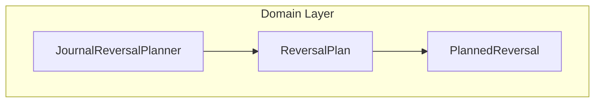

# 🔄 Reversal Plan Domain Model Feature Documentation

## Overview

The **Reversal Plan** domain model encapsulates the output of the `JournalReversalPlanner` logic. It provides a clear, structured plan for reversing previously posted FSCM journal entries for a specific WorkOrder line, respecting open and closed accounting periods. By modeling both the aggregate quantity and the individual reversal details, downstream processes can generate precise negative journal lines to correct historical postings and maintain financial integrity.

## Architecture Overview



## Component Structure

### Domain Layer

#### **ReversalPlan** (`src/Rpc.AIS.Accrual.Orchestrator.Core.Domain.Delta/ReversalPlan.cs`)

- **Purpose**: Aggregates the net reversal instructions for a WorkOrder line.
- **Definition**:

```csharp
  public sealed record ReversalPlan(
      Guid WorkOrderLineId,
      decimal TotalQuantityToReverse,
      IReadOnlyList<PlannedReversal> Reversals
  );
```

- **Properties**:- **WorkOrderLineId** (Guid)

Unique identifier of the WorkOrder line to reverse.

- **TotalQuantityToReverse** (decimal)

Net sum of all quantities that need reversal.

- **Reversals** (IReadOnlyList\<PlannedReversal\>)

Detailed list of individual reversal entries.

#### **PlannedReversal** (`src/Rpc.AIS.Accrual.Orchestrator.Core.Domain.Delta/ReversalPlan.cs`)

- **Purpose**: Represents a single reversal journal entry.
- **Definition**:

```csharp
  public sealed record PlannedReversal(
      DateTime TransactionDate,
      decimal Quantity,
      bool FromClosedPeriod,
      string Reason
  );
```

- **Properties**:- **TransactionDate** (DateTime)

Date on which the reversal should be posted.

- **Quantity** (decimal)

Amount to reverse (typically negative).

- **FromClosedPeriod** (bool)

Indicates if this reversal targets a closed accounting period.

- **Reason** (string)

Contextual reason for audit and telemetry.

## Data Models Reference

| Model | Description |
| --- | --- |
| **ReversalPlan** | Encapsulates the reversal plan for a WorkOrder line. |
| **PlannedReversal** | Details an individual reversal journal entry. |


## Example Usage

```csharp
using Rpc.AIS.Accrual.Orchestrator.Core.Domain.Delta;

// Create a single reversal for 5 units dated today
var reversalEntry = new PlannedReversal(
    TransactionDate: DateTime.UtcNow.Date,
    Quantity: -5.0m,
    FromClosedPeriod: false,
    Reason: "NetFullReversal"
);

var plan = new ReversalPlan(
    WorkOrderLineId: Guid.NewGuid(),
    TotalQuantityToReverse: 5.0m,
    Reversals: new[] { reversalEntry }
);
```

## Key Classes Reference

| Class | Location | Responsibility |
| --- | --- | --- |
| **ReversalPlan** | `Core/Domain/Delta/ReversalPlan.cs` | Holds overall reversal quantity and reversal entries. |
| **PlannedReversal** | `Core/Domain/Delta/ReversalPlan.cs` | Describes each reversal line’s date, quantity, and reason. |


## Dependencies

- **Namespaces**:- `System`
- `System.Collections.Generic`
- **Consumer**:- Instantiated and returned by `JournalReversalPlanner` in the Delta workflow.

## Testing Considerations

- **Aggregate Consistency**: Verify that `TotalQuantityToReverse` equals the sum of absolute `Quantity` values in `Reversals`.
- **Closed/Open Split**: Ensure entries with `FromClosedPeriod = true` use the open-period start date.
- **Reason Annotation**: Confirm `Reason` strings include flags like `"(NetFullReversal; ClosedHistoryPresent)"` when applicable.