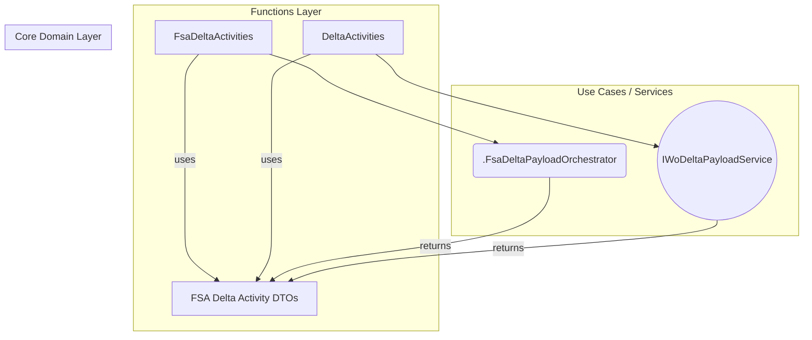
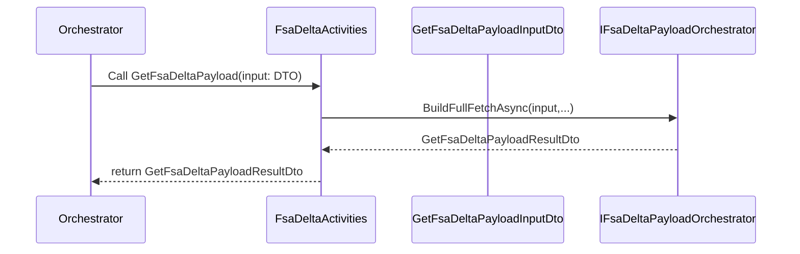
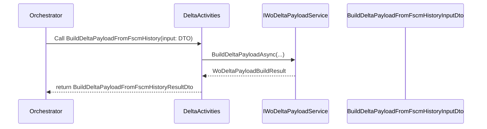

# FSA Delta Activities DTOs Feature Documentation

## Overview

The FSA Delta Activities DTOs define immutable data contracts for passing information between Durable Function activities and the core domain when fetching and processing Field Service (FSA) payloads.

They serve two main purposes:

- **GetFsaDeltaPayload**: encapsulates parameters and results for retrieving FSA delta snapshots from Dataverse.
- **BuildDeltaPayloadFromFscmHistory**: encapsulates parameters and results for comparing an FSA payload against FSCM journal history to produce a delta-only payload.

These DTOs ensure a stable, versioned interface between the Functions layer and the underlying orchestration/use-case logic, enabling clear separation of concerns and consistent logging/correlation across activities.

## Architecture Overview

## Component Structure

### Domain Layer: DTO Definitions (`src/Rpc.AIS.Accrual.Orchestrator.Domain/Domain/FsaDeltaActivityDtos.cs`)

#### GetFsaDeltaPayloadInputDto

Carries input parameters for the **GetFsaDeltaPayload** activity.

| Property | Type | Description |
| --- | --- | --- |
| RunId | string | Unique identifier for this pipeline run. |
| CorrelationId | string | Correlation key for distributed tracing. |
| TriggeredBy | string | Source of the trigger (e.g., “Timer”, “Http”). |
| WorkOrderGuid | string? | Optional FSA work order GUID to fetch single WO. |
| DurableInstanceId | string? | Identifier of the Durable Functions instance. |

#### GetFsaDeltaPayloadResultDto

Carries the result of the **GetFsaDeltaPayload** activity.

| Property | Type | Description |
| --- | --- | --- |
| PayloadJson | string | JSON payload of FSA data (Work Orders, lines). |
| ProductDeltaLinkAfter | string? | Continuation token for product delta (change tracking “@odata.nextLink”). |
| ServiceDeltaLinkAfter | string? | Continuation token for service delta. |
| WorkOrderNumbers | IReadOnlyList<string> | List of work order numbers included in the payload. |

#### BuildDeltaPayloadFromFscmHistoryInputDto

Carries input parameters for the **BuildDeltaPayloadFromFscmHistory** activity.

| Property | Type | Description |
| --- | --- | --- |
| RunId | string | Unique identifier for this pipeline run. |
| CorrelationId | string | Correlation key for distributed tracing. |
| TriggeredBy | string | Source of the trigger for delta build. |
| FsaPayloadJson | string | FSA payload JSON to compare against FSCM history. |
| DurableInstanceId | string? | Identifier of the Durable Functions instance. |

#### BuildDeltaPayloadFromFscmHistoryResultDto

Carries the result of the **BuildDeltaPayloadFromFscmHistory** activity.

| Property | Type | Description |
| --- | --- | --- |
| DeltaPayloadJson | string | JSON payload containing only the calculated delta. |
| WorkOrdersInInput | int | Number of work orders received from FSA input. |
| WorkOrdersInOutput | int | Number of work orders present in the delta payload. |
| DeltaLines | int | Count of new/changed journal lines. |
| ReverseLines | int | Count of reversal-only lines. |
| RecreateLines | int | Count of full-recreate lines. |

## Feature Flows

### 1. Fetch FSA Delta Payload Flow 📥

### 2. Build Delta Payload from FSCM History Flow 🔄

## Key Classes Reference

| Class | Location | Responsibility |
| --- | --- | --- |
| GetFsaDeltaPayloadInputDto | FsaDeltaActivityDtos.cs | Encapsulates input for fetching FSA delta payload. |
| GetFsaDeltaPayloadResultDto | FsaDeltaActivityDtos.cs | Encapsulates result of fetching FSA delta payload. |
| BuildDeltaPayloadFromFscmHistoryInputDto | FsaDeltaActivityDtos.cs | Encapsulates input for delta build against FSCM history. |
| BuildDeltaPayloadFromFscmHistoryResultDto | FsaDeltaActivityDtos.cs | Encapsulates result of building delta payload. |
| FsaDeltaActivities | FsaDeltaActivities.cs | Durable Activity wrapper for GetFsaDeltaPayload. |
| DeltaActivities | DeltaActivities.cs | Durable Activity wrapper for BuildDeltaPayloadFromFscmHistory. |

## Integration Points

- **Orchestrations** invoke **GetFsaDeltaPayload** and **BuildDeltaPayloadFromFscmHistory** in sequence.
- **IFsaDeltaPayloadOrchestrator** (Functions.Services) implements the core use-case logic for fetching FSA data.
- **IWoDeltaPayloadService** performs the JSON comparison against FSCM history.

## Dependencies

- Microsoft.Azure.Functions.Worker.Extensions.DurableTask
- Microsoft.Extensions.Logging
- Microsoft.Extensions.Options
- Rpc.AIS.Accrual.Orchestrator.Core.Services (payload orchestration, delta math)

## Testing Considerations

- Validate that the DTO properties correctly map to function parameters and logging scopes.
- Simulate null or empty `FsaPayloadJson` to ensure `BuildDeltaPayloadFromFscmHistory` handles empty input gracefully.
- Confirm that continuation tokens (`ProductDeltaLinkAfter`, `ServiceDeltaLinkAfter`) propagate correctly for paging tests.