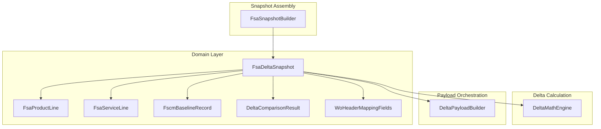

# Fsa Delta DTOs Feature Documentation

## Overview

The Fsa Delta DTOs define the core data structures used throughout the AIS Accrual Orchestrator for carrying **Field Service (FSA)** snapshot and delta information. These immutable records serve as the canonical payloads exchanged between:

- **Snapshot builders**, which parse raw JSON from Dataverse into strongly‐typed domain objects
- **Delta calculators**, which compare FSA snapshots against FSCM history
- **Payload orchestrators**, which assemble outbound JSON for journal posting

Together, they enable reliable detection of changes (additions, removals, updates) on work order lines and support enrichment of both product/service details and header‐level metadata.

## Architecture Overview

## Domain Models

### FsaDeltaSnapshot

📦 **Location:** `src/Rpc.AIS.Accrual.Orchestrator.Core.Domain/FsaDeltaDtos.cs`

Carries a complete snapshot of all lines for one work order.

| Property | Type | Description |
| --- | --- | --- |
| WorkOrderNumber | string | Business identifier for the work order |
| WorkOrderId | Guid | Unique GUID of the work order |
| InventoryProducts | IReadOnlyList\<FsaProductLine> | Item journal lines |
| NonInventoryProducts | IReadOnlyList\<FsaProductLine> | Expense journal lines |
| ServiceLines | IReadOnlyList\<FsaServiceLine> | Hour journal lines |
| Header | WoHeaderMappingFields? | Optional header metadata for payload injection |

### FsaProductLine

🛒 **Location:** same as above

Represents one product‐type journal line in the FSA snapshot.

| Property | Type | Description |
| --- | --- | --- |
| LineId | Guid | Unique identifier for the line |
| WorkOrderId | Guid | Parent work order GUID |
| WorkOrderNumber | string | Parent work order number |
| ProductId | Guid? | Dataverse product GUID |
| ItemNumber | string? | Product number |
| ProductType | string | “Inventory”, “Non-Inventory”, or “Unknown” |
| Quantity | decimal? | Quantity provided by FSA |
| UnitCost | decimal? | Cost per unit |
| FsaUnitPrice | decimal? | Dataverse unit price (msdyn_unitamount) |
| UnitAmount | decimal? | Extended total amount |
| Currency | string? | Currency code |
| Unit | string? | Unit of measure |
| JournalDescription | string? | Description text for the journal line |
| DiscountAmount | decimal? | Line‐level discount amount |
| DiscountPercent | decimal? | Line‐level discount percentage |
| SurchargeAmount | decimal? | Line‐level surcharge amount |
| SurchargePercent | decimal? | Line‐level surcharge percentage |
| CustomerProductReference | string? | Custom product reference for downstream lookup |
| CalculatedUnitPrice | decimal? | Enriched unit price for delta comparison |
| LineProperty | string? | Additional line property |
| Department | string? | Department dimension |
| ProductLine | string? | Product line dimension |
| Warehouse | string? | Warehouse identifier |
| Site | string? | Derived operational site |
| Location | string? | Physical location |
| IsActive | bool? | Active state flag |
| DataAreaId | string? | Dataverse data area identifier |
| Printable | bool? | Printable flag |
| TaxabilityType | string? | Line‐level taxability type |
| ProjectCategory | string? | FSCM‐derived project category |
| OperationsDateUtc | DateTime? | Original operations date for journal |

### FsaServiceLine

🔧 **Location:** same as above

Mirrors **FsaProductLine** but for service‐type (hour) journal lines.

| Property | Type | Description |
| --- | --- | --- |
| LineId | Guid | Unique service line identifier |
| WorkOrderId | Guid | Parent work order GUID |
| WorkOrderNumber | string | Parent work order number |
| ProductId | Guid? | Service product GUID |
| Duration | decimal? | Service duration in hours |
| UnitCost | decimal? | Cost per service unit |
| FsaUnitPrice | decimal? | Dataverse service rate |
| UnitAmount | decimal? | Extended service amount |
| Currency | string? | Currency code |
| Unit | string? | Unit of measure |
| JournalDescription | string? | Description text for the service line |
| DiscountAmount | decimal? | Discount amount |
| DiscountPercent | decimal? | Discount percentage |
| SurchargeAmount | decimal? | Surcharge amount |
| SurchargePercent | decimal? | Surcharge percentage |
| CustomerProductReference | string? | Service reference |
| CalculatedUnitPrice | decimal? | Enriched rate for delta logic |
| LineProperty | string? | Additional service line property |
| Department | string? | Department dimension |
| ProductLine | string? | Product line dimension |
| IsActive | bool? | Active state |
| DataAreaId | string? | Dataverse data area identifier |
| Printable | bool? | Printable flag |
| TaxabilityType | string? | Service taxability type |
| OperationsDateUtc | DateTime? | Original operations date |

### FscmBaselineRecord

📘 **Location:** same as above

Holds FSCM journal history baseline for one line.

| Property | Type | Description |
| --- | --- | --- |
| WorkOrderNumber | string | Work order identifier |
| JournalType | string | “Item”, “Expense”, or “Hour” |
| LineKey | string | Unique key for the journal line |
| Hash | string | Checksum of the baseline record |

### DeltaComparisonResult

📊 **Location:** same as above

Summarizes added/removed counts per journal type.

| Property | Type | Description |
| --- | --- | --- |
| WorkOrderNumber | string | Work order identifier |
| JournalType | string | Journal section (“Item”, “Expense”, “Hour”) |
| AddedOrChanged | int | Number of new or modified lines |
| Removed | int | Number of removed lines |

### WoHeaderMappingFields

🏷️ **Location:** same as above

Mapping‐only header fields fetched from Dataverse for payload injection.

| Property | Type | Description |
| --- | --- | --- |
| ActualStartDateUtc | DateTime? | Well actual start date |
| ActualEndDateUtc | DateTime? | Well actual end date |
| ProjectedStartDateUtc | DateTime? | Projected start date |
| ProjectedEndDateUtc | DateTime? | Projected end date |
| WellLatitude | decimal? | Well latitude |
| WellLongitude | decimal? | Well longitude |
| InvoiceNotesInternal | string? | Free-form internal notes |
| PONumber | string? | Purchase order number |
| DeclinedToSignReason | string? | Reason for declined signature |
| Department | string? | FSA department |
| ProductLine | string? | FSA product line |
| Warehouse | string? | FSA warehouse |
| FSATaxabilityType | string? | Header‐level taxability type |
| FSAWellAge | string? | Well age classification |
| FSAWorkType | string? | Well work type |
| Coountry | string? | Country region ID |
| County | string? | County name |
| State | string? | State name |

## Relationships

- **FsaDeltaSnapshot** composes- zero or more **FsaProductLine** (inventory/expense)
- zero or more **FsaServiceLine**
- an optional **WoHeaderMappingFields**

- **DeltaComparisonResult** and **FscmBaselineRecord** are standalone comparison helpers.

## Integration Points

- **FsaSnapshotBuilder** constructs `FsaDeltaSnapshot` from JSON documents
- **DeltaMathEngine** consumes `FsaWorkOrderLineSnapshot` (derived from these DTOs) to compute reversals and deltas
- **DeltaPayloadBuilder** serializes a list of `FsaDeltaSnapshot` into outbound JSON for FSCM posting

## Key Classes Reference

| Class | Location | Responsibility |
| --- | --- | --- |
| FsaDeltaSnapshot | `Domain/FsaDeltaDtos.cs` | Carries full FSA snapshot per work order |
| FsaProductLine | `Domain/FsaDeltaDtos.cs` | Represents individual product journal line |
| FsaServiceLine | `Domain/FsaDeltaDtos.cs` | Represents individual service journal line |
| FscmBaselineRecord | `Domain/FsaDeltaDtos.cs` | Holds FSCM baseline comparisons |
| DeltaComparisonResult | `Domain/FsaDeltaDtos.cs` | Summarizes added/removed line counts |
| WoHeaderMappingFields | `Domain/FsaDeltaDtos.cs` | Encapsulates header fields for payload enrichment |
