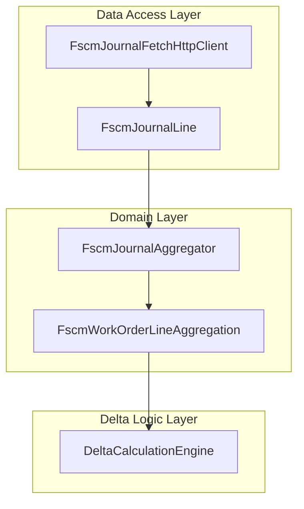

# FscmJournalLine Feature Documentation

## Overview

The **FscmJournalLine** record defines a normalized representation of an FSCM (Finance and Supply Chain Management) journal line used throughout AIS’s delta calculation and reversal planning logic. Incoming OData entity sets—covering Item, Expense, and Hour journals—are mapped into this shape by the fetch client. Downstream components aggregate and bucket these lines to drive business rules around closed/open periods and reversal-triggering dimension changes.

By centralizing common fields—quantities, unit prices, dimensions (department, product line, warehouse, line property), and transaction context—this model enables deterministic grouping, comparison, and snapshotting for accurate delta and reversal payloads. It forms the backbone of the domain layer’s journal history processing.

## Architecture Overview



## Component Structure

### 1. Data Access Layer

#### **FscmJournalFetchHttpClient** (`src/Rpc.AIS.Accrual.Orchestrator.Infrastructure/Adapters/Fscm/Clients/FscmJournalFetchHttpClient.cs`)

- Fetches raw journal lines via OData for a batch of Work Order GUIDs
- Normalizes each JSON record into an immutable **FscmJournalLine**

### 2. Domain Layer

#### **FscmJournalLine** (`src/Rpc.AIS.Accrual.Orchestrator.Domain/Domain/FscmJournalLine.cs`)

- **Purpose**

Represents a single FSCM journal entry in a form optimized for delta comparison and reversal planning.

- **Properties**

| Property | Type | Description |
| --- | --- | --- |
| JournalType | JournalType | The journal category (Item, Expense, or Hour). |
| WorkOrderId | Guid | Identifier of the related Work Order. |
| WorkOrderLineId | Guid | Identifier of the specific Work Order Line. |
| SubProjectId | string? | Subproject target for the line; used when posting customer change entries. |
| Quantity | decimal | The numeric quantity or hours value. |
| CalculatedUnitPrice | decimal? | Derived unit price for comparison/aggregation. |
| ExtendedAmount | decimal? | Line’s extended monetary amount; may be computed if missing in source. |
| Department | string? | Department dimension triggering reversal logic. |
| ProductLine | string? | Product line dimension triggering reversal logic. |
| Warehouse | string? | Warehouse dimension triggering reversal logic. |
| LineProperty | string? | Line property dimension triggering reversal logic. |
| TransactionDate | DateTime? | Posting date used to segment closed vs. open period history. |
| DataAreaId | string? | FSCM data area identifier for context. |
| SourceJournalNumber | string? | Original FSCM journal reference number. |
| PayloadSnapshot | FscmReversalPayloadSnapshot? | Optional snapshot of reversal-specific fields; populated when fetch policy requests mapping data. |


### 3. Delta Logic Layer

> **Note:** This record is immutable and designed for safe value comparisons in LINQ-based aggregations.

- **FscmJournalAggregator** groups and buckets **FscmJournalLine** instances by WorkOrderLineId, then further by date (`FscmDateBucket`) and dimensions (`FscmDimensionBucket`) to produce **FscmWorkOrderLineAggregation** objects.
- **DeltaCalculationEngine** consumes these aggregations alongside FSA snapshots to plan reversals and new postings.
- **JournalReversalPlanner** applies closed/open period and dimension-change rules to compute reversal plans.

## Data Models

#### JournalType (enum)

| Value | Description |
| --- | --- |
| Item | Inventory journal lines. |
| Expense | Expense journal lines. |
| Hour | Hour-based journal lines (time entries). |


Defined in `src/Rpc.AIS.Accrual.Orchestrator.Domain/Domain/JournalType.cs`.

#### FscmReversalPayloadSnapshot (record)

Carries reversal-mapping fields when the fetch policy includes snapshot data. Used by downstream payload builders. Defined in the same core domain namespace (not shown here).

## Key Classes Reference

| Class | Location | Responsibility |
| --- | --- | --- |
| FscmJournalLine | src/Rpc.AIS.Accrual.Orchestrator.Domain/Domain/FscmJournalLine.cs | Immutable DTO for normalized fetched journal lines. |
| FscmJournalFetchHttpClient | src/Rpc.AIS.Accrual.Orchestrator.Infrastructure/Adapters/Fscm/Clients/FscmJournalFetchHttpClient.cs | Retrieves and maps OData journal entries to FscmJournalLine. |
| FscmJournalAggregator | src/Rpc.AIS.Accrual.Orchestrator.Domain/Domain/Delta/FscmJournalAggregator.cs | Aggregates lines by WorkOrderLine and dimensions. |
| FscmDateBucket | src/Rpc.AIS.Accrual.Orchestrator.Domain/Domain/Delta/FscmDateBucket.cs | Buckets lines by transaction date. |
| FscmDimensionBucket | src/Rpc.AIS.Accrual.Orchestrator.Domain/Domain/Delta/FscmWorkOrderLineAggregation.cs | Buckets lines by reversal-triggering dimensions. |
| FscmWorkOrderLineAggregation | src/Rpc.AIS.Accrual.Orchestrator.Domain/Domain/Delta/FscmWorkOrderLineAggregation.cs | Aggregated view per WorkOrderLine, feeding delta logic. |
| DeltaCalculationEngine | src/Rpc.AIS.Accrual.Orchestrator.Core.Domain.Delta/DeltaCalculationEngine.cs | Drives delta decision workflow. |


## Dependencies

- Relies on the **JournalType** enum for classification.
- Interacts with **FscmReversalPayloadSnapshot** for reversal payloads.
- Consumed by aggregation and delta engine components in the core domain.

## Testing Considerations

While **FscmJournalLine** contains no behavior, it is central to unit tests that simulate FSCM history:

- Test builders create `new FscmJournalLine(...)` instances to model closed/open splits.
- Aggregator and planner tests assert correct bucketing and reversal planning based on these records.

### Example

```csharp
// Simulate two item lines on different dates
var history = new List<FscmJournalLine>
{
    new(JournalType.Item, woId, lineId, SubProjectId: null,
        Quantity: 1m, CalculatedUnitPrice: 10m, ExtendedAmount: null,
        Department: "0344", ProductLine: "119", Warehouse: null,
        LineProperty: "Bill", TransactionDate: new DateTime(2025,12,15),
        DataAreaId: "425", SourceJournalNumber: "J1"),
    new(JournalType.Item, woId, lineId, SubProjectId: null,
        Quantity: 2m, CalculatedUnitPrice: 10m, ExtendedAmount: null,
        Department: "0344", ProductLine: "119", Warehouse: null,
        LineProperty: "Bill", TransactionDate: new DateTime(2026,01,10),
        DataAreaId: "425", SourceJournalNumber: "J2"),
};
```

These records feed into `FscmJournalAggregator.GroupByWorkOrderLine(history)` to validate bucketing logic.