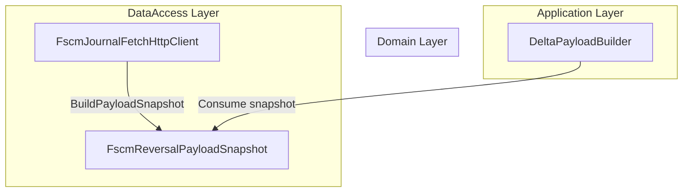

# FSCM Reversal Payload Snapshot Feature Documentation

## Overview

The **FscmReversalPayloadSnapshot** record represents a canonical snapshot of values retrieved from the FSCM system. It contains all fields required to construct reversal delta lines, ensuring AIS relies on the original FSCM data rather than any transformed FSA values. This snapshot drives the reversal logic in delta payload construction.

This model lives in the domain layer of the Accrual Orchestrator and is populated by the FSCM journal‐fetch adapter. Downstream components consume it to build JSON payloads for reversal operations.

## Architecture Overview

This component resides in the **Domain** layer. It interacts upstream with the FSCM HTTP client adapter and downstream with the delta payload builder in the application layer.



## Component Structure

### Domain Models

#### FscmReversalPayloadSnapshot (`src/Rpc.AIS.Accrual.Orchestrator.Domain/Domain/FscmReversalPayloadSnapshot.cs`)

- **Purpose:**

Carries all FSCM‐sourced values needed for reversal delta lines. Ensures reversal logic uses the original transaction data.

- **Characteristics:**- Immutable, value‐based equality via a C# `record`.
- Sealed to prevent inheritance.
- Positional parameters define the complete payload schema.

```csharp
public sealed record FscmReversalPayloadSnapshot(
    Guid WorkOrderLineId,
    string? Currency,
    string? DimensionDisplayValue,
    decimal? FsaUnitPrice,
    string? ItemId,
    string? ProjectCategory,
    string? JournalLineDescription,
    string? LineProperty,
    decimal Quantity,
    string? RcpCustomerProductReference,
    decimal? RpcDiscountAmount,
    decimal? RpcDiscountPercent,
    decimal? RpcMarkupPercent,
    decimal? RpcOverallDiscountAmount,
    decimal? RpcOverallDiscountPercent,
    decimal? RpcSurchargeAmount,
    decimal? RpcSurchargePercent,
    decimal? RpMarkUpAmount,
    DateTime? TransactionDate,
    DateTime? OperationDate,
    decimal? UnitAmount,
    decimal? UnitCost,
    bool? IsPrintable,
    string? UnitId,
    string? Warehouse,
    string? Site,
    string? FsaCustomerProductDesc,
    string? FsaTaxabilityType
);
```

##### Property Reference

| Property | Type | Description |
| --- | --- | --- |
| WorkOrderLineId | Guid | Identifier of the work order line |
| Currency | string? | FSCM currency code |
| DimensionDisplayValue | string? | Display value of the financial dimension |
| FsaUnitPrice | decimal? | Unit price as reported for FSA |
| ItemId | string? | Identifier for the item |
| ProjectCategory | string? | FSCM project category |
| JournalLineDescription | string? | Description from the FSCM journal line |
| LineProperty | string? | FSCM line property |
| Quantity | decimal | Quantity recorded in FSCM |
| RcpCustomerProductReference | string? | Unmapped customer product reference (if any) |
| RpcDiscountAmount | decimal? | Discount amount |
| RpcDiscountPercent | decimal? | Discount percentage |
| RpcMarkupPercent | decimal? | Markup percentage |
| RpcOverallDiscountAmount | decimal? | Overall discount amount |
| RpcOverallDiscountPercent | decimal? | Overall discount percentage |
| RpcSurchargeAmount | decimal? | Surcharge amount |
| RpcSurchargePercent | decimal? | Surcharge percentage |
| RpMarkUpAmount | decimal? | Markup amount |
| TransactionDate | DateTime? | Date of the original transaction |
| OperationDate | DateTime? | Operation date reported by FSCM |
| UnitAmount | decimal? | Amount per unit |
| UnitCost | decimal? | Cost per unit |
| IsPrintable | bool? | Indicates if line is printable |
| UnitId | string? | Unit of measure identifier |
| Warehouse | string? | Warehouse identifier |
| Site | string? | Site identifier |
| FsaCustomerProductDesc | string? | Customer product description |
| FsaTaxabilityType | string? | Taxability classification |


## Usage Context

- **Population:**

Created by the `FscmJournalFetchHttpClient.BuildPayloadSnapshot` method when journal rows contain reversal‐relevant fields.

- **Consumption:**- `DeltaJournalSectionBuilder` uses these snapshots to map reversal lines into the final JSON payload.
- `DeltaPayloadBuilder` merges snapshot data with delta logic to produce outbound reversal payloads.

## Design Details

- **Immutability:**

The record’s positional parameters enforce a complete and unchangeable snapshot once instantiated.

- **Value Semantics:**

Equality and hash code are based on property values, facilitating comparison during aggregation or deduplication.

- **Nullability:**

Many fields are nullable to distinguish “absent in FSCM” vs. explicit empty values.

## Key Classes Reference

| Class | Location | Responsibility |
| --- | --- | --- |
| FscmReversalPayloadSnapshot | src/Rpc.AIS.Accrual.Orchestrator.Domain/Domain/FscmReversalPayloadSnapshot.cs | Carries FSCM values for building reversal delta lines |


## Dependencies

- Relies solely on the .NET `System` namespace.
- No external packages or frameworks.

## Testing Considerations

- Ensure snapshots include all provided FSCM fields when mapping rows.
- Verify immutability and value‐equality behavior.
- Cover scenarios when optional fields are missing (null) to confirm downstream mapping handles absences correctly.