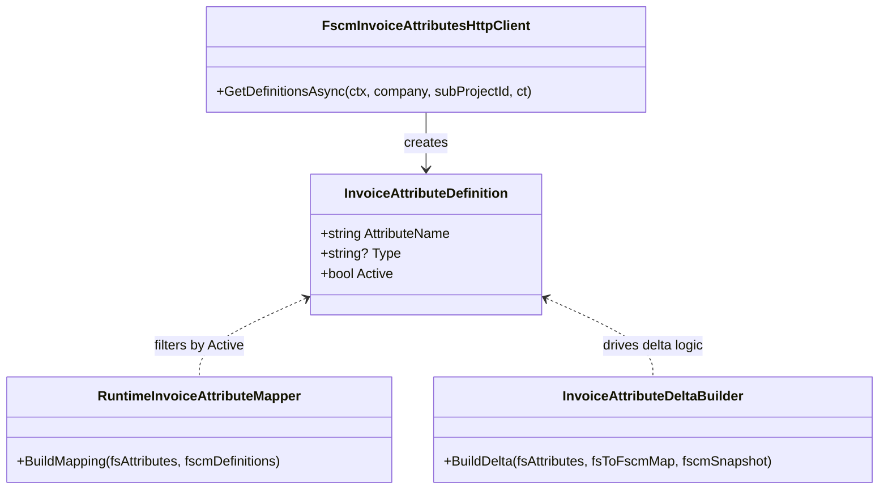

# InvoiceAttributeDefinition Feature Documentation

## Overview

`InvoiceAttributeDefinition` represents the minimal contract for an invoice attribute as returned by the FSCM “attribute table” endpoint. It captures the attribute’s name, an optional type identifier, and whether the attribute is currently active. This record underpins the runtime mapping and delta‐calculation logic in the accrual orchestrator, ensuring that only valid, active attributes flow through the posting pipeline.

## File Location

`src/Rpc.AIS.Accrual.Orchestrator.Domain/Domain/InvoiceAttributes/InvoiceAttributeDefinition.cs`

## Code Snippet

```csharp
namespace Rpc.AIS.Accrual.Orchestrator.Core.Domain.InvoiceAttributes;

/// <summary>
/// Minimal attribute definition returned by FSCM "attribute table" endpoint.
/// </summary>
public sealed record InvoiceAttributeDefinition(
    string AttributeName,
    string? Type = null,
    bool Active = true);
```

## Properties

| Property | Type | Description |
| --- | --- | --- |
| **AttributeName** | string | Logical name of the invoice attribute in FSCM. |
| **Type** | string? | (Optional) Data‐type or classification hint for the attribute. |
| **Active** | bool | Indicates if the attribute is enabled (defaults to `true`). |


## Usage 🚀

- **Definition Fetching:**

`FscmInvoiceAttributesHttpClient.GetDefinitionsAsync(...)` parses FSCM JSON into a list of `InvoiceAttributeDefinition` records.

- **Runtime Mapping:**

`RuntimeInvoiceAttributeMapper.BuildMapping(...)` filters and matches FS keys against active definitions.

- **Delta Computation:**

`InvoiceAttributeDeltaBuilder.BuildDelta(...)` uses the definitions to decide which attributes to include when computing changes.

## Relationships



## Key Points

- **Immutability:** As a C# `record`, instances are immutable, enabling safe sharing across threads.
- **Default Values:**- `Type` defaults to `null` when FSCM does not specify a type.
- `Active` defaults to `true`, so attributes are included unless explicitly deactivated.

```card
{
    "title": "Design Note",
    "content": "This record encapsulates only schema metadata; all business logic resides in mapping and delta-builder services."
}
```