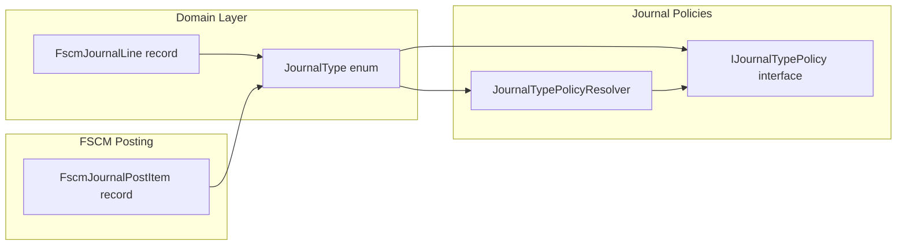

# JournalType Feature Documentation

## Overview

The **JournalType** enumeration defines the categories of journals processed by the Accrual Orchestrator. Each journal type corresponds to a specific payload structure and validation policy. This enum underpins how work-order lines are grouped, validated, and ultimately posted to the FSCM system.

By centralizing journal type values, the application ensures:

- Consistent section keys for JSON payloads
- Type-safe policy resolution and validation
- Clear mapping between domain models and external integrations

## Architecture Overview



## Component Structure

### 1. Domain Layer

#### **JournalType** (`src/Rpc.AIS.Accrual.Orchestrator.Domain/Domain/JournalType.cs`)

- **Purpose:** Enumerates the supported journal categories for accrual orchestration.
- **Location:** 
- **Usage:**- Key in `IJournalTypePolicy` implementations
- Property in `FscmJournalLine` domain record
- Determines JSON section key in posting payloads

```csharp
namespace Rpc.AIS.Accrual.Orchestrator.Core.Domain;

/// <summary>
/// Defines journal type values.
/// </summary>
public enum JournalType
{
    Item    = 1,
    Expense = 2,
    Hour    = 3
}
```

##### Enumeration Values

| Value | Numeric | Description |
| --- | --- | --- |
| Item | 1 | Inventory and material journal lines |
| Expense | 2 | Expense-based journal lines |
| Hour | 3 | Labor and time-based journal lines |


```card
{
    "title": "Enum Stability",
    "content": "Do not change numeric values of JournalType to maintain compatibility with existing data and integrations."
}
```

## Integration Points

- **IJournalTypePolicy**:

Policies implement `JournalType` to apply type-specific validation logic.

- **JournalTypePolicyResolver**:

Uses `JournalType` to locate the correct policy or fallback.

- **FscmJournalLine**:

Contains a `JournalType` property to tag each normalized journal entry.

- **FscmJournalPostItem**:

Serializes `JournalType` into the FSCM posting payload.

## Key Classes Reference

| Class/Interface | Location | Responsibility |
| --- | --- | --- |
| JournalType | src/Rpc.AIS.Accrual.Orchestrator.Domain/Domain/JournalType.cs | Defines the set of supported journal categories. |
| IJournalTypePolicy | src/Rpc.AIS.Accrual.Orchestrator.Application/Features/Journals/.../IJournalTypePolicy.cs | Contract for journal-type specific validation. |
| JournalTypePolicyResolver | src/Rpc.AIS.Accrual.Orchestrator.Application/Features/Journals/.../JournalTypePolicyResolver.cs | Resolves registered policies by `JournalType`. |
| FscmJournalLine | src/Rpc.AIS.Accrual.Orchestrator.Domain/Domain/FscmJournalLine.cs | Domain record representing a normalized journal line. |


## Dependencies

- This enum is consumed by:- **Validation Engine** via `IJournalTypePolicy`
- **Delta Calculation** through `FscmJournalLine` grouping
- **FSCM Posting** adapters for payload generation

## Testing Considerations

- Verify each `JournalType` maps to the correct `SectionKey` in `DefaultJournalTypePolicy`.
- Ensure adding new types fails at compile time unless policies and section keys are defined.
- Confirm `FscmJournalLine` parsing respects the enum values.