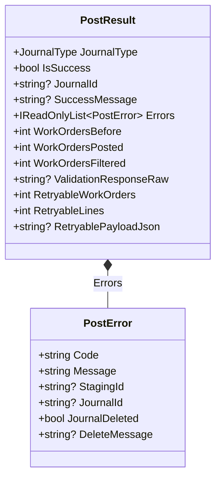

# 🏷️ PostResult Feature Documentation

## Overview

The **PostResult** feature defines two immutable domain models—`PostResult` and `PostError`—that capture the outcome of posting journal entries to an external FSCM (Financial Supply Chain Management) system.

- **`PostResult`** encapsulates summary data such as success status, created journal identifier, and work-order metrics.
- **`PostError`** carries granular error details for individual failures.

These records travel through the posting pipeline: created by `PostOutcomeProcessor`, optionally handled by `IPostResultHandler` implementations, and aggregated in a `RunOutcome` to determine overall success.

## Architecture Overview



## Domain Models

### 1. PostResult

> **Legend:** - Solid boxes represent domain record types. - The composition arrow indicates that `PostResult` holds a collection of `PostError` instances.

Encapsulates the result of posting one journal group (typically per `JournalType`).

| Property | Type | Description |
| --- | --- | --- |
| **JournalType** | `JournalType` | Enum indicating which journal group was posted. |
| **IsSuccess** | `bool` | `true` if posting succeeded; otherwise `false`. |
| **JournalId** | `string?` | Identifier returned by FSCM when creation succeeds; `null` on failure. |
| **SuccessMessage** | `string?` | Human-readable message when posting succeeds. |
| **Errors** | `IReadOnlyList<PostError>` | List of detailed errors captured during posting. |
| **WorkOrdersBefore** | `int` | Count of work orders considered before posting. |
| **WorkOrdersPosted** | `int` | Count of work orders successfully posted. |
| **WorkOrdersFiltered** | `int` | Count of work orders filtered out (e.g., empty or invalid). |
| **ValidationResponseRaw** | `string?` | Raw JSON/XML validation response from FSCM, if applicable. |
| **RetryableWorkOrders** | `int` | Number of work orders marked as retryable due to transient errors. |
| **RetryableLines** | `int` | Total lines across work orders marked for retry. |
| **RetryablePayloadJson** | `string?` | JSON payload prepared for retrying failed work orders. |


#### Code Snippet

```csharp
public sealed record PostResult(
    JournalType JournalType,
    bool IsSuccess,
    string? JournalId,
    string? SuccessMessage,
    IReadOnlyList<PostError> Errors,
    int WorkOrdersBefore = 0,
    int WorkOrdersPosted = 0,
    int WorkOrdersFiltered = 0,
    string? ValidationResponseRaw = null,
    int RetryableWorkOrders = 0,
    int RetryableLines = 0,
    string? RetryablePayloadJson = null);
```

---

### 2. PostError

Carries detailed error data for each failure encountered during posting.

| Property | Type | Description |
| --- | --- | --- |
| **Code** | `string` | Service-specific error code. |
| **Message** | `string` | Descriptive error message. |
| **StagingId** | `string?` | Identifier of the staging record related to this error, if any. |
| **JournalId** | `string?` | Journal identifier when error occurs after creation. |
| **JournalDeleted** | `bool` | `true` if the journal was rolled back/deleted due to error. |
| **DeleteMessage** | `string?` | Message explaining why the journal was deleted. |


#### Code Snippet

```csharp
public sealed record PostError(
    string Code,
    string Message,
    string? StagingId,
    string? JournalId,
    bool JournalDeleted,
    string? DeleteMessage);
```

## Integration Points

- **PostOutcomeProcessor**

Builds `PostResult` instances after HTTP calls and parsing, then invokes registered `IPostResultHandler` implementations for further actions (notifications, compensations, retries).

- **IPostResultHandler**

Receives each `PostResult` via `HandleAsync` when `CanHandle` returns `true`.

- **RunOutcome**

Aggregates a collection of `PostResult` objects to determine overall orchestration success.

## Usage Flow

1. The **posting client** triggers an HTTP call to FSCM.
2. `PostOutcomeProcessor` receives raw status and body.
3. It aggregates pre-errors, HTTP errors, parse errors, or marks success.
4. A `PostResult` is constructed and returned.
5. Registered post-result handlers run any follow-up logic.
6. All `PostResult` objects feed into a `RunOutcome` for final status.

## Error Handling

- **Transient vs. Permanent**:- Errors marked in `PostError` may include a `JournalDeleted` flag.
- `RetryableWorkOrders` and `RetryableLines` in `PostResult` indicate items safe to retry.
- **Aggregation**:- The `Errors` list captures both validation and HTTP-level problems.
- Client code can inspect `IsSuccess` and `Errors` to decide next steps.

## Dependencies

- **JournalType** (enum): groups postings by type.
- **IPostResultHandler**: extension point for post-processing.
- **RunOutcome**: upstream aggregator for overall process results.

## Key Classes Reference

| Class | Location | Responsibility |
| --- | --- | --- |
| **PostResult** | src/Rpc.AIS.Accrual.Orchestrator.Domain/Domain/PostResult.cs | Encapsulates a single journal posting outcome. |
| **PostError** | src/Rpc.AIS.Accrual.Orchestrator.Domain/Domain/PostResult.cs | Represents a specific error within a posting attempt. |
| **PostOutcomeProcessor** | src/.../Posting/PostOutcomeProcessor.cs | Converts HTTP responses into `PostResult` and dispatches handlers. |
| **IPostResultHandler** | src/.../Abstractions/IPostResultHandler.cs | Defines contract for post-posting follow-up actions. |
| **RunOutcome** | src/Rpc.AIS.Accrual.Orchestrator.Domain/Domain/RunOutcome.cs | Aggregates multiple `PostResult`s and validation failures. |


---

> 💡 **Note:** This feature sits entirely within the **Domain** layer. It provides immutable data carriers that facilitate clear separation between posting logic, error aggregation, and downstream processing.