# Accrual Orchestrator Core & Domain Documentation

## Overview

The Accrual Orchestrator coordinates fetching work-order data from FSCM/Dataverse, computes accrual deltas, validates payloads, and posts journals back to FSCM. It provides:

- **Context propagation** (`RunContext`) across steps for tracing and logging.
- **Domain models** (`RunOutcome`, `PostResult`, etc.) to encapsulate run summaries and outcomes.
- **Service contracts** in Core.Abstractions for delta building, payload validation, posting, and telemetry.
- **Infrastructure clients** to communicate with various FSCM endpoints.
- **Test utilities** to facilitate unit and integration testing.

This modular design ensures clear separation between domain modeling, orchestration logic, and external integrations.

## Architecture Overview

```mermaid
flowchart TB
  subgraph Domain
    RunContext[RunContext\nRun metadata]
    RunOutcome[RunOutcome\nOrchestration summary]
    PostResult[PostResult & PostError\nPosting outcome details]
    LegalNames[LegalEntityJournalNames\nJournal identifier config]
    StatusReq[StatusChangeRequest\nStatus change request]
    AccountSnap[AccountingPeriodSnapshot\nAccounting period context]
  end

  subgraph Abstractions
    SingleWO[ISingleWorkOrderPostingClient]
    Posting[IPostingClient]
    StatusSvc[IStatusChangeService]
    DeltaSvc[IWoDeltaPayloadService]
    ValidationClient[IFscmWoPayloadValidationClient]
    Notifier[IInvalidPayloadNotifier]
    JournalDesc[IJournalDescriptionBuilder]
    Telemetry[ITelemetry]
  end

  subgraph Infrastructure
    LogScope[LogScopeContext\nLogging scope fields]
    FscmStatus[FscmWorkOrderStatusUpdateHttpClient]
    FscmFetch[FscmJournalFetchHttpClient]
  end

  subgraph Testing
    TestCtx[TestFunctionContext\nFunctionContext for tests]
  end

  RunContext --> RunOutcome
  RunContext --> SingleWO
  SingleWO --> FscmStatus
  Posting --> FscmFetch
  RunContext --> ValidationClient
  RunContext --> DeltaSvc
  RunContext --> Notifier
  LogScope --> FscmStatus
  LogScope --> FscmFetch
```



## Component Structure

### 1. Domain Models

#### **RunContext** (`src/Rpc.AIS.Accrual.Orchestrator.Domain/Domain/RunContext.cs`)

Carries metadata for a single orchestration run, enabling correlation and tracing across components.

```csharp
public sealed record RunContext(
    string RunId,
    DateTimeOffset StartedAtUtc,
    string? TriggeredBy,
    string CorrelationId,
    string? SourceSystem = null,
    string? DataAreaId = null);
```

| Property | Type | Description |
| --- | --- | --- |
| **RunId** | string | Unique identifier for this run |
| **StartedAtUtc** | DateTimeOffset | UTC timestamp when the run began |
| **TriggeredBy** | string? | Origin of the trigger (e.g., Timer, HTTP) |
| **CorrelationId** | string | Correlation identifier for distributed traces |
| **SourceSystem** | string? | Optional source system code (e.g., “AIS”) |
| **DataAreaId** | string? | Optional FSCM data area identifier |


#### **RunOutcome** (`src/Rpc.AIS.Accrual.Orchestrator.Domain/Domain/RunOutcome.cs`)

Summarizes the results of the orchestration run, including counts, posting results, validation failures, and errors.

```csharp
public sealed record RunOutcome(
    RunContext Context,
    int StagingRecordsConsidered,
    int ValidRecords,
    int InvalidRecords,
    IReadOnlyList<PostResult> PostResults,
    IReadOnlyList<ValidationResult> ValidationFailures,
    IReadOnlyList<string> GeneralErrors,
    int WorkOrdersConsidered = 0,
    int WorkOrdersValid = 0,
    int WorkOrdersInvalid = 0)
{
    public bool HasAnyErrors =>
        InvalidRecords > 0
        || WorkOrdersInvalid > 0
        || PostResults.Any(r => !r.IsSuccess)
        || GeneralErrors.Count > 0;
}
```

| Parameter | Type | Description |
| --- | --- | --- |
| **Context** | RunContext | The run’s metadata |
| **StagingRecordsConsidered** | int | Number of staging records processed |
| **ValidRecords** | int | Number of records passing validation |
| **InvalidRecords** | int | Number of records failing validation |
| **PostResults** | IReadOnlyList<PostResult> | Results of journal posting |
| **ValidationFailures** | IReadOnlyList<ValidationResult> | Details of validation failures |
| **GeneralErrors** | IReadOnlyList<string> | Run-level error messages |
| **WorkOrdersConsidered** | int (optional) | Count used in WO-payload mode |
| **WorkOrdersValid** | int (optional) | Count used in WO-payload mode |
| **WorkOrdersInvalid** | int (optional) | Count used in WO-payload mode |


#### **PostResult** & **PostError** (`src/Rpc.AIS.Accrual.Orchestrator.Domain/Domain/PostResult.cs`)

Encapsulates the outcome of posting journal groups, with details on success, messages, and errors.

```csharp
public sealed record PostResult(
    JournalType JournalType,
    bool IsSuccess,
    string? JournalId,
    string? SuccessMessage,
    IReadOnlyList<PostError> Errors,
    int WorkOrdersBefore = 0,
    int WorkOrdersPosted = 0,
    int WorkOrdersFiltered = 0,
    string? ValidationResponseRaw = null,
    int RetryableWorkOrders = 0,
    int RetryableLines = 0,
    string? RetryablePayloadJson = null);

public sealed record PostError(
    string Code,
    string Message,
    string? StagingId,
    string? JournalId,
    bool JournalDeleted,
    string? DeleteMessage);
```

#### **LegalEntityJournalNames** (`src/Rpc.AIS.Accrual.Orchestrator.Domain/Domain/LegalEntityJournalNames.cs`)

Holds FSCM journal name identifiers per legal entity.

```csharp
public sealed record LegalEntityJournalNames(
    string? ExpenseJournalNameId,
    string? HourJournalNameId,
    string? InventJournalNameId);
```

#### **StatusChangeRequest** (`src/Rpc.AIS.Accrual.Orchestrator.Domain/Domain/StatusChangeRequest.cs`)

Carries data for a status update request to FSCM.

```csharp
public sealed record StatusChangeRequest(
    string EntityName,
    string RecordId,
    string OldStatus,
    string NewStatus,
    string? Message,
    string? RunId,
    string? CorrelationId,
    object? Payload);
```

#### **AccountingPeriodSnapshot** (`src/Rpc.AIS.Accrual.Orchestrator.Domain/Domain/Delta/AccountingPeriodSnapshot.cs`)

Represents accounting period context for reversal dating rules.

### 2. Core Abstractions

> *Details omitted for brevity.*

A suite of service contracts defines extensibility and integration points. Key interfaces include:

| Interface | Purpose |
| --- | --- |
| **ISingleWorkOrderPostingClient** | Post a single WO payload |
| **IPostingClient** | Post staging records grouped by journal type |
| **IStatusChangeService** | Handle status change events |
| **IWoDeltaPayloadService** | Build delta payload from raw WO JSON |
| **IFscmWoPayloadValidationClient** | Call FSCM custom WO-payload validation endpoint |
| **IInvalidPayloadNotifier** | Notify on invalid work orders/lines |
| **IJournalDescriptionBuilder** | Construct journal descriptions for postings |
| **IPostResultHandler** | Post-processing after a posting attempt |
| **ITelemetry** | Log custom JSON telemetry events |


### 3. Infrastructure Logging

#### **LogScopeContext** (`src/Rpc.AIS.Accrual.Orchestrator.Infrastructure/Logging/LogScopeContext.cs`)

Standardizes logging scope fields across Azure Functions, Durable Activities, and HTTP clients.

```csharp
public readonly record struct LogScopeContext
{
    public string? Function { get; init; }
    public string? Activity { get; init; }
    public string? Operation { get; init; }
    public string? Trigger { get; init; }
    public string? Step { get; init; }
    public string? RunId { get; init; }
    public string? CorrelationId { get; init; }
    public string? SourceSystem { get; init; }
    public Guid? WorkOrderGuid { get; init; }
    public string? WorkOrderId { get; init; }
    public string? SubProjectId { get; init; }
    public string? DurableInstanceId { get; init; }
    public JournalType? JournalType { get; init; }

    public static LogScopeContext ForHttp(string function, string runId, string correlationId, string sourceSystem) => …;
    public static LogScopeContext ForTimer(string function, string runId, string correlationId, string mode) => …;
    public LogScopeContext WithWorkOrder(Guid woGuid) => …;
    // Other fluent setters…
}
```

### 4. Testing Support

#### **TestFunctionContext** (`tests/Rpc.AIS.Accrual.Orchestrator.Tests/TestDoubles/TestFunctionContext.cs`)

Provides a minimal `FunctionContext` for unit tests, registering `ObjectSerializer`, `WorkerOptions`, and custom services via `IServiceCollection`.

## Key Classes Reference

| Class | Location | Responsibility |
| --- | --- | --- |
| **RunContext** | Domain/RunContext.cs | Carries run metadata |
| **RunOutcome** | Domain/RunOutcome.cs | Summarizes run results |
| **PostResult** & **PostError** | Domain/PostResult.cs | Captures posting outcomes |
| **LegalEntityJournalNames** | Domain/LegalEntityJournalNames.cs | Configures journal names per entity |
| **StatusChangeRequest** | Domain/StatusChangeRequest.cs | Data for status change operations |
| **AccountingPeriodSnapshot** | Domain/Delta/AccountingPeriodSnapshot.cs | Context for reversal date resolution |
| **ISingleWorkOrderPostingClient** | Core.Abstractions/ISingleWorkOrderPostingClient.cs | Contract for single-WO posting |
| **IPostingClient** | Core.Abstractions/IPostingClient.cs | Contract for batch posting |
| **IWoDeltaPayloadService** | Core.Abstractions/IWoDeltaPayloadService.cs | Contract for delta payload building |
| **IFscmWoPayloadValidationClient** | Core.Abstractions/IFscmWoPayloadValidationClient.cs | Contract for remote WO validation |
| **LogScopeContext** | Infrastructure/Logging/LogScopeContext.cs | Standardizes logging scope |
| **FscmWorkOrderStatusUpdateHttpClient** | Infrastructure/Adapters/Fscm/Clients/FscmWorkOrderStatusUpdateHttpClient.cs | HTTP client for status updates |
| **FscmJournalFetchHttpClient** | Infrastructure/Adapters/Fscm/Clients/FscmJournalFetchHttpClient.cs | HTTP client for journal history fetch |
| **TestFunctionContext** | Tests/TestDoubles/TestFunctionContext.cs | Provides `FunctionContext` for tests |


## Dependencies

> *Enables Azure Functions–style dependency resolution in tests.*

- **Azure Functions Worker SDK** for orchestration and binding contexts.
- **HttpClient** (via `IHttpClientFactory`) for external FSCM and Dataverse calls.
- **Microsoft.Extensions.Logging**, **Options**, and **DependencyInjection**.

---

🚀 This documentation covers the core domain, abstractions, infrastructure, and testing utilities of the Accrual Orchestrator. It should serve as a guide for understanding how run context, outcomes, and service contracts interrelate within the application.