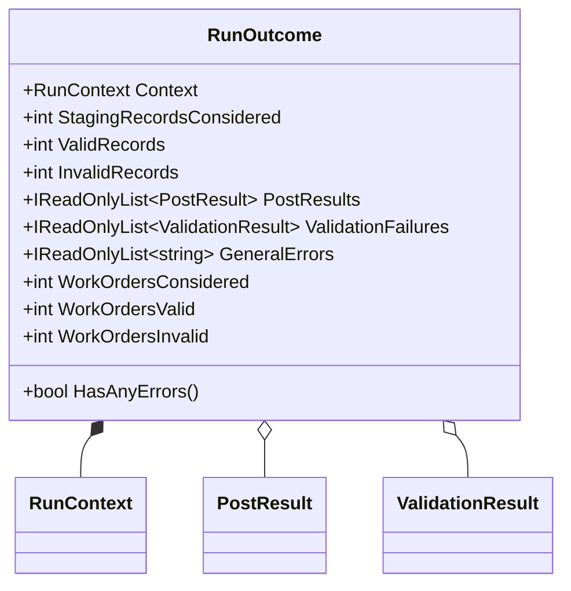

# RunOutcome Domain Model Documentation

## Overview

The **RunOutcome** record encapsulates a comprehensive summary of an accrual orchestration execution. It aggregates counts of staging records, validation results, posting outcomes, and any general errors encountered during the run. For “WO-payload mode,” the properties **WorkOrdersConsidered**, **WorkOrdersValid**, and **WorkOrdersInvalid** serve as primary counters for work-order-based processing.

By centralizing all run metrics and results in a single immutable object, **RunOutcome** streamlines decision-making in downstream workflows—such as notifications, metric logging, or orchestration completion logic—without scattering summary logic across multiple services.

## Class Diagram



## Properties

| Property | Type | Description |
| --- | --- | --- |
| **Context** | RunContext | Identifies this run (IDs, timestamps, trigger, correlation) |
| **StagingRecordsConsidered** | int | Total records fetched from staging before validation/posting |
| **ValidRecords** | int | Number of staging records that passed initial validation |
| **InvalidRecords** | int | Number of staging records that failed initial validation |
| **PostResults** | IReadOnlyList\<PostResult\> | Detailed outcomes of each journal-type posting attempt |
| **ValidationFailures** | IReadOnlyList\<ValidationResult\> | Per-record validation failures from staging references |
| **GeneralErrors** | IReadOnlyList\<string\> | Run-level errors not tied to a record (e.g., system faults) |
| **WorkOrdersConsidered** | int | (WO-payload mode) Count of work orders examined for posting |
| **WorkOrdersValid** | int | (WO-payload mode) Count of work orders that passed AIS-side validation |
| **WorkOrdersInvalid** | int | (WO-payload mode) Count of work orders failing AIS validation |


## Computed Property

- **HasAnyErrors**

Returns **true** if any of the following conditions occur:

1. Legacy record-level invalid count > 0
2. WO-payload invalid count > 0
3. Any **PostResult** indicates failure
4. Any **GeneralErrors** exist

```csharp
  public bool HasAnyErrors =>
      InvalidRecords > 0 ||
      WorkOrdersInvalid > 0 ||
      PostResults.Any(r => !r.IsSuccess) ||
      GeneralErrors.Count > 0;
```

## Related Domain Models

- **RunContext**

Carries run identifiers, start time, trigger origin, and correlation ID.

- **PostResult**

Describes the outcome of posting a single journal group, including success flag, journal ID, work-order counts, and any errors.

- **ValidationResult**

Represents the validation status of a single staging record, with optional error code/message.

## Usage Context

In accrual orchestrations, services compute **RunOutcome** after:

1. Fetching and validating staging data.
2. Executing posting pipelines for each journal type.
3. Aggregating validation failures and posting errors.

Consumers then inspect **RunOutcome.HasAnyErrors** to decide whether to send notifications, retry, or finalize the orchestration.

## Key Classes Reference

| Class | Location | Responsibility |
| --- | --- | --- |
| **RunOutcome** | Domain/RunOutcome.cs | Aggregates run metrics, validation failures, posting outcomes, and errors. |
| **RunContext** | Domain/RunContext.cs | Identifies orchestration context (IDs, timestamps, triggers). |
| **PostResult** | Domain/PostResult.cs | Models the result of an FSCM journal posting. |
| **ValidationResult** | Domain/ValidationResult.cs | Models the result of validating an accrual staging reference. |


## Error Handling

Errors are surfaced in two ways:

- **ValidationFailures**: per-record issues flagged before posting.
- **GeneralErrors**: run-level exceptions or unexpected conditions.

Use **HasAnyErrors** to unify error detection across both dimensions.

## Dependencies

- **Rpc.AIS.Accrual.Orchestrator.Core.Domain.RunContext**
- **Rpc.AIS.Accrual.Orchestrator.Core.Domain.PostResult**
- **Rpc.AIS.Accrual.Orchestrator.Core.Domain.ValidationResult**

---

*This documentation covers all aspects of the `RunOutcome` domain model as defined in **RunOutcome.cs**.*