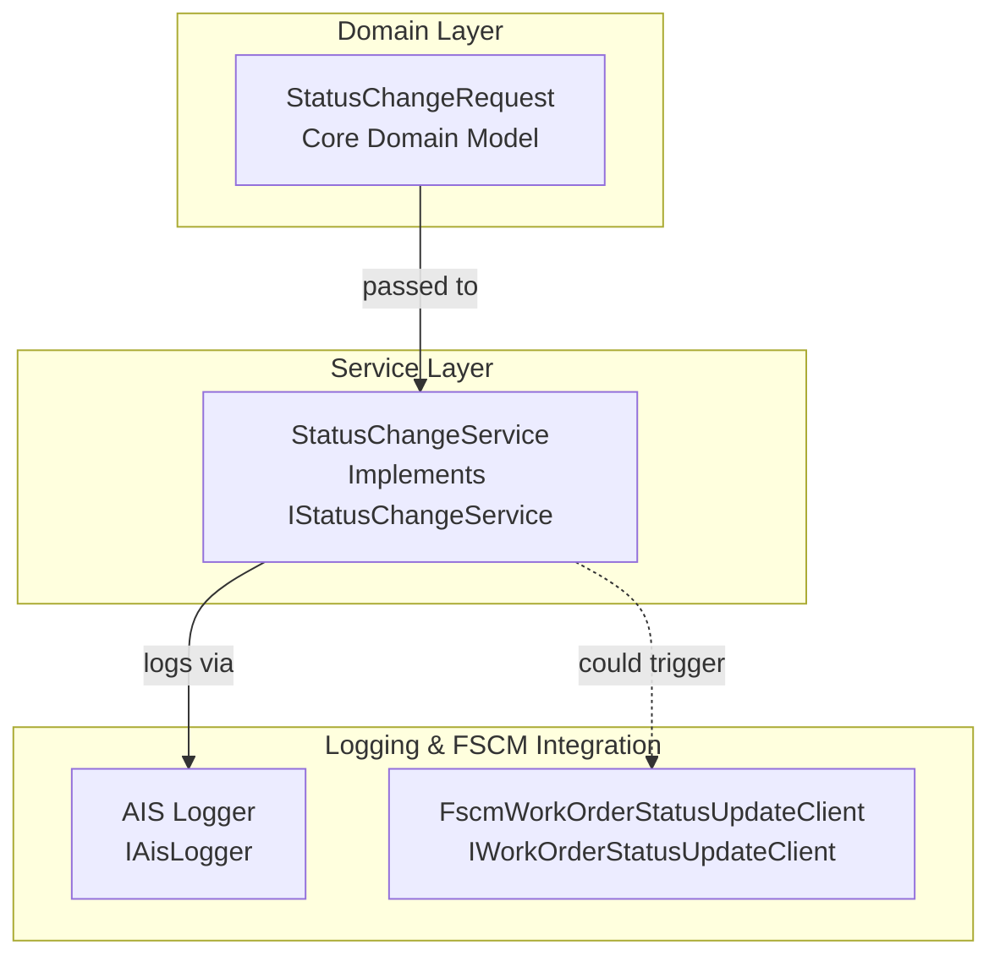

# Status Change Request Feature Documentation

## Overview

The **StatusChangeRequest** record encapsulates all information needed to express a status change for a domain entity. It carries identifiers, old and new status values, optional tracing metadata (run and correlation IDs), a human-readable message, and any arbitrary payload. This model enables consistent logging, auditing, and downstream processing of status transitions across the accrual orchestrator.

By centralizing status-change data in a single immutable structure, the application:

- Ensures uniform logging and telemetry of status events.
- Simplifies service interfaces that handle status updates.
- Provides flexibility to attach custom payloads for specialized handlers.

In the broader orchestrator, **StatusChangeRequest** flows from HTTP/function entry points into domain services (e.g., `StatusChangeService`) and durable orchestrations that invoke FSCM status‐update clients.

## Architecture Overview



## Component Structure

### Domain Model 🗄️

#### **StatusChangeRequest**

```csharp
namespace Rpc.AIS.Accrual.Orchestrator.Core.Domain;

/// <summary>
/// Carries status change request data.
/// </summary>
public sealed record StatusChangeRequest(
    string EntityName,
    string RecordId,
    string OldStatus,
    string NewStatus,
    string? Message,
    string? RunId,
    string? CorrelationId,
    object? Payload);
```

This record is immutable and requires:

| Property | Type | Description |
| --- | --- | --- |
| EntityName | string | Logical name of the entity whose status changed. |
| RecordId | string | Unique identifier of the specific record instance. |
| OldStatus | string | Previous status value. |
| NewStatus | string | Updated status value. |
| Message | string? | Optional descriptive text about the change. |
| RunId | string? | Optional run identifier for trace correlation. |
| CorrelationId | string? | Optional correlation identifier for cross-flow tracing. |
| Payload | object? | Optional additional structured data. |


## Integration Points 🔗

- **IStatusChangeService** defines a contract to handle status change requests:

```csharp
  public interface IStatusChangeService
  {
      Task HandleAsync(StatusChangeRequest request, CancellationToken ct);
  }
```

Implementations receive a `StatusChangeRequest` and perform logging or external calls.

- **StatusChangeService** logs incoming status changes to AIS:

```csharp
  public sealed class StatusChangeService : IStatusChangeService
  {
      private readonly IAisLogger _ais;
      public StatusChangeService(IAisLogger ais) { … }

      public Task HandleAsync(StatusChangeRequest request, CancellationToken ct)
      {
          var runId = string.IsNullOrWhiteSpace(request.RunId) ? "RUN-NA" : request.RunId!;
          var data = new { request.EntityName, request.RecordId, request.OldStatus, request.NewStatus,
                           request.CorrelationId, request.Message, request.Payload };
          return _ais.InfoAsync(runId, "StatusChange", "Status change received.", data, ct);
      }
  }
```

- **Durable Orchestrations** and **Activity Handlers** may construct and pass `StatusChangeRequest` instances when updating FSCM via `IWorkOrderStatusUpdateClient`.

## Key Classes Reference

| Class | Location | Responsibility |
| --- | --- | --- |
| StatusChangeRequest | Domain/StatusChangeRequest.cs | Data carrier for status change operations |
| IStatusChangeService | Application/Ports/Common/Abstractions/IStatusChangeService.cs | Defines service contract for handling status change requests |
| StatusChangeService | Application/Deprecated/Services/StatusChangeService.cs | Logs status change events via AIS logger |


## Testing Considerations

- **Null and empty checks**: Ensure that `EntityName`, `RecordId`, `OldStatus`, and `NewStatus` are non-empty strings.
- **Logging verification**: Tests should assert that `IAisLogger.InfoAsync` is invoked with correct structured data.
- **RunId fallback**: Validate that missing or blank `RunId` defaults to `"RUN-NA"`.

---

*This documentation describes the `StatusChangeRequest` feature as implemented in the provided code context.*