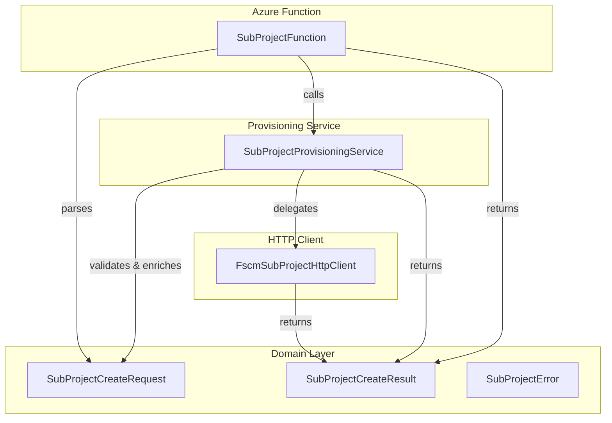

# SubProject Models Feature Documentation

## Overview

The SubProject Models feature defines the canonical domain contracts for creating subprojects in the FSCM system. It encapsulates:

- A **request model** that represents the inner payload of the FSCM subproject creation envelope.
- A **result model** that captures success status, generated subproject identifier, message, and any errors.
- An **error model** to convey granular failure codes and descriptions.

These models form the core **Domain Layer** objects that drive subproject provisioning, are consumed by the Azure Function endpoint, and are serialized across FSCM HTTP clients and orchestrator services.

## Architecture Overview



## Component Structure

### 1. Data Models 📦

#### **SubProjectCreateRequest**

Defines the inner FSCM contract envelope payload:

```csharp
public sealed record SubProjectCreateRequest(
    string DataAreaId,
    string ParentProjectId,
    string ProjectName,
    string? CustomerReference,
    string? InvoiceNotes,
    string? ActualStartDate,
    string? ActualEndDate,
    string? AddressName,
    string? Street,
    string? City,
    string? State,
    string? County,
    string? CountryRegionId,
    string? WellLocale,
    string? WellName,
    string? WellNumber,
    int? ProjectStatus)
{
    public string? WorkOrderGuid { get; init; }
    public int? IsFsaProject { get; init; }
    public int? ProjectStatus { get; init; }
    public object? LegalEntity { get; internal set; }
}
```

- **Purpose**: Carries all required and optional fields for subproject creation .
- **Core Properties**:

| Property | Type | Description |
| --- | --- | --- |
| DataAreaId | string | Legal entity or company identifier |
| ParentProjectId | string | Identifier of the parent project |
| ProjectName | string | Name of the new subproject |
| CustomerReference | string? | Optional customer-facing reference |
| InvoiceNotes | string? | Optional notes to include on invoice |
| ActualStartDate | string? | ISO date string for project start |
| ActualEndDate | string? | ISO date string for project end |
| AddressName | string? | Optional address name |
| Street | string? | Optional street |
| City | string? | Optional city |
| State | string? | Optional state |
| County | string? | Optional county |
| CountryRegionId | string? | Optional country/region code |
| WellLocale | string? | Optional locale for well |
| WellName | string? | Optional well name |
| WellNumber | string? | Optional well number |
| ProjectStatus | int? | Optional status code control |


- **Additional Fields**:

- `WorkOrderGuid` (`string?`): When set, serialized as `"WorkOrderGUID"` for Field Service scenarios.
- `IsFsaProject` (`int?`): Serialized flag `"IsFSAProject"`.
- `ProjectStatus` (`int?`): Overrides constructor value when explicitly assigned.
- `LegalEntity` (`object?`): Internal mapping of legacy envelope field.

---

#### **SubProjectCreateResult**

Captures the outcome of a subproject creation request:

```csharp
public sealed record SubProjectCreateResult(
    bool IsSuccess,
    string? parmSubProjectId,
    string? Message,
    IReadOnlyList<SubProjectError> Errors);
```

- **Purpose**: Returns success indicator, created subproject identifier, status message, and a list of any errors .
- **Properties**:

| Property | Type | Description |
| --- | --- | --- |
| IsSuccess | bool | True if creation succeeded |
| parmSubProjectId | string? | The newly created subproject identifier |
| Message | string? | Informational or error message |
| Errors | IReadOnlyList\<SubProjectError\> | List of errors encountered |


---

#### **SubProjectError**

Represents an individual error detail:

```csharp
public sealed record SubProjectError(
    string Code,
    string Message);
```

- **Purpose**: Provides error code and human-readable message for failed operations .
- **Properties**:

| Property | Type | Description |
| --- | --- | --- |
| Code | string | Unique error code |
| Message | string | Description of the error |


---

### 2. Usage Context 🔗

These domain models are consumed across layers:

- **Azure Function** ()

Parses incoming JSON into `SubProjectCreateRequest` and returns `SubProjectCreateResult`.

- **Business Service** ()

Validates and orchestrates subproject creation, returning `SubProjectCreateResult`.

- **Infrastructure HTTP Client** ()

Serializes `SubProjectCreateRequest` into FSCM envelope, calls external API, and maps response to `SubProjectCreateResult`.

### 3. Key Classes Reference

| Class | Location | Responsibility |
| --- | --- | --- |
| SubProjectCreateRequest | src/.../Domain/SubProjectModels.cs | Model for FSCM subproject create request |
| SubProjectCreateResult | src/.../Domain/SubProjectModels.cs | Model carrying creation outcome and errors |
| SubProjectError | src/.../Domain/SubProjectModels.cs | Error detail record |


### 4. Error Handling ⚠️

- All validation and API failures are encapsulated in `SubProjectError` and returned as part of `SubProjectCreateResult.Errors`.
- Consuming services log and inspect `.IsSuccess` before proceeding.

### 5. Integration Points 🔄

- **IFscmSubProjectClient.CreateSubProjectAsync**

Accepts `SubProjectCreateRequest` and returns `SubProjectCreateResult`.

- **SubProjectProvisioningService.ProvisionAsync**

Coordinates validation, logging, and client invocation.

- **SubProjectFunction.RunAsync**

Exposes HTTP endpoint to initiate subproject creation.

### 6. Testing Considerations 🧪

Key scenarios to cover:

- **Happy path**: Valid `SubProjectCreateRequest` returns `IsSuccess = true` with a non-null `parmSubProjectId`.
- **Validation failures**: Missing required fields yield `IsSuccess = false` and appropriate `Errors`.
- **API error mapping**: Non-transient HTTP errors from FSCM map into `SubProjectError` entries.
- **Optional fields**: `WorkOrderGuid`, `IsFsaProject`, and `ProjectStatus` inclusion and serialization.

---

By centralizing these domain contracts, the orchestrator ensures consistency across functions, services, and clients when handling FSCM subproject operations.