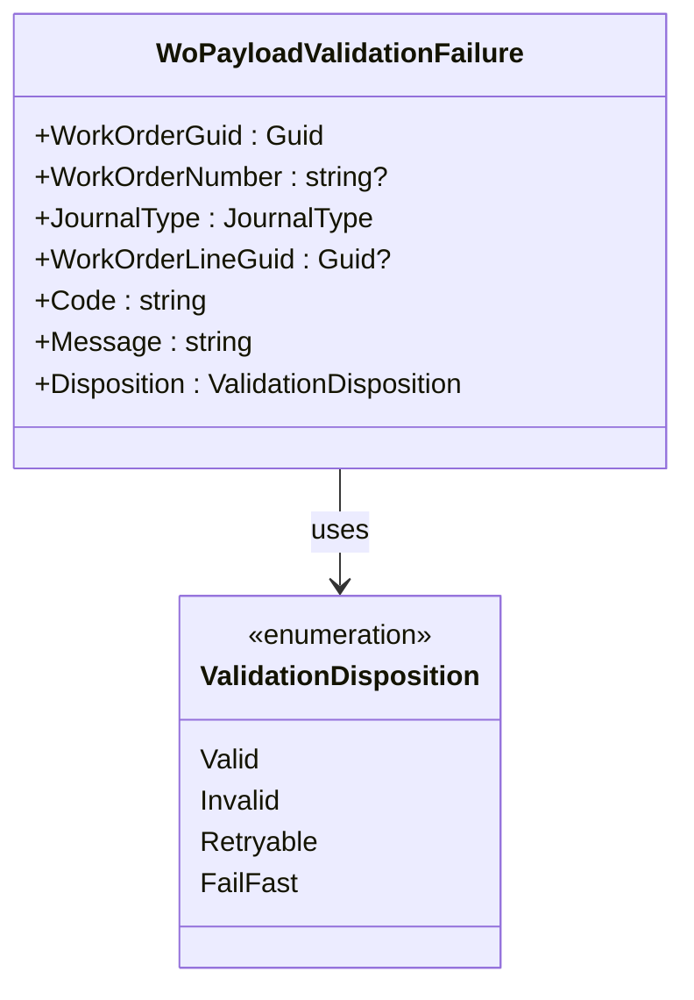

# Validation Disposition Feature Documentation

## Overview

The **ValidationDisposition** enum standardizes how the orchestration handles validation outcomes during AIS payload processing. It categorizes each validation issue into one of four dispositions—Valid, Invalid, Retryable, or FailFast—so the pipeline can consistently decide whether to proceed, drop records, retry operations, or abort the run. This enum underpins both local and remote validation logic across the domain and infrastructure layers.

## Definition

```csharp
using System;

namespace Rpc.AIS.Accrual.Orchestrator.Core.Domain.Validation;

/// <summary>
/// Indicates how AIS should handle a validation issue.
/// </summary>
public enum ValidationDisposition
{
    /// <summary>
    /// Record is valid and may be posted.
    /// </summary>
    Valid = 0,

    /// <summary>
    /// Record is invalid (data/contract issue) and should not be retried.
    /// </summary>
    Invalid = 1,

    /// <summary>
    /// Record failed validation due to a transient dependency and may be retried.
    /// </summary>
    Retryable = 2,

    /// <summary>
    /// Validation cannot proceed due to a configuration or system issue; the run should stop.
    /// </summary>
    FailFast = 3
}
```

## Member Values

| Member | Value | Description |
| --- | --- | --- |
| ✅ Valid | 0 | Record is valid and may be posted. |
| 🚫 Invalid | 1 | Record is invalid (data/contract issue) and should not be retried. |
| 🔄 Retryable | 2 | Record failed validation due to a transient dependency and may be retried. |
| ⚠️ FailFast | 3 | Validation cannot proceed due to a configuration or system issue; the run should stop. |


## Role in Payload Validation

- **WoPayloadValidationFailure** carries a `Disposition` of this enum to indicate how each validation failure should be handled in the pipeline .
- In the **FscmCustomValidationClient**, JSON properties `"disposition"` or `"severity"` are parsed into this enum to interpret remote validation responses.
- **FscmReferenceValidator** groups and classifies failures by `Disposition` to decide whether to retry work orders, drop them, or trigger a fail-fast abort.
- **WoPayloadValidationResult** inspects any `FailFast` dispositions to determine if the entire orchestration run must stop immediately.

## Relationship Diagram



This diagram illustrates how each validation failure record references a `ValidationDisposition` to guide its handling.