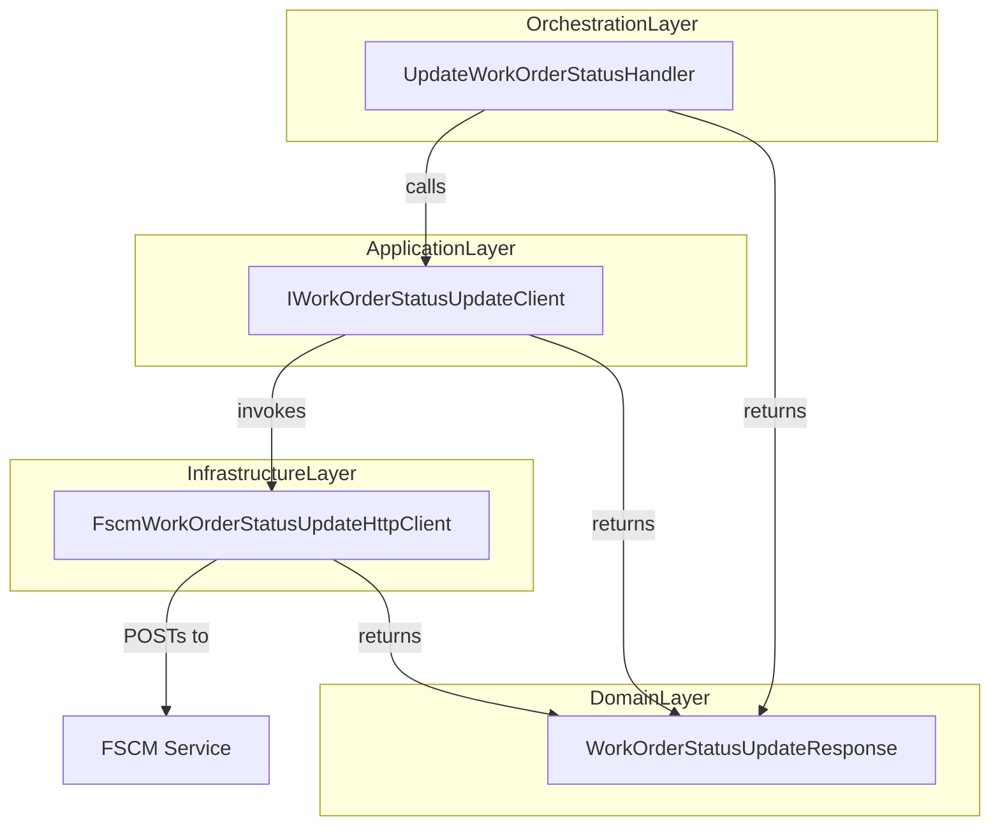
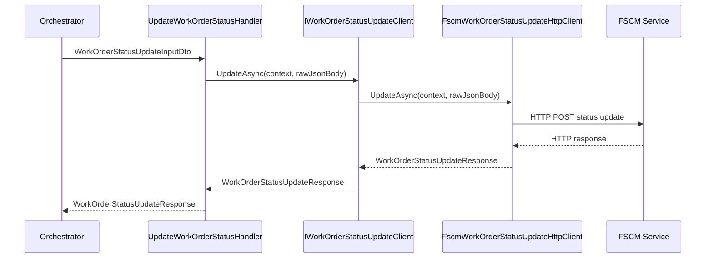

# 🚧 Work Order Status Update Feature Documentation

## Overview

The **Work Order Status Update** feature enables the accrual orchestrator to propagate work-order status changes from AIS to the FSCM system. It provides a robust, retry-capable pipeline using Azure Durable Functions and a pluggable client abstraction. Business value includes:

- Ensuring downstream systems reflect the correct posting or cancellation status.
- Centralizing error handling and logging through AIS telemetry.
- Decoupling orchestration logic from HTTP details via an interface.

This feature fits into the broader accrual orchestration by handling the `_request` payload from upstream activities, invoking FSCM status endpoints, and returning structured responses for further orchestration steps.

## Architecture Overview

## 🔧 Component Structure

### 1. Business Layer

#### **UpdateWorkOrderStatusHandler**

*Location:* `src/Rpc.AIS.Accrual.Orchestrator.Functions/Durable/Activities/Handlers/UpdateWorkOrderStatusHandler.cs`

- **Purpose:** Executes the Durable Function activity to send a raw JSON status‐update payload to FSCM and logs progress.
- **Dependencies:**- `IWorkOrderStatusUpdateClient` – status‐update client abstraction
- `IAisLogger` – AIS telemetry logger
- `ILogger<UpdateWorkOrderStatusHandler>` – activity‐scope logging
- **Key Method:**- `Task<WorkOrderStatusUpdateResponse> HandleAsync(WorkOrderStatusUpdateInputDto input, RunContext runCtx, CancellationToken ct)`- Reads `input.RawJsonBody`, logs payload size.
- Calls `_woStatus.UpdateAsync(runCtx, body, ct)` and times the call.
- Emits success or error events to AIS.

### 2. Application Ports

#### **IWorkOrderStatusUpdateClient**

*Location:* `src/Rpc.AIS.Accrual.Orchestrator.Application/Ports/Common/Abstractions/IWorkOrderStatusUpdateClient.cs`

- **Purpose:** Defines the contract for forwarding raw JSON work-order status payloads to FSCM.
- **Methods:**

| Signature | Description |
| --- | --- |
| `Task<WorkOrderStatusUpdateResponse> UpdateAsync(string rawJsonBody, CancellationToken ct)` | Legacy/back-compat overload without correlation context. |
| `Task<WorkOrderStatusUpdateResponse> UpdateAsync(RunContext context, string rawJsonBody, CancellationToken ct)` | Preferred overload carrying orchestration context. |

### 3. Infrastructure Layer

#### **FscmWorkOrderStatusUpdateHttpClient**

*Location:* `src/Rpc.AIS.Accrual.Orchestrator.Infrastructure/Adapters/Fscm/Clients/FscmWorkOrderStatusUpdateHttpClient.cs`

- **Purpose:** Sends HTTP POST requests to the FSCM endpoint for status updates, mapping responses into domain models.
- **Constructor Dependencies:**- `HttpClient` – configured with base address and retry policies
- `FscmOptions` – configuration for base URLs and paths
- `ILogger<FscmWorkOrderStatusUpdateHttpClient>` – logging
- **Key Methods:**- **Back-compat overload**

`public Task<WorkOrderStatusUpdateResponse> UpdateAsync(string rawJsonBody, CancellationToken ct)`

Builds a default `RunContext` and delegates to the main implementation.

- **Main implementation**

`public async Task<WorkOrderStatusUpdateResponse> UpdateAsync(RunContext context, string rawJsonBody, CancellationToken ct)`

- Resolves the FSCM base URL from `FscmOptions` or legacy overrides.
- Validates `WorkOrderStatusUpdatePath` configuration.
- Constructs `HttpRequestMessage` with headers (`x-run-id`, `x-correlation-id`) and JSON content.
- Sends request, reads response, and logs status, elapsed time, and payload sizes.
- Throws `UnauthorizedAccessException` for 401/403.
- Throws `HttpRequestException` for 429 or 5xx statuses (transient).
- Returns `WorkOrderStatusUpdateResponse` for 400–499 statuses without throwing.

## 📦 Data Models

#### **WorkOrderStatusUpdateResponse**

*Location:* `src/Rpc.AIS.Accrual.Orchestrator.Domain/Domain/WorkOrderStatusUpdateResponse.cs`

| Property | Type | Description |
| --- | --- | --- |
| **IsSuccess** | bool | Indicates whether the FSCM call succeeded. |
| **StatusCode** | int | HTTP status code returned by the FSCM endpoint. |
| **ResponseBody** | string? | Raw JSON or error message returned by FSCM. |

This record captures the outcome of the status-update request .

## Feature Flows

### 1. Status Update Sequence

## Integration Points

- **Durable Functions:** Invoked from a Durable Orchestration via `WorkOrderStatusUpdateInputDto`.
- **AIS Telemetry:** Uses `IAisLogger` to emit structured events on success and errors.
- **Configuration:** Reads FSCM host and endpoint path from `FscmOptions` (e.g., `Fscm:BaseUrl`, `Fscm:WorkOrderStatusUpdatePath`).

## Error Handling

- **Handler Level:** Catches all exceptions, logs via `_ais.ErrorAsync`, and rethrows to trigger Durable retry policies .
- **HTTP Client Level:**- 401/403 → `UnauthorizedAccessException`.
- 429 or ≥500 → `HttpRequestException` (transient).
- 400–499 (excluding auth) → non-transient failure; returned in `WorkOrderStatusUpdateResponse` without exception. .

## Key Classes Reference

| Class | Location | Responsibility |
| --- | --- | --- |
| **WorkOrderStatusUpdateResponse** | `Domain/WorkOrderStatusUpdateResponse.cs` | Domain model for FSCM status update responses. |
| **IWorkOrderStatusUpdateClient** | `Application/Ports/Common/Abstractions/IWorkOrderStatusUpdateClient.cs` | Abstraction for sending status-update payloads. |
| **FscmWorkOrderStatusUpdateHttpClient** | `Infrastructure/Adapters/Fscm/Clients/FscmWorkOrderStatusUpdateHttpClient.cs` | HTTP client implementing status-update calls to FSCM. |
| **UpdateWorkOrderStatusHandler** | `Functions/Durable/Activities/Handlers/UpdateWorkOrderStatusHandler.cs` | Durable Function handler orchestrating the update activity. |

## Dependencies

- Microsoft.Extensions.Logging
- System.Net.Http
- Rpc.AIS.Accrual.Orchestrator.Core.Domain (`RunContext`, record types)
- Rpc.AIS.Accrual.Orchestrator.Core.Abstractions (`IAisLogger`, `IWorkOrderStatusUpdateClient`)
- Rpc.AIS.Accrual.Orchestrator.Infrastructure.Options (`FscmOptions`)

## Testing Considerations

- **Unit Tests:**- Mock `IWorkOrderStatusUpdateClient` to simulate success, client errors, and exceptions.
- Verify `UpdateWorkOrderStatusHandler` logs correct AIS events and rethrows failures.
- **Integration Tests:**- Use a test `HttpClient` handler to return specific status codes (401, 429, 500, 400) and assert exception vs. response mapping.
- **Edge Cases:**- Missing or empty `WorkOrderStatusUpdatePath` should yield a 500-coded response without an HTTP call.