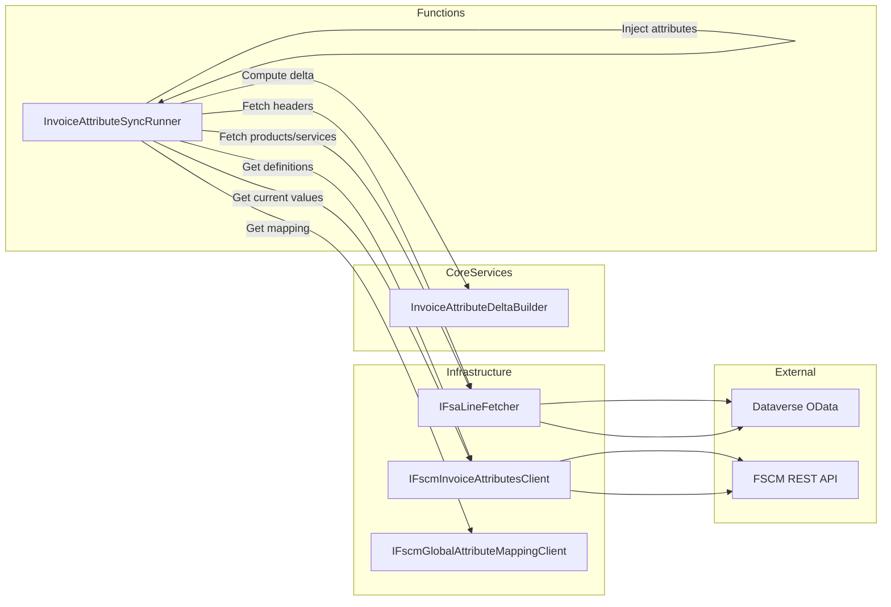
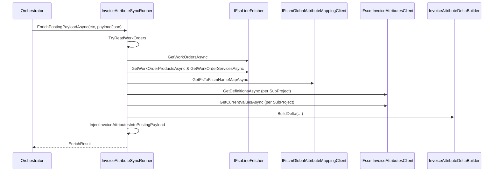

# Invoice Attribute Synchronization Feature Documentation

## Overview

The Invoice Attribute Synchronization feature computes and injects changes between Field Service (FS) work-order header attributes and Oracle Fusion SCM (FSCM) snapshots into the posting payload. It respects FS as the system of record—clearing FSCM values when FS values are null—and ensures attribute updates occur only after successful journal posting. By enriching the JSON payload rather than invoking update endpoints immediately, it decouples attribute synchronization from the posting pipeline.

This component is invoked by orchestrators and API use-cases to prepare enriched payloads. It minimizes external calls by caching FSCM definitions and current values once per SubProject per run, grouping work orders accordingly.

## Architecture Overview



## Component Structure

### 1. Function Layer

#### **InvoiceAttributeSyncRunner** (`src/Rpc.AIS.Accrual.Orchestrator.Functions/Services/InvoiceAttributeSyncRunner.cs`)

- **Purpose:**

Builds the delta of invoice attributes (FS → FSCM) and injects the computed `InvoiceAttributes` into the posting payload JSON.

- **Usage Constraints:**- Must **not** call FSCM update endpoints directly.
- Attribute updates occur **after** journal posting via `InvoiceAttributesUpdateRunner`.
- **Dependencies:**

| Dependency | Role |
| --- | --- |
| ILogger\<InvoiceAttributeSyncRunner> | Structured logging |
| IFsaLineFetcher | Fetch work-order headers, products, services from Dataverse |
| IFscmInvoiceAttributesClient | Read-only FSCM endpoints (definitions & current snapshots) |
| IFscmGlobalAttributeMappingClient | Map FS logical keys to FSCM schema names |


- **Constants & Fields:**

| Name | Type | Description |
| --- | --- | --- |
| ODataFormattedSuffix | string | Suffix for OData formatted lookup values |
| FsInvoiceKeys | string[] | List of FS attribute keys to extract |
| FscmAttr_WorkType | string | Derived FSCM name for Work Type |
| FscmAttr_WellAge | string | Derived FSCM name for Well Age |
| FscmAttr_TaxabilityType | string | Derived FSCM name for Taxability Type |


- **Nested Records:**

| Record Name | Description |
| --- | --- |
| EnrichResult | Outcome of enrichment: counts, notes, enriched JSON |
| WoCtx | Work-order context (GUID, ID, Company, SubProjectId) |
| SubProjectKey | Cache key grouping by Company & SubProjectId |


### 2. Core Services Layer

#### **InvoiceAttributeDeltaBuilder**

- **Role:** Compute differences between FS attribute values and FSCM snapshot.
- **Usage:**

```csharp
  var delta = InvoiceAttributeDeltaBuilder.BuildDelta(
      newValues: allowed,
      identityMap: allowed.Keys.ToDictionary(k => k, k => k, StringComparer.OrdinalIgnoreCase),
      currentValues: currentDict);
```

### 3. Data Access Layer (Interfaces)

| Interface | Key Methods |
| --- | --- |
| IFsaLineFetcher | GetWorkOrdersAsync(ctx, woGuids, ct)<br/>GetWorkOrderProductsAsync(ctx, woGuids, ct)<br/>GetWorkOrderServicesAsync(ctx, woGuids, ct) |
| IFscmGlobalAttributeMappingClient | GetFsToFscmNameMapAsync(ctx, ct) |
| IFscmInvoiceAttributesClient | GetDefinitionsAsync(ctx, company, subProj, ct)<br/>GetCurrentValuesAsync(ctx, company, subProj, names, ct) |


### 4. Utilities & JSON Helpers

| Helper Method | Description |
| --- | --- |
| TryReadWorkOrders | Parse `_request.WOList` into `WoCtx` records |
| IndexWorkOrderHeaders | Index Dataverse header JSON by work-order GUID |
| ExtractFsAttributes | Read raw FS attribute or lookup value |
| AddWorkTypeAndWellAgeDerived | Derive work type & well age from lookup formatted string |
| BuildTaxabilityTypeByWorkOrder | Produce taxability map from products/services JSON |
| GetActiveDefinitionsAsync | Fetch & cache active FSCM definitions per SubProject |
| GetCurrentSnapshotAsync | Fetch & cache current FSCM values per SubProject |
| ApplyUpdatesToCurrentSnapshot | Update in-memory snapshot with delta |
| InjectInvoiceAttributesIntoPostingPayload | Rewrite posting payload JSON to include `InvoiceAttributes` arrays |
| JSON parsing helpers (`TryReadGuid`, etc.) | Generic utilities for JSON value extraction |


## Feature Flow

### Invoice Attribute Enrichment Sequence



## Caching Strategy

- **Definitions Cache** (`defsCache`):

Caches active FSCM attribute names per `SubProjectKey`.

- **Current Values Cache** (`currentCache`):

Caches current FSCM attribute name⇢value snapshots per `SubProjectKey`.

- Both caches live for one `EnrichPostingPayloadAsync` invocation to minimize external calls.

## Error Handling

- **Validation**: Null or empty JSON yields a skipped enrichment result.
- **JSON Parsing**: Helper methods swallow exceptions and skip invalid entries.
- **Missing Data**: Logs warnings when headers or definitions are unavailable.
- **Cancellation**: Honors the provided `CancellationToken` during external calls.

## Integration Points

- **SyncInvoiceAttributesHandler** (`Functions/Durable/Activities/Handlers/SyncInvoiceAttributesHandler.cs`):

Calls `EnrichPostingPayloadAsync` before delegating to `InvoiceAttributesUpdateRunner`.

- **PostJobUseCase & AdHocSingleJobUseCase** (`Functions/Endpoints/UseCases`):

Enrich posting envelope JSON in minimal‐payload scenarios or full‐fetch flows.

- **InvoiceAttributesUpdateRunner**:

Executes the actual FSCM update after journal posts using the enriched payload.

## Key Classes Reference

| Class | Location | Responsibility |
| --- | --- | --- |
| InvoiceAttributeSyncRunner | src/Rpc.AIS.Accrual.Orchestrator.Functions/Services/InvoiceAttributeSyncRunner.cs | Enrich payload with invoice attribute changes |
| EnrichResult | Nested record in `InvoiceAttributeSyncRunner` | Captures enrichment outcome and enriched JSON |
| WoCtx | Nested record in `InvoiceAttributeSyncRunner` | Holds work-order GUID, ID, Company, SubProjectId |
| SubProjectKey | Nested record in `InvoiceAttributeSyncRunner` | Key for grouping work orders by Company/SubProjectId |
| InvoiceAttributeDeltaBuilder | Rpc.AIS.Accrual.Orchestrator.Core.Services.InvoiceAttributes | Builds delta updates between FS and FSCM snapshots |


## Dependencies

- Rpc.AIS.Accrual.Orchestrator.Core.Services.InvoiceAttributes
- Rpc.AIS.Accrual.Orchestrator.Core.Abstractions
- Microsoft.Extensions.Logging
- System.Text.Json

## Testing Considerations

- Empty or invalid payloads
- No FS attributes (skipped enrichment)
- Missing FSCM definitions
- No delta between FS and FSCM (no injection)
- Successful enrichment of multiple work orders across subprojects