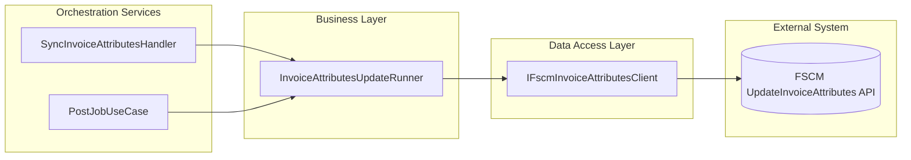
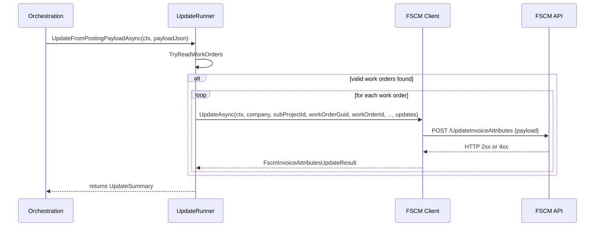

# Invoice Attributes Update Runner Feature Documentation

## Overview

The **Invoice Attributes Update Runner** processes invoice attribute updates extracted from a journal posting payload. It reads each work order’s enriched attributes and dispatches them to the FSCM UpdateInvoiceAttributes endpoint. This separation ensures that invoice attribute updates occur only after a successful posting, maintaining clear orchestration boundaries.

Business value:

- Guarantees that FSCM reflects the latest attribute values recorded in FS.
- Provides detailed logging and summary metrics for audit and debugging.
- Integrates seamlessly with existing orchestration flows without altering posting logic.

## Architecture Overview

## Component Structure

### InvoiceAttributesUpdateRunner (`src/Rpc.AIS.Accrual.Orchestrator.Functions/Composition/InvoiceAttributesUpdateRunner.cs`)

#### Purpose and Responsibilities

- Parses the posting payload JSON to extract work orders with invoice attribute updates.
- Invokes the FSCM client’s `UpdateAsync` for each work order containing changes.
- Aggregates counts of work orders considered, updates attempted, successes, and failures.
- Logs detailed information and warnings for troubleshooting.

#### Dependencies

- **IFscmInvoiceAttributesClient**: abstraction for FSCM invoice-attribute HTTP operations
- **ILogger<InvoiceAttributesUpdateRunner>**: structured logging
- **InvoiceAttributePair**: domain type representing a name/value pair
- **LogText**: utility to trim large bodies for logs

#### Key Methods

| Method | Description | Returns |
| --- | --- | --- |
| `UpdateFromPostingPayloadAsync(RunContext, string, CancellationToken)` | Reads payload, filters work orders with updates, calls FSCM client, logs result | `UpdateSummary` |
| `TryReadWorkOrders(string, out List<WorkOrderInvoiceUpdates>)` | Parses JSON `_request.WOList` into typed update records | `bool` |

#### Supporting Records

##### UpdateSummary

| Property | Type | Description |
| --- | --- | --- |
| WorkOrdersConsidered | int | Number of WOs processed in payload |
| WorkOrdersWithUpdates | int | Count of WOs that had ≥1 attribute updates |
| UpdatePairs | int | Total attribute pairs sent across all WOs |
| SuccessCount | int | Number of successful FSCM update calls |
| FailureCount | int | Number of failed FSCM update calls |

##### WorkOrderInvoiceUpdates

| Property | Type | Description |
| --- | --- | --- |
| Company | string | Company code |
| SubProjectId | string | Sub-project identifier |
| WorkOrderGuid | Guid | Work order GUID |
| WorkOrderId | string | Work order number |
| CountryRegionId | string? | Country/region identifier (optional) |
| County | string? | County (optional) |
| State | string? | State (optional) |
| DimensionDisplayValue | string? | Financial dimension display value (optional) |
| FSATaxabilityType | string? | Derived taxability (optional) |
| FSAWellAge | string? | Derived well age (optional) |
| FSAWorkType | string? | Derived work type (optional) |
| Updates | IReadOnlyList<InvoiceAttributePair> | List of attribute name/value pairs to send to FSCM |

## Sequence Flow

### Invoice Attributes Update Flow

## Error Handling

- Throws `ArgumentNullException` if `RunContext` is null.
- Returns zeroed `UpdateSummary` for empty or unparsable payloads.
- Skips work orders missing required fields or with no `InvoiceAttributes` array.
- Catches and logs individual update failures, trimming the response body for safety.

## Dependencies

- Rpc.AIS.Accrual.Orchestrator.Core.Abstractions.IFscmInvoiceAttributesClient
- Rpc.AIS.Accrual.Orchestrator.Core.Domain.InvoiceAttributes.InvoiceAttributePair
- Rpc.AIS.Accrual.Orchestrator.Core.Utilities.LogText
- Microsoft.Extensions.Logging.ILogger

## Integration Points

- **SyncInvoiceAttributesHandler** (Durable activity) calls `UpdateFromPostingPayloadAsync` after enrichment.
- **PostJobUseCase** (HTTP endpoint) invokes attribute updates explicitly after journal posting.

## Testing Considerations

- Validate behavior with:- Empty or null payload → no update calls, zero summary.
- Payload missing `_request` or `WOList` → no update calls.
- Work orders without `InvoiceAttributes` → skipped.
- Mixed success/failure scenarios → correct logging and summary counts.

## Key Classes Reference

| Class | Location | Responsibility |
| --- | --- | --- |
| InvoiceAttributesUpdateRunner | src/Rpc.AIS.Accrual.Orchestrator.Functions/Composition/InvoiceAttributesUpdateRunner.cs | Orchestrates reading payload and dispatching FSCM invoice attribute updates |
| UpdateSummary | same | Encapsulates metrics of the update operation |
| WorkOrderInvoiceUpdates | same | Data holder for a single work order’s invoice attribute updates parsed from payload |

## Caching Strategy

This component does not employ any in-memory or external caching. It delegates all data retrieval and update operations to the FSCM client.