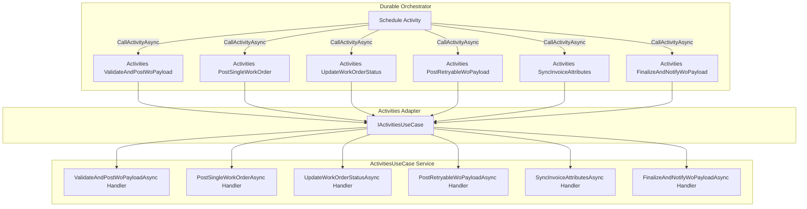
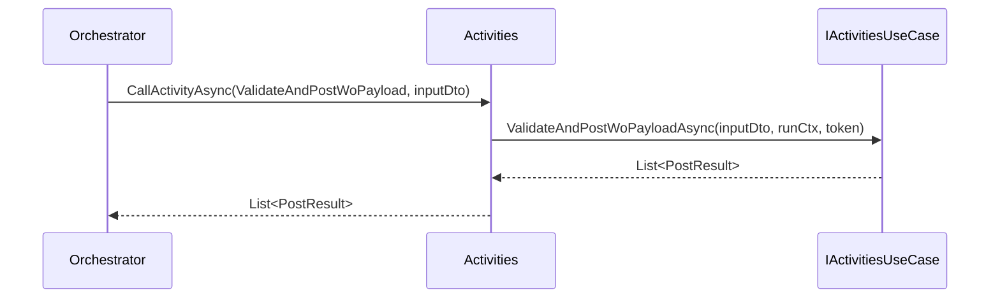

# Durable Activities Adapter Feature Documentation

## Overview

The **Activities** class serves as a thin adapter between Azure Durable Functions and the core activity business logic. It exposes six activity triggers that map directly to methods on the **IActivitiesUseCase** service. Each method:

- Receives a DTO from the orchestration context.
- Constructs a `RunContext` for logging and telemetry.
- Delegates all business logic to the corresponding use-case method.
- Returns the use-case result back to the orchestrator.

This separation keeps activity functions simple and deterministic, while encapsulating complex logic in the **ActivitiesUseCase** implementation.

## Architecture Overview



## Component Structure

### **Activities** (`src/Rpc.AIS.Accrual.Orchestrator.Functions/Durable/Activities/Activities.cs`)

- **Purpose:**

Acts as the Durable Functions activity entry point layer. Creates a `RunContext` and delegates to **IActivitiesUseCase**.

- **Dependencies:**- `IActivitiesUseCase` – encapsulates business logic.
- `RunContext` – holds metadata for logging.
- DTO types under `DurableAccrualOrchestration.*`.

- **Constructor:**

```csharp
  public Activities(IActivitiesUseCase useCase)
```

- Throws `ArgumentNullException` if `useCase` is null.

### Methods Overview

| Method | Trigger Name | Input DTO Type | Return Type |
| --- | --- | --- | --- |
| ValidateAndPostWoPayload | ValidateAndPostWoPayload | `WoPayloadPostingInputDto` | `Task<List<PostResult>>` |
| PostSingleWorkOrder | PostSingleWorkOrder | `SingleWoPostingInputDto` | `Task<PostSingleWorkOrderResponse>` |
| UpdateWorkOrderStatus | UpdateWorkOrderStatus | `WorkOrderStatusUpdateInputDto` | `Task<WorkOrderStatusUpdateResponse>` |
| PostRetryableWoPayload | PostRetryableWoPayload | `RetryableWoPayloadPostingInputDto` | `Task<PostResult>` |
| SyncInvoiceAttributes | SyncInvoiceAttributes | `InvoiceAttributesSyncInputDto` | `Task<InvoiceAttributesSyncResultDto>` |
| FinalizeAndNotifyWoPayload | FinalizeAndNotifyWoPayload | `FinalizeWoPayloadInputDto` | `Task<RunOutcomeDto>` |


## Sequence Flow



## Method Details

### ValidateAndPostWoPayload

```csharp
[Function(nameof(ValidateAndPostWoPayload))]
public Task<List<PostResult>> ValidateAndPostWoPayload(
    [ActivityTrigger] WoPayloadPostingInputDto input,
    FunctionContext ctx)
```

- **Behavior:**- Creates `RunContext` with fields: `RunId`, timestamp, trigger source `"Durable"`, and `CorrelationId`.
- Calls `ValidateAndPostWoPayloadAsync` on the use-case.
- **Use Case:**

Bulk-validates and posts multiple work-order payloads. Returns detailed `PostResult` list.

### PostSingleWorkOrder

```csharp
[Function(nameof(PostSingleWorkOrder))]
public Task<PostSingleWorkOrderResponse> PostSingleWorkOrder(
    [ActivityTrigger] SingleWoPostingInputDto input,
    FunctionContext ctx)
```

- **Behavior:**

Delegates to `PostSingleWorkOrderAsync` to post one work order.

- **Use Case:**

Handles idempotent, single work-order POST operations.

### UpdateWorkOrderStatus

```csharp
[Function(nameof(UpdateWorkOrderStatus))]
public Task<WorkOrderStatusUpdateResponse> UpdateWorkOrderStatus(
    [ActivityTrigger] WorkOrderStatusUpdateInputDto input,
    FunctionContext ctx)
```

- **Behavior:**

Delegates to `UpdateWorkOrderStatusAsync`, updating status in external systems.

- **Use Case:**

Transitions work-order state (e.g., from Pending → Completed).

### PostRetryableWoPayload

```csharp
[Function(nameof(PostRetryableWoPayload))]
public Task<PostResult> PostRetryableWoPayload(
    [ActivityTrigger] RetryableWoPayloadPostingInputDto input,
    FunctionContext ctx)
```

- **Behavior:**

Calls `PostRetryableWoPayloadAsync` for payloads that can be retried on failure.

- **Use Case:**

Ensures transient failures (e.g., network) don’t block orchestration.

### SyncInvoiceAttributes

```csharp
[Function(nameof(SyncInvoiceAttributes))]
public Task<InvoiceAttributesSyncResultDto> SyncInvoiceAttributes(
    [ActivityTrigger] InvoiceAttributesSyncInputDto input,
    FunctionContext ctx)
```

- **Behavior:**

Invokes `SyncInvoiceAttributesAsync` to synchronize invoice metadata.

- **Use Case:**

Keeps external invoice attributes in sync with CRM or ERP.

### FinalizeAndNotifyWoPayload

```csharp
[Function(nameof(FinalizeAndNotifyWoPayload))]
public Task<RunOutcomeDto> FinalizeAndNotifyWoPayload(
    [ActivityTrigger] FinalizeWoPayloadInputDto input,
    FunctionContext ctx)
```

- **Behavior:**

Calls `FinalizeAndNotifyWoPayloadAsync` to complete processing and send notifications.

- **Use Case:**

Marks orchestration final state and triggers downstream notifications or cleanup.

## Key Class Reference

| Class | Location | Responsibility |
| --- | --- | --- |
| Activities | `.../Durable/Activities/Activities.cs` | Exposes activity trigger methods; adapter to use-case. |
| IActivitiesUseCase | `.../Durable/Activities/IActivitiesUseCase.cs` | Defines contract for all orchestration activity logic. |
| ActivitiesUseCase | `.../Durable/Activities/ActivitiesUseCase.cs` | Implements business logic for each activity. |
| RunContext | `Rpc.AIS.Accrual.Orchestrator.Core.Domain` (imported) | Encapsulates run metadata for logging and telemetry. |


## Dependencies

- **Microsoft.Azure.Functions.Worker** for function bindings.
- **Rpc.AIS.Accrual.Orchestrator.Core.Domain.RunContext** for logging scopes.
- **Rpc.AIS.Accrual.Orchestrator.Functions.Services** for activity use-case wiring.
- DTO types under **DurableAccrualOrchestration** contract.

---

*This documentation covers the responsibilities and structure of the `Activities.cs` file within the Durable Functions layer, providing a clear map of how orchestration triggers delegate work to the core use-case implementation.*