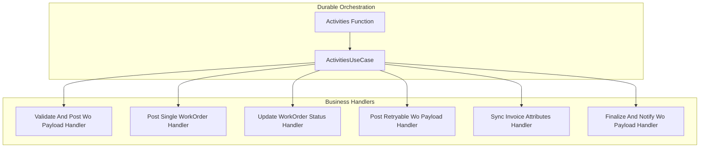

# ActivitiesUseCase Feature Documentation

## Overview

The **ActivitiesUseCase** consolidates business logic for durable function activities in the accrual orchestrator. It implements `IActivitiesUseCase` and delegates each operation to a dedicated handler. This separation keeps the orchestration adapter thin and enforces single responsibility for each activity.

## Architecture Overview



## Component Structure

### ActivitiesUseCase (`src/Rpc.AIS.Accrual.Orchestrator.Functions/Durable/Activities/ActivitiesUseCase.cs`)

- **Purpose:** Implements `IActivitiesUseCase` by routing calls to specific handlers.
- **Dependencies:**- `ValidateAndPostWoPayloadHandler`
- `PostSingleWorkOrderHandler`
- `UpdateWorkOrderStatusHandler`
- `PostRetryableWoPayloadHandler`
- `SyncInvoiceAttributesHandler`
- `FinalizeAndNotifyWoPayloadHandler`
- `ILogger<ActivitiesUseCase>`

#### Constructor

```csharp
public ActivitiesUseCase(
    ValidateAndPostWoPayloadHandler validateAndPost,
    PostSingleWorkOrderHandler postSingle,
    UpdateWorkOrderStatusHandler updateStatus,
    PostRetryableWoPayloadHandler postRetryable,
    SyncInvoiceAttributesHandler syncInvoice,
    FinalizeAndNotifyWoPayloadHandler finalizeAndNotify,
    ILogger<ActivitiesUseCase> logger)
```

- Throws `ArgumentNullException` if any dependency is `null`.

#### Public Methods

| Method | Description | Returns |
| --- | --- | --- |
| ValidateAndPostWoPayloadAsync (input,runCtx,ct) | Delegates to validation and posting handler | `Task<List<PostResult>>` |
| PostSingleWorkOrderAsync (input,runCtx,ct) | Delegates to single work order posting handler | `Task<PostSingleWorkOrderResponse>` |
| UpdateWorkOrderStatusAsync (input,runCtx,ct) | Delegates to status update handler | `Task<WorkOrderStatusUpdateResponse>` |
| PostRetryableWoPayloadAsync (input,runCtx,ct) | Delegates to retryable payload posting handler | `Task<PostResult>` |
| SyncInvoiceAttributesAsync (input,runCtx,ct) | Delegates to invoice attribute sync handler | `Task<InvoiceAttributesSyncResultDto>` |
| FinalizeAndNotifyWoPayloadAsync (input,runCtx,ct) | Delegates to finalization and notification handler | `Task<RunOutcomeDto>` |


#### Internal Utilities

##### AggregateForEmail

```csharp
internal static PostResult AggregateForEmail(IReadOnlyList<PostResult> postResults)
```

- **Purpose:** Combine multiple `PostResult` objects into one summary result.
- **Behavior:**- Treats empty input as success with zero work orders.
- Flags failure if any result reports errors.
- Computes conservative posted count and aggregates errors.

##### TryGetWorkOrderCount

```csharp
internal static int TryGetWorkOrderCount(string woPayloadJson)
```

- **Purpose:** Count work orders in a JSON payload.
- **Behavior:**- Parses `_request.WOList` or `_request.wo list` arrays.
- Returns array length or 0 on parse failure.

## Design Patterns

- **Handler Pattern:** Each activity delegates its core logic to a dedicated handler class.
- **Dependency Injection:** Constructor injection ensures loose coupling and testability.
- **Single Responsibility:** ActivitiesUseCase routes operations without embedding business rules.

## Integration Points

- **Durable Functions:**- The `Activities` class in `Activities.cs` uses this use case to serve activity triggers.
- **Dependency Registration:**- Registered in `Program.cs` via

```csharp
    services.AddSingleton<IActivitiesUseCase, ActivitiesUseCase>();
```

## Key Classes Reference

| Class | Location | Responsibility |
| --- | --- | --- |
| ActivitiesUseCase | `Durable/Activities/ActivitiesUseCase.cs` | Implements activity logic by invoking handlers. |
| IActivitiesUseCase | `Durable/Activities/IActivitiesUseCase.cs` | Defines contracts for all activity operations. |
| ValidateAndPostWoPayloadHandler | `Services/Handlers/ValidateAndPostWoPayloadHandler.cs` | Validates and posts work order payloads. |
| PostSingleWorkOrderHandler | `Services/Handlers/PostSingleWorkOrderHandler.cs` | Posts a single work order. |
| UpdateWorkOrderStatusHandler | `Services/Handlers/UpdateWorkOrderStatusHandler.cs` | Updates work order status. |
| PostRetryableWoPayloadHandler | `Services/Handlers/PostRetryableWoPayloadHandler.cs` | Posts payloads with retry logic. |
| SyncInvoiceAttributesHandler | `Services/Handlers/SyncInvoiceAttributesHandler.cs` | Synchronizes invoice attributes. |
| FinalizeAndNotifyWoPayloadHandler | `Services/Handlers/FinalizeAndNotifyWoPayloadHandler.cs` | Finalizes payload and sends notifications. |


## Error Handling

- **Constructor:** Validates non-null dependencies and throws on failure.
- **JSON Parsing:**- `TryGetWorkOrderCount` returns 0 if parsing fails or JSON is invalid.

## Testing Considerations

- Verify each public method calls the correct handler with passed parameters.
- Test `AggregateForEmail` for combinations of successes and failures.
- Validate `TryGetWorkOrderCount` against valid and malformed JSON inputs.