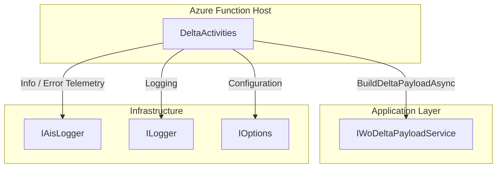
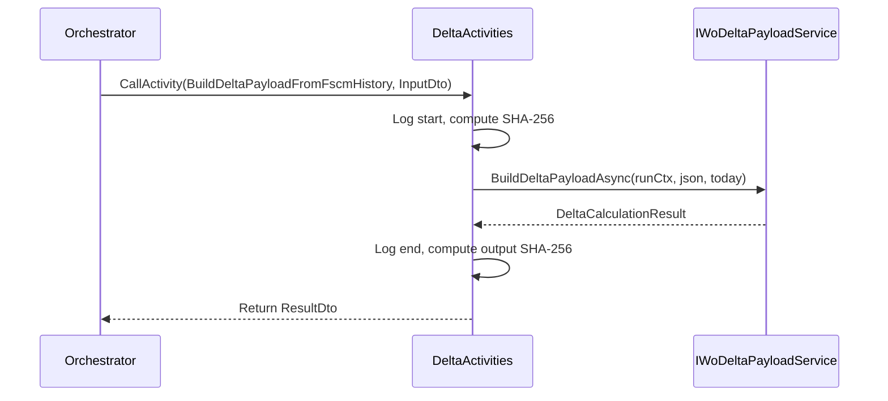

# DeltaActivities Feature Documentation

## Overview

The **DeltaActivities** feature implements a durable activity within the Azure Functions orchestrator. It transforms a full Field Service (FS) JSON payload—fetched from Dataverse—into a delta-only payload by comparing it against historical FSCM journal entries. This ensures that downstream posting activities process only the changes (adds, updates, reversals), reducing load and improving processing efficiency.

During an orchestrated accrual run, this activity is invoked after fetching the FS payload. It measures and logs payload sizes, computes SHA-256 hashes for integrity, delegates to the core delta-payload service, and returns a compact JSON containing only the journal deltas, along with metrics on work orders and line counts.

## Architecture Overview



## Component Structure

### 1. Azure Durable Activity

#### **DeltaActivities** (`src/Rpc.AIS.Accrual.Orchestrator.Functions/Durable/Activities/DeltaActivities.cs`)

- **Purpose:**

Executes a Durable Functions activity that builds a delta-only JSON payload by comparing the incoming FS payload against FSCM journal history.

- **Dependencies:**- `_delta` (`IWoDeltaPayloadService`): Core service for delta payload generation.
- `_ais` (`IAisLogger`): AIS-specific telemetry logger.
- `_log` (`ILogger<DeltaActivities>`): Standard application logging.
- `_fscm` (`IOptions<FscmOptions>`): FSCM integration settings (currently unused directly).

- **Methods:**

| Method | Trigger | Description | Returns |
| --- | --- | --- | --- |
| BuildDeltaPayloadFromFscmHistory | `[ActivityTrigger]` | 1. Validates input and starts a timing scope.<br/>2. Logs input payload size and SHA-256 hash.<br/>3. Calls `_delta.BuildDeltaPayloadAsync` with run context and run date.<br/>4. Logs completion metrics and hash of result.<br/>5. Maps to `BuildDeltaPayloadFromFscmHistoryResultDto`. | `Task<BuildDeltaPayloadFromFscmHistoryResultDto>` |


- **Helper Method:**

```csharp
private static string Sha256Hex(string s)
{
    var bytes = Encoding.UTF8.GetBytes(s ?? string.Empty);
    var hash = SHA256.HashData(bytes);
    return Convert.ToHexString(hash).ToLowerInvariant();
}
```

Computes a SHA-256 hash of the input string, returned as lowercase hexadecimal.

### 2. Data Models

#### **BuildDeltaPayloadFromFscmHistoryInputDto**

*Location:* `src/Rpc.AIS.Accrual.Orchestrator.Core.Domain/FsaDeltaActivityDtos.cs`

Carries inputs to the delta activity.

| Property | Type | Description |
| --- | --- | --- |
| `RunId` | `string` | Unique run identifier. |
| `CorrelationId` | `string` | Correlation token across systems. |
| `TriggeredBy` | `string` | Source trigger (e.g., timer, HTTP). |
| `FsaPayloadJson` | `string` | Raw FS JSON payload to process. |
| `DurableInstanceId` | `string?` | Optional Durable Functions instance ID. |


#### **BuildDeltaPayloadFromFscmHistoryResultDto**

*Location:* `src/Rpc.AIS.Accrual.Orchestrator.Core.Domain/FsaDeltaActivityDtos.cs`

Returns the delta payload and metrics.

| Property | Type | Description |
| --- | --- | --- |
| `DeltaPayloadJson` | `string` | Generated delta-only JSON payload. |
| `WorkOrdersInInput` | `int` | Count of work orders received. |
| `WorkOrdersInOutput` | `int` | Count of work orders in the resulting payload. |
| `DeltaLines` | `int` | Total delta lines generated. |
| `ReverseLines` | `int` | Number of reversal lines generated. |
| `RecreateLines` | `int` | Number of recreation lines generated. |


## Feature Flows

### Delta Payload Generation Flow



## Error Handling

- Wraps the core call in a `try/catch`.
- On exception:- Stops the stopwatch.
- Logs an error via `_log.LogError` with elapsed time.
- Emits AIS error telemetry via `_ais.ErrorAsync` with exception details.
- Rethrows the exception.

## Integration Points

- **Durable Orchestrator:** Invoked by `AccrualOrchestratorFunctions` (or other orchestrations) through `CallActivityAsync` using the function name `BuildDeltaPayloadFromFscmHistory`.
- **IWoDeltaPayloadService:** Core application service that encapsulates delta-calculation logic based on FSCM history.
- **IAisLogger:** Sends structured telemetry events to AIS sinks before and after delta computation.
- **FscmOptions:** Holds FSCM integration configuration, injected via `IOptions<FscmOptions>`.

## Key Classes Reference

| Class | Location | Responsibility |
| --- | --- | --- |
| **DeltaActivities** | `src/Rpc.AIS.Accrual.Orchestrator.Functions/Durable/Activities/DeltaActivities.cs` | Durable Function activity that generates delta payloads. |
| **BuildDeltaPayloadFromFscmHistoryInputDto** | `src/Rpc.AIS.Accrual.Orchestrator.Core.Domain/FsaDeltaActivityDtos.cs` | Input DTO for the delta activity. |
| **BuildDeltaPayloadFromFscmHistoryResultDto** | `src/Rpc.AIS.Accrual.Orchestrator.Core.Domain/FsaDeltaActivityDtos.cs` | Output DTO containing delta JSON and metrics. |


## Dependencies

- **Azure Functions Worker** (`Microsoft.Azure.Functions.Worker`) for defining durable activities.
- **Microsoft.Extensions.Logging** for standard logging abstractions.
- **Rpc.AIS.Accrual.Orchestrator.Core.Abstractions.IWoDeltaPayloadService** for core delta-payload generation.
- **Rpc.AIS.Accrual.Orchestrator.Infrastructure.Options.FscmOptions** for FSCM configuration.
- **Rpc.AIS.Accrual.Orchestrator.Infrastructure.Logging.IAisLogger** for AIS telemetry.

## Testing Considerations

- Provide mock implementations of `IWoDeltaPayloadService` and `IAisLogger` to verify:- Correct invocation of `BuildDeltaPayloadAsync`.
- Logging calls with expected payload sizes and hash values.
- Exception handling path emits AIS error telemetry.