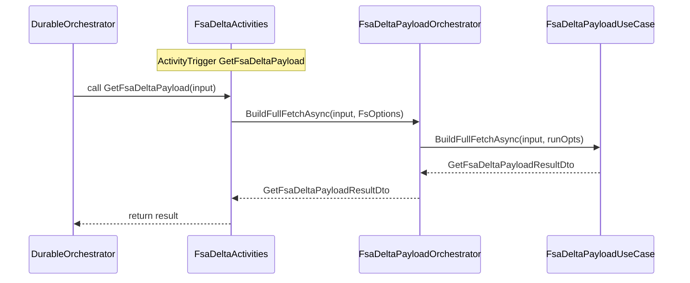

# FSA Delta Payload Feature Documentation

## Overview

This feature provides a **durable, serverless pipeline** for fetching Field Service (FS) data from Dataverse, computing the delta compared to existing FSCM journal history, and preparing a payload for downstream posting. It consists of Azure Functions activities, orchestrators, and core use-case services. Business logic resides in the **Core Use Cases** layer, while the **Functions** layer acts as a thin adapter to Durable Functions, preserving input/output contracts and logging scopes.

By isolating configuration, logging, orchestration, and domain models, the design promotes testability, single-responsibility, and clear separation between the **Functions**, **Services**, **Core**, and **Domain** layers. This enables:

- Safe retries via Durable Functions patterns.
- Consistent logging context across activities.
- Plug-and-play business logic in the core use case.

## Architecture Overview

```mermaid
flowchart TB
    subgraph FunctionsLayer [Azure Functions - Activities & Orchestrations]
        A[FsaDeltaActivities] -->|calls| B[FsaDeltaPayloadOrchestrator]
        C[DeltaActivities] -->|calls| D[IWoDeltaPayloadService]
        E[ActivitiesHandlerBase] --> F[ValidateAndPostWoPayloadHandler]
        G[JobOperationsOrchestration] -->|schedules| A
    end

    subgraph OrchestratorServices [Functions.Services]
        B[FsaDeltaPayloadOrchestrator]
    end

    subgraph CoreUseCases [Core.UseCases.FsaDeltaPayload]
        H[FsaDeltaPayloadUseCase]
        I[FsaDeltaPayloadUseCase (SingleAnyStatus)]
    end

    subgraph EnrichmentPipeline [Core.Services.FsaDeltaPayload.EnrichmentPipeline]
        J[FsExtrasEnrichmentStep]
        K[JournalNamesEnrichmentStep]
        L[SubProjectEnrichmentStep]
        M[JournalDescriptionsEnrichmentStep]
    end

    subgraph CoreServices [Core.Services.FsaDeltaPayload + Helpers]
        N[IFsaLineFetcher]
        O[DeltaComparer]
        P[IFscmBaselineFetcher]
        Q[IFsaSnapshotBuilder]
        R[IFsaDeltaPayloadEnricher]
    end

    subgraph DomainModels [Core.Domain]
        S[GetFsaDeltaPayloadInputDto]
        T[GetFsaDeltaPayloadResultDto]
        U[BuildDeltaPayloadFromFscmHistoryInputDto]
        V[BuildDeltaPayloadFromFscmHistoryResultDto]
    end

    A --> B
    B --> H
    H --> N
    H --> O
    H --> P
    H --> Q
    H --> R
    H --> J
    H --> K
    H --> L
    H --> M
    C --> D
    A --> S
    A --> T
    C --> U
    C --> V
```

## Component Structure

### 1. Functions Layer

#### **FsaDeltaActivities** (`src/Rpc.AIS.Accrual.Orchestrator.Functions/Functions/FsaDeltaActivities.cs`)

Provides the durable activity that initiates the **Full Fetch** delta payload build.

- **Dependencies**- ILogger<FsaDeltaActivities>
- IOptions<FsOptions>
- IFsaDeltaPayloadOrchestrator
- **Key Method**

| Method | Trigger | Description | Returns |
| --- | --- | --- | --- |
| GetFsaDeltaPayload 🎯 | `[ActivityTrigger]` | Validates **DataverseApiBaseUrl**, logs start, and calls the orchestrator to build the payload. | `Task<GetFsaDeltaPayloadResultDto>` |


```csharp
[Function(nameof(GetFsaDeltaPayload))]
public async Task<GetFsaDeltaPayloadResultDto> GetFsaDeltaPayload(
    [ActivityTrigger] GetFsaDeltaPayloadInputDto input,
    FunctionContext ctx)
{
    // Logging scopes for function and trigger
    using var scope = LogScopes.BeginFunctionScope(_log, new LogScopeContext { /* ... */ });
    using var triggerScope = _log.BeginScope(new Dictionary<string, object?> { ["Trigger"] = input.TriggeredBy });

    try
    {
        var opt = _ingestion.Value;
        if (string.IsNullOrWhiteSpace(opt.DataverseApiBaseUrl))
            throw new InvalidOperationException("FsaIngestion:DataverseApiBaseUrl is missing.");

        _log.LogInformation(
            "GetFsaDeltaPayload START PageSize={PageSize} MaxPages={MaxPages}",
            opt.PageSize, opt.MaxPages);

        return await _orchestrator.BuildFullFetchAsync(input, opt, ctx.CancellationToken);
    }
    catch (Exception ex)
    {
        _log.LogError(ex, "GetFsaDeltaPayload FAILED");
        throw;
    }
}
```

#### **DeltaActivities** (`src/Rpc.AIS.Accrual.Orchestrator.Functions/Durable/Activities/DeltaActivities.cs`)

Executes the **FSCM history comparison** to produce a delta-only payload. It wraps `IWoDeltaPayloadService` and logs progress.

- **Citations:**

#### **ActivitiesHandlerBase** (`src/Rpc.AIS.Accrual.Orchestrator.Functions/Durable/Activities/Handlers/ActivitiesHandlerBase.cs`)

Provides a base for handler classes to begin a log scope with `RunContext`.

- **Citations:**

#### **ValidateAndPostWoPayloadHandler**, **PostRetryableWoPayloadHandler**, **UpdateWorkOrderStatusHandler**, **FinalizeAndNotifyWoPayloadHandler**

Implement durable activity handlers for:

- Validation & initial posting
- Retryable payload posting
- FSCM work order status updates
- Final notification & enrichment

Each handler:

- Begins a scoped log with `RunContext`.
- Calls the corresponding client/service.
- Logs execution details and calls into `IAisLogger` for telemetry.

### 2. Orchestrator Services

#### **FsaDeltaPayloadOrchestrator** (`src/Rpc.AIS.Accrual.Orchestrator.Functions/Durable/Orchestrators/FsaDeltaPayloadOrchestrator.cs`)

Thin Functions-layer adapter translating `FsOptions` into `FsaDeltaPayloadRunOptions`, then invoking the Core use case interface `IFsaDeltaPayloadUseCase` .

| Method | Description | Returns |
| --- | --- | --- |
| BuildFullFetchAsync(input, FsOptions, ct) | Maps to `BuildFullFetchAsync` on the core use case with work order filter options. | `Task<GetFsaDeltaPayloadResultDto>` |
| BuildSingleWorkOrderAnyStatusAsync(...) | Maps to `BuildSingleWorkOrderAnyStatusAsync`, for ad-hoc single WO payloads regardless of FS status. | `Task<GetFsaDeltaPayloadResultDto>` |


### 3. Durable Orchestrators

#### **AccrualOrchestratorFunctions** (`src/Rpc.AIS.Accrual.Orchestrator.Functions/Functions/AccrualOrchestratorFunctions.cs`)

Timer-triggered function scheduling the `DurableAccrualOrchestration`, enforcing single-flight, and sending fatal alerts on error. It then orchestrates fetching, delta computation, validation, posting, and finalization steps.

#### **JobOperationsOrchestration** (`src/Rpc.AIS.Accrual.Orchestrator.Functions/Functions/JobOperationsOrchestration.cs`)

Orchestrates job-specific flows (e.g., **Post**, **CustomerChange**), reusing the accrual pipeline for a single WO then executing operation-specific FSCM steps.

#### **JobOperationsV2ParsingActivities** (`src/Rpc.AIS.Accrual.Orchestrator.Functions/Functions/JobOperationsV2ParsingActivities.cs`)

Deterministic JSON parsing activities (e.g., `TryExtractSubprojectGuid`) to avoid non-deterministic operations in orchestrator code.

### 4. Core Use Cases

#### **IFsaDeltaPayloadUseCase** & **FsaDeltaPayloadUseCase** (`src/Rpc.AIS.Accrual.Orchestrator.Core/UseCases/FsaDeltaPayload`)

Encapsulates the business workflow to:

1. Fetch open WO IDs with products/services.
2. Enrich product/service lookups.
3. Build snapshots and header mappings.
4. Construct an outbound FS list payload (`DeltaPayloadBuilder`).
5. Apply a step-per-concern enrichment pipeline (`IFsaDeltaPayloadEnrichmentPipeline`).
6. Fetch FSCM baseline (scaffold only).
7. Return `GetFsaDeltaPayloadResultDto`.

It leverages:

- `ITelemetry` for JSON logging.
- `IFsaLineFetcher`, `DeltaComparer`, `IFscmBaselineFetcher`, `IFsaSnapshotBuilder`, `IFsaDeltaPayloadEnricher`, and `IFsaDeltaPayloadEnrichmentPipeline`.

### 5. Enrichment Pipeline

#### **IFsaDeltaPayloadEnrichmentStep** (`Core.Services.FsaDeltaPayload.EnrichmentPipeline`)

Defines a step in the payload enrichment pipeline, with stable **Name**, **Order**, and `ApplyAsync`.

#### **Steps**:

- **FsExtrasEnrichmentStep**: Injects FS line extras (currency, site, etc.).
- **JournalNamesEnrichmentStep**: Injects FSCM journal names per legal entity.
- **SubProjectEnrichmentStep**: Injects SubProjectId into payload.
- **JournalDescriptionsEnrichmentStep**: Stamps journal descriptions based on action suffix.

### 6. Domain Models & DTOs

#### **FsaDeltaActivityDtos.cs** (`src/Rpc.AIS.Accrual.Orchestrator.Domain/Domain/FsaDeltaActivityDtos.cs`)

- **GetFsaDeltaPayloadInputDto**: run/context identifiers, optional WO GUID, instance ID.
- **GetFsaDeltaPayloadResultDto**: payload JSON, optional delta links, list of WO numbers.
- **BuildDeltaPayloadFromFscmHistoryInputDto** / **ResultDto**: carry FS payload JSON and delta build metrics.

#### **FsaDeltaDtos.cs** (`src/Rpc.AIS.Accrual.Orchestrator.Core.Domain`)

Defines snapshot and line models used during delta payload construction.

#### **Delta/ReversalPlan**, **DeltaCalculationEngine**, **DeltaMathEngine** (`Core.Domain.Delta`)

Encapsulate reversal planning, edge-case reversal rules, and core math workflows for delta computation.

### 7. Options & Configuration

| Class | Description |
| --- | --- |
| **FsOptions** | Dataverse API base URL, `PageSize`, `MaxPages`. |
| **FscmOptions** | FSCM endpoint settings. |
| **FsaDeltaPayloadRunOptions** | Minimal runtime options (e.g., `WorkOrderFilter`) for use case. |
| **AisDiagnosticsOptions** | Flags for logging payload bodies and snippets. |
| **AisDiagnosticsOptionsAdapter** | Adapts `AisDiagnosticsOptions` to `IAisDiagnosticsOptions`. |
| **FscmCustomValidationOptions** | Custom validation endpoint path and timeout. |
| **InvoiceAttributeMappingOptions** | Mapping for invoice attribute enrichment. |


### 8. Utilities

#### **FsaDeltaPayloadJsonUtil** (`Core.Services.FsaDeltaPayload`)

JSON helper methods for GUID parsing, formatted value normalization, and safe JSON manipulation.

## Sequence Diagram: Full-Fetch Delta Payload



## Error Handling

All **Activities** wrap business calls in `try/catch`, log errors via `ILogger.LogError`, and rethrow to allow Durable Functions retry policies to apply. Critical configuration checks (e.g., missing `DataverseApiBaseUrl`) throw `InvalidOperationException`, surfacing misconfiguration early.

## Key Classes Reference

| Class | Location | Responsibility |
| --- | --- | --- |
| FsaDeltaActivities | Functions/Functions/FsaDeltaActivities.cs | Durable activity for full-fetch delta payload |
| DeltaActivities | Functions/Durable/Activities/DeltaActivities.cs | Durable activity for FSCM history delta |
| FsaDeltaPayloadOrchestrator | Functions/Services/FsaDeltaPayloadOrchestrator.cs | Adapter to core use case |
| FsaDeltaPayloadUseCase | Core/UseCases/FsaDeltaPayload/FsaDeltaPayloadUseCase.cs | Core orchestration of FS delta payload |
| IFsaLineFetcher | Core/Abstractions | Fetches FS products/services |
| IFsaDeltaPayloadEnricher | Core/Services/FsaDeltaPayload | Enriches JSON payload |
| GetFsaDeltaPayloadInputDto | Domain/Domain/FsaDeltaActivityDtos.cs | DTO for GetFsaDeltaPayload activity |
| GetFsaDeltaPayloadResultDto | Domain/Domain/FsaDeltaActivityDtos.cs | Result DTO for GetFsaDeltaPayload |
| BuildDeltaPayloadFromFscmHistoryInputDto | Domain/Domain/FsaDeltaActivityDtos.cs | Input DTO for BuildDeltaPayloadFromFscmHistory |
| BuildDeltaPayloadFromFscmHistoryResultDto | Domain/Domain/FsaDeltaActivityDtos.cs | Result DTO for BuildDeltaPayloadFromFscmHistory |
| ActivitiesHandlerBase | Functions/Durable/Activities/Handlers/ActivitiesHandlerBase.cs | Base class for scoped logging in handlers |


## Testing Considerations

- **Configuration Validation**: Ensure missing `DataverseApiBaseUrl` triggers `InvalidOperationException`.
- **Activity Invocation**: Mock `IFsaDeltaPayloadOrchestrator` to verify `GetFsaDeltaPayload` routes inputs correctly.
- **Error Propagation**: Confirm exceptions in orchestrator propagate through Durable Function retry policies.
- **Logging Scopes**: Validate log entries include the expected scope fields (`RunId`, `CorrelationId`, `Activity`, `Trigger`).