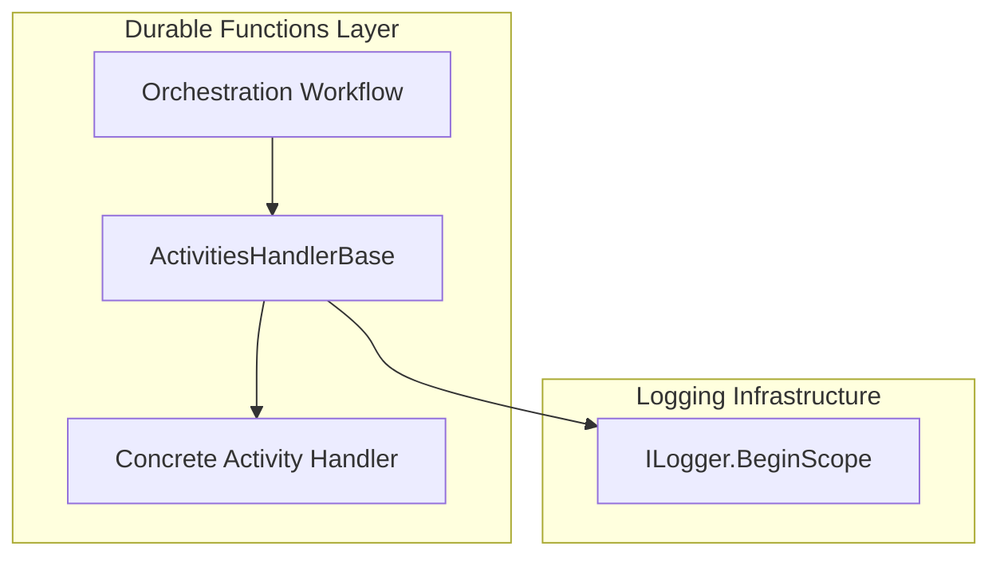
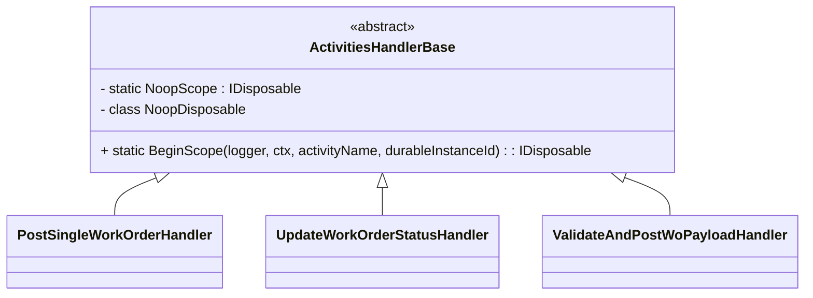

# Activities Handler Base Feature Documentation

## Overview

The **ActivitiesHandlerBase** class centralizes logging scope creation for all durable function activity handlers. It ensures each activity logs with consistent context: Run ID, Correlation ID, Durable Instance ID, and activity name. This base class simplifies handler implementations and promotes structured diagnostics across the orchestration pipeline.

## Architecture Overview



## Component Structure

### Business Layer

#### **ActivitiesHandlerBase** (`src/Rpc.AIS.Accrual.Orchestrator.Functions/Durable/Activities/Handlers/ActivitiesHandlerBase.cs`)

- **Purpose**- Provide a reusable method to start a structured logging scope for activity handlers.
- Avoid repetitive boilerplate in each handler.

- **Responsibilities**- Invoke `ILogger.BeginScope` with a dictionary containing:- `RunId`
- `CorrelationId`
- `DurableInstanceId`
- `Activity` (activity name)
- Supply a no-op `IDisposable` if `BeginScope` returns `null`.

## Class Diagram



## Key Classes Reference

| Class | Location | Responsibility |
| --- | --- | --- |
| ActivitiesHandlerBase | src/Rpc.AIS.Accrual.Orchestrator.Functions/Durable/Activities/Handlers/ActivitiesHandlerBase.cs | Base for activity handlers; initializes log scopes. |


## Dependencies

- Microsoft.Extensions.Logging
- Rpc.AIS.Accrual.Orchestrator.Core.Domain (RunContext)
- System
- System.Collections.Generic

## Method Details

| Method | Signature | Description |
| --- | --- | --- |
| BeginScope | protected static IDisposable BeginScope(ILogger logger, RunContext ctx, string activityName, string? durableInstanceId) | Starts a logging scope with keys `RunId`, `CorrelationId`, `DurableInstanceId`, and `Activity`. Returns a no-op scope if logging returns `null`. |


### BeginScope Parameters

- **logger** (`ILogger`)

The logger instance used to begin the scope.

- **ctx** (`RunContext`)

Contains the current run’s identifiers and timing.

- **activityName** (`string`)

Logical name of the activity for diagnostics.

- **durableInstanceId** (`string?`)

Optional identifier of the durable orchestration instance.

## Usage Example

```csharp
public sealed class ExampleHandler : ActivitiesHandlerBase
{
    private readonly ILogger<ExampleHandler> _logger;
    private readonly IExampleClient _client;

    public ExampleHandler(ILogger<ExampleHandler> logger, IExampleClient client)
    {
        _logger = logger;
        _client = client;
    }

    public async Task<ExampleResponse> HandleAsync(InputDto input, RunContext ctx, CancellationToken ct)
    {
        using var scope = BeginScope(_logger, ctx, "ExampleActivity", input.DurableInstanceId);
        _logger.LogInformation("Starting ExampleActivity");
        return await _client.CallAsync(input, ct);
    }
}
```

## Error Handling

- If `logger.BeginScope` returns `null`, the method uses a no-op disposable so callers need not check for null.
- The internal `NoopDisposable` implements `IDisposable` with an empty `Dispose` method, preventing null-reference exceptions.

## Testing Considerations

- **Scope Invocation**: Verify that `ILogger.BeginScope` receives a dictionary with the correct keys and values.
- **No-Op Fallback**: Test behavior when `BeginScope` returns `null`. Ensure `NoopDisposable` is returned and does not throw.