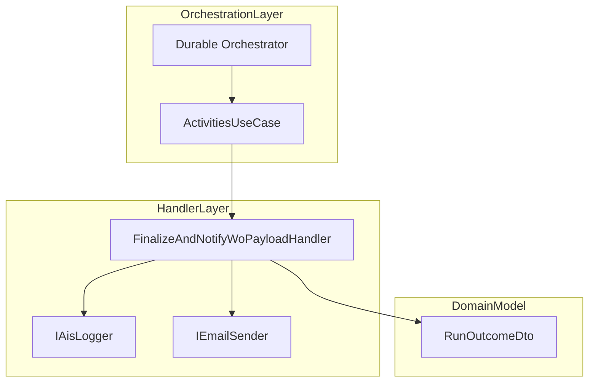

# Work Order Payload Finalization & Notification Handler

## Overview

This component finalizes work order (WO) posting results and notifies stakeholders on errors.

It aggregates posting outcomes, logs summary metrics, and, when failures occur, sends an HTML email to a configured distribution list.

It fits into the Durable Functions orchestration after all journal posting activities have completed.

## Architecture Overview



## Component Detail

### FinalizeAndNotifyWoPayloadHandler (src/Rpc.AIS.Accrual.Orchestrator.Functions/Durable/Activities/Handlers/FinalizeAndNotifyWoPayloadHandler.cs)

- **Purpose**

Aggregates WO posting results, logs final metrics, and sends an error notification email if needed.

- **Key Dependencies**- **IAisLogger**: logs structured telemetry to Application Insights.
- **IEmailSender**: abstracts email delivery (e.g. ACS, SMTP).
- **NotificationOptions**: reads distribution lists from configuration.
- **ILogger<…>**: writes framework-level logs.

- **Core Method**

```csharp
  public async Task<DurableAccrualOrchestration.RunOutcomeDto> HandleAsync(
      DurableAccrualOrchestration.FinalizeWoPayloadInputDto input,
      RunContext runCtx,
      CancellationToken ct)
```

- Begins a scoped log with run identifiers.
- Computes:- **WorkOrdersConsidered** via `ActivitiesUseCase.TryGetWorkOrderCount`.
- **WorkOrdersValid** as the minimum posted count across journal types.
- **WorkOrdersInvalid** = considered – valid.
- **PostFailureGroups** = number of journal types that failed.
- **HasAnyErrors** flag.
- Emits a final info log via `_ais.InfoAsync`.
- If any failures exist, retrieves recipients and sends a styled error email.
- Returns a populated `RunOutcomeDto`.

## Data Model

### RunOutcomeDto

| Property | Type | Description |
| --- | --- | --- |
| RunId | string | Unique identifier for this orchestration run. |
| CorrelationId | string | Correlates logs across services. |
| WorkOrdersConsidered | int | Number of WOs analyzed. |
| WorkOrdersValid | int | Count of WOs successfully posted. |
| WorkOrdersInvalid | int | Count of WOs that failed posting. |
| PostFailureGroups | int | Number of journal types that reported failure. |
| HasAnyErrors | bool | Indicates if any posting or general errors occurred. |
| GeneralErrors | List<string> | Additional non-posting errors captured upstream. |


## Execution Flow

### Orchestration Invocation

1. **Durable Orchestrator** calls the activity:

```csharp
   var outcome = await context.CallActivityAsync<RunOutcomeDto>(
     nameof(Activities.FinalizeAndNotifyWoPayload),
     new FinalizeWoPayloadInputDto(...));
```

1. **ActivitiesUseCase** routes to `FinalizeAndNotifyWoPayloadHandler.HandleAsync`.

### Handler Logic

1. **Begin Scope**

Creates a logging scope with `RunId`, `CorrelationId`, `Activity` and `DurableInstanceId`.

1. **Log Start**

`_logger.LogInformation("Activity FinalizeAndNotifyWoPayload: Begin…")`.

1. **Compute Metrics**- Uses `ActivitiesUseCase.TryGetWorkOrderCount`.
- Aggregates `PostResults`.
2. **Log Summary**

`_ais.InfoAsync` logs combined metrics and any general errors.

1. **Error Notification**- If failures exist:1. Retrieves recipients via `NotificationOptions.GetRecipients()`.
2. Warns if list is empty.
3. Composes subject and HTML body via `ErrorEmailComposer`.
4. Sends email with `IEmailSender.SendAsync`.
- Catches and logs any email-sending exception.
2. **Return Outcome**

Returns a new `RunOutcomeDto` instance with final metrics.

## Error Handling

- **Posting Failures**

Counts as `PostFailureGroups` and drives `HasAnyErrors`.

- **Notification Failures**

Wrapped in a `try/catch`; logs via `_logger.LogError`, but does not break orchestration.

```card
{
    "title": "Empty Distribution List",
    "content": "If no recipients are configured in NotificationOptions, the handler logs a warning and skips email sending."
}
```

## Key Classes Reference

| Class | Location | Responsibility |
| --- | --- | --- |
| FinalizeAndNotifyWoPayloadHandler | src/Rpc.AIS.Accrual.Orchestrator.Functions/Durable/Activities/Handlers/FinalizeAndNotifyWoPayloadHandler.cs | Aggregates posting results and sends error notification. |
| ActivitiesHandlerBase | src/Rpc.AIS.Accrual.Orchestrator.Functions/Durable/Activities/Handlers/ActivitiesHandlerBase.cs | Provides a BeginScope helper for structured logging. |
| DurableAccrualOrchestration.RunOutcomeDto | src/Rpc.AIS.Accrual.Orchestrator.Functions/Durable/Activities/Activities.cs (`RunOutcomeDto` record in orchestrator DTOs) | Carries summary outcome of WO payload posting. |


## Dependencies

- **Rpc.AIS.Accrual.Orchestrator.Core.Services**
- **Rpc.AIS.Accrual.Orchestrator.Core.Abstractions**
- **Rpc.AIS.Accrual.Orchestrator.Infrastructure.Options**
- **Rpc.AIS.Accrual.Orchestrator.Core.Domain**

All dependencies are injected via constructor and validated for non-null arguments.