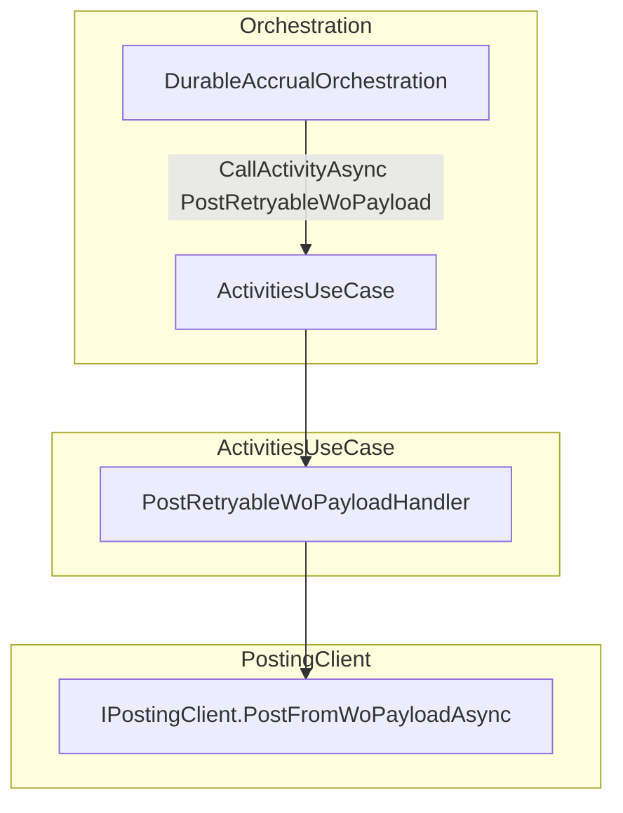
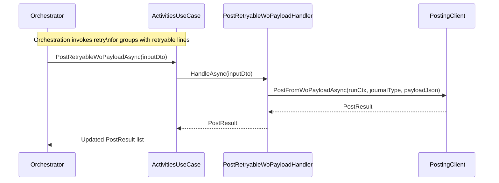

# Post Retryable WO Payload Activity Documentation

## Overview

This activity handler re-posts only the subset of work orders that previously failed due to transient or lookup errors. It integrates into the Durable Functions orchestration to avoid duplicate side effects while ensuring retryable payloads are retried once. By isolating retry logic per journal type and payload subset, it maintains idempotency and reliability in FSCM journal posting.

## Architecture Overview



## Component Structure

### PostRetryableWoPayloadHandler (`src/Rpc.AIS.Accrual.Orchestrator.Functions/Durable/Activities/Handlers/PostRetryableWoPayloadHandler.cs`)

- **Purpose**

Handles the durable activity that posts retryable work order payloads per journal type and attempt.

- **Responsibilities**- Begins a structured logging scope.
- Logs start and end of the retryable post.
- Invokes `IPostingClient.PostFromWoPayloadAsync` to re-post the filtered payload.
- Propagates any remaining retryable work orders in the returned `PostResult`.
- Logs and rethrows exceptions to let Durable Functions apply its retry policy.

#### Constructor Dependencies

| Dependency | Role |
| --- | --- |
| IPostingClient _posting | FSCM journal posting pipeline |
| IAisLogger _ais | Application Insights structured payload logging |
| ILogger<PostRetryableWoPayloadHandler> _logger | Activity-scoped logging |


```csharp
public PostRetryableWoPayloadHandler(
    IPostingClient posting,
    IAisLogger ais,
    ILogger<PostRetryableWoPayloadHandler> logger)
{ … } 
```

#### HandleAsync Method

```csharp
public async Task<PostResult> HandleAsync(
    DurableAccrualOrchestration.RetryableWoPayloadPostingInputDto input,
    RunContext runCtx,
    CancellationToken ct)
{
    using var scope = BeginScope(_logger, runCtx, "PostRetryableWoPayload", input.DurableInstanceId);
    _logger.LogInformation(
        "Activity PostRetryableWoPayload: Begin. RunId={RunId} CorrelationId={CorrelationId} JournalType={JournalType} Attempt={Attempt}",
        runCtx.RunId, runCtx.CorrelationId, input.JournalType, input.Attempt);

    try
    {
        // Re-run posting for retryable subset
        var result = await _posting.PostFromWoPayloadAsync(
            runCtx,
            input.JournalType,
            input.WoPayloadJson,
            ct)
        .ConfigureAwait(false);

        _logger.LogInformation(
            "Activity PostRetryableWoPayload: Completed. RunId={RunId} CorrelationId={CorrelationId} JournalType={JournalType} Attempt={Attempt} Success={Success} PostedWO={PostedWO} RetryableWO={RetryWO}",
            runCtx.RunId, runCtx.CorrelationId, input.JournalType, input.Attempt,
            result.IsSuccess, result.WorkOrdersPosted, result.RetryableWorkOrders);

        return result;
    }
    catch (Exception ex)
    {
        _logger.LogError(
            ex,
            "Activity PostRetryableWoPayload failed. RunId={RunId} CorrelationId={CorrelationId} JournalType={JournalType} Attempt={Attempt}",
            runCtx.RunId, runCtx.CorrelationId, input.JournalType, input.Attempt);
        throw;
    }
}
```

### Activity Input DTO

The handler consumes the following input DTO defined in `DurableAccrualOrchestration`:

| Property | Type | Description |
| --- | --- | --- |
| RunId | string | Unique orchestration run identifier |
| CorrelationId | string | Correlation across logs and telemetry |
| WoPayloadJson | string | JSON payload of retryable work orders |
| JournalType | JournalType | Enum: Item, Expense, Hour |
| Attempt | int | Retry attempt number (1) |
| DurableInstanceId | string? | Durable Functions instance identifier |


```csharp
public sealed record RetryableWoPayloadPostingInputDto(
    string RunId,
    string CorrelationId,
    string WoPayloadJson,
    JournalType JournalType,
    int Attempt,
    string? DurableInstanceId = null);
```

### Activity Output Model

- **PostResult**

Domain model carrying posting outcome:

- `IsSuccess` (bool): All work orders posted successfully.
- `WorkOrdersPosted` (int): Count of work orders successfully posted.
- `RetryableWorkOrders` (int): Count of lines still retryable.
- Additional error details, filtered counts, and raw validation payloads.

## Execution Flow



## Logging & Error Handling

- **Scope**: Begins a logging scope including RunId, CorrelationId, DurableInstanceId, and Activity name via `ActivitiesHandlerBase.BeginScope` .
- **Information**: Logs start and end with details: journal type, attempt, success flag, posted and retryable counts.
- **Errors**: Catches exceptions, logs them at Error level with context, then rethrows.

```csharp
using var scope = BeginScope(_logger, runCtx, "PostRetryableWoPayload", input.DurableInstanceId);
_logger.LogError(ex, "... failed. RunId={RunId} ...", ...);
throw;
```

## Integration Points & Dependencies

- **DurableAccrualOrchestration.RetryRetryableGroupsAsync**

Invokes this handler per journal type for retryable groups .

- **ActivitiesUseCase**

Exposes `PostRetryableWoPayloadAsync` delegating to this handler .

- **IPostingClient**

Core posting pipeline that validates and posts payload subsets.

## Key Classes Reference

| Class | Location | Responsibility |
| --- | --- | --- |
| PostRetryableWoPayloadHandler | Functions/Durable/Activities/Handlers/PostRetryableWoPayloadHandler.cs | Activity logic for retryable payload posting |
| ActivitiesHandlerBase | Functions/Durable/Activities/Handlers/ActivitiesHandlerBase.cs | Provides consistent logging scope for activities |
| RetryableWoPayloadPostingInputDto | Functions/Durable/Orchestrators/DurableAccrualOrchestration.cs | Input DTO for retryable post activity |
| IPostingClient | Core/Abstractions/IPostingClient.cs | Abstraction for FSCM posting pipeline |
| PostResult | Core/Domain/PostResult.cs | Domain model carrying posting outcome |


```card
{
    "title": "Retryable Activity",
    "content": "This handler retries only once per journal type for retryable work orders to avoid duplicate server-side effects."
}
```

## Dependencies

- Microsoft.Azure.Functions.Worker.DurableTask
- Microsoft.Extensions.Logging
- Rpc.AIS.Accrual.Orchestrator.Core.Abstractions
- Rpc.AIS.Accrual.Orchestrator.Core.Domain
- Rpc.AIS.Accrual.Orchestrator.Functions.Functions