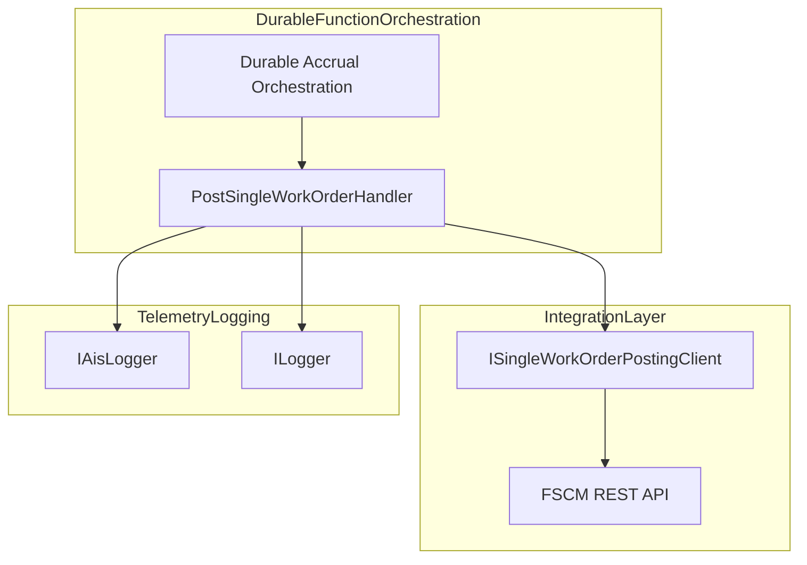
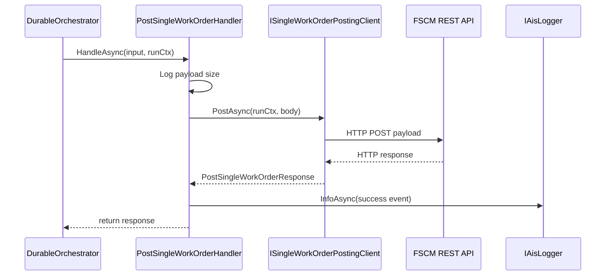

# Post Single Work Order Feature Documentation

## Overview

The **Post Single Work Order** feature handles the posting of a single work order payload from the durable orchestration to the FSCM system. It wraps the raw JSON payload, invokes the FSCM HTTP client, logs metrics, and records success or failure via AIS telemetry. This activity ensures reliable, retry-capable communication in the Azure Durable Function orchestration for accrual processing.

## Architecture Overview

## Component Structure

### 1. Activity Handler

#### **PostSingleWorkOrderHandler** (`src/Rpc.AIS.Accrual.Orchestrator.Functions/Durable/Activities/Handlers/PostSingleWorkOrderHandler.cs`)

- **Purpose and responsibilities**- Receives a single-work-order input DTO from the orchestrator.
- Invokes the FSCM posting client asynchronously.
- Logs request size, duration, outcome, and telemetry.
- Propagates exceptions to trigger durable retries.

- **Key Dependencies**- `_singleWo`: **ISingleWorkOrderPostingClient** – sends payload to FSCM.
- `_ais`: **IAisLogger** – records structured success/error events.
- `_logger`: **ILogger<PostSingleWorkOrderHandler>** – writes local diagnostic logs.

- **Key Method**- `HandleAsync(SingleWoPostingInputDto input, RunContext runCtx, CancellationToken ct)`

Processes the input, calls the client, logs metrics, and returns `PostSingleWorkOrderResponse`.

### 2. Activity Input DTO

#### **SingleWoPostingInputDto** (defined in `DurableAccrualOrchestration`)

- **Properties**- `RawJsonBody` (string?) – the serialized work order envelope.
- `DurableInstanceId` (string) – orchestration instance identifier.
- (Other orchestration metadata omitted.)

### 3. Response Model

#### **PostSingleWorkOrderResponse** (`Rpc.AIS.Accrual.Orchestrator.Application.Ports.Common.Abstractions`)

| Property | Type | Description |
| --- | --- | --- |
| `IsSuccess` | bool | Indicates whether FSCM returned HTTP 2xx. |
| `StatusCode` | int | FSCM HTTP status code. |
| `ResponseBody` | string? | Raw response JSON or error snippet. |

## Feature Flows

### 1. Posting Single Work Order

## Error Handling

- The handler wraps the client call in a `try…catch`.
- On exception, it logs via `_ais.ErrorAsync(...)` with the exception and CorrelationId.
- It then **rethrows** to allow Azure Durable retry policies to apply.

## Integration Points

- **DurableAccrualOrchestration** invokes this activity as one step in the accrual orchestration.
- **ISingleWorkOrderPostingClient** abstraction (implemented by `FscmSingleWorkOrderHttpClient`) performs the actual HTTP call.
- **IAisLogger** captures structured telemetry for downstream monitoring.

## Dependencies

- Microsoft.Extensions.Logging
- Rpc.AIS.Accrual.Orchestrator.Core.Abstractions
- Rpc.AIS.Accrual.Orchestrator.Functions.Functions
- Rpc.AIS.Accrual.Orchestrator.Core.Domain
- System.Diagnostics
- System.Text

## Key Classes Reference

| Class | Location | Responsibility |
| --- | --- | --- |
| PostSingleWorkOrderHandler | `Functions/Durable/Activities/Handlers/PostSingleWorkOrderHandler.cs` | Activity handler for single work order posting |
| ISingleWorkOrderPostingClient | `Application/Ports/Common/Abstractions/ISingleWorkOrderPostingClient.cs` | Defines POST behavior to FSCM |
| PostSingleWorkOrderResponse | `Application/Ports/Common/Abstractions/ISingleWorkOrderPostingClient.cs` | Carries FSCM response data for single work order post |
| RunContext | `Core/Domain/RunContext.cs` | Correlation and context metadata across steps |

## Testing Considerations

- **Success Scenario**: FSCM returns 200 → handler returns `IsSuccess=true`.
- **Client Returns Null**: Simulate `null` → handler wraps into 500 error response.
- **Transient Errors**: HTTP 5xx or network exceptions → exception thrown for retry.
- **Authorization Failures**: HTTP 401/403 → logged and exception triggers retry/failure path.