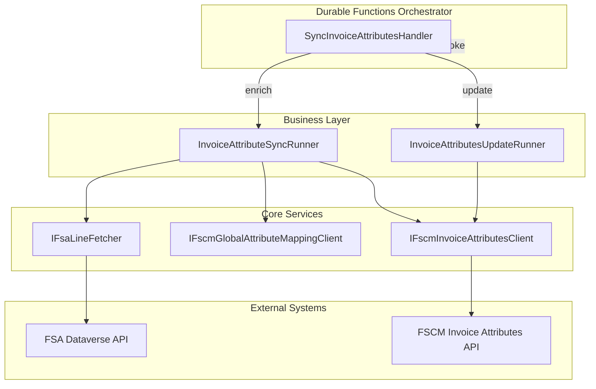
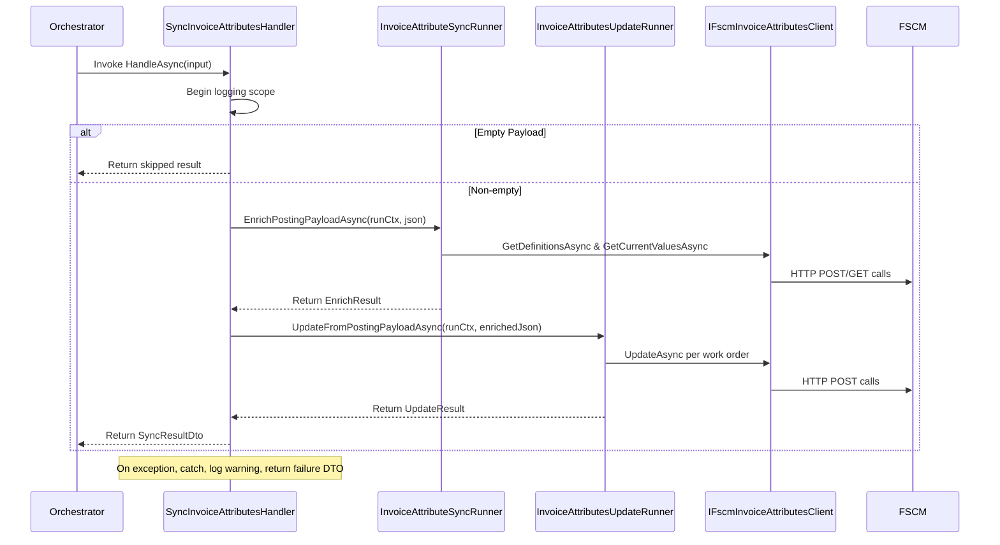

# Sync Invoice Attributes Handler Feature Documentation

## Overview 🚀

The **SyncInvoiceAttributesHandler** orchestrates invoice attribute synchronization within the durable orchestration. It coordinates two core runners:

- **InvoiceAttributeSyncRunner**: computes differences between field service (FS) and financial (FSCM) invoice attributes, enriching the posting payload.
- **InvoiceAttributesUpdateRunner**: extracts updated attribute pairs from the enriched payload and invokes the FSCM update endpoint.

This handler ensures that invoice attributes stay consistent across systems by first determining what needs to change, then applying those changes in a controlled, durable workflow. It plugs into the broader Azure Durable Functions orchestration and provides structured success/failure reporting.

## Architecture Overview



## Component Structure

### 1. Activities Handler Layer

#### **SyncInvoiceAttributesHandler** (`src/Rpc.AIS.Accrual.Orchestrator.Functions/Durable/Activities/Handlers/SyncInvoiceAttributesHandler.cs`)

- **Purpose & Responsibilities**- Acts as the durable activity handler for invoice attribute synchronization.
- Invokes enrichment and update runners in sequence.
- Manages logging scope and error handling.
- **Dependencies**- `InvoiceAttributeSyncRunner`
- `InvoiceAttributesUpdateRunner`
- `ILogger<SyncInvoiceAttributesHandler>`
- **Key Methods**

| Method | Signature | Returns |
| --- | --- | --- |
| HandleAsync | `Task<DurableAccrualOrchestration.InvoiceAttributesSyncResultDto> HandleAsync(InvoiceAttributesSyncInputDto input, RunContext runCtx, CancellationToken ct)` | `InvoiceAttributesSyncResultDto` |


```csharp
public async Task<DurableAccrualOrchestration.InvoiceAttributesSyncResultDto> HandleAsync(
    DurableAccrualOrchestration.InvoiceAttributesSyncInputDto input,
    RunContext runCtx,
    CancellationToken ct)
```

- **Behavior**1. Begins a logging scope with `BeginScope`.
2. Validates and reads the incoming JSON payload.
3. If payload is empty, returns a skipped result.
4. Calls `_invoiceSync.EnrichPostingPayloadAsync(...)`.
5. Calls `_invoiceUpdate.UpdateFromPostingPayloadAsync(...)` using the enriched JSON.
6. Constructs and returns a result DTO with enrichment and update metrics.
7. Catches exceptions, logs a warning, and returns a failure DTO.

### 2. Business Layer

#### **InvoiceAttributeSyncRunner** (`src/Rpc.AIS.Accrual.Orchestrator.Functions/Composition/InvoiceAttributeSyncRunner.cs`)

- **Purpose**

Computes the delta between FS (field service) attributes and existing FSCM snapshots, then injects new or cleared attributes into the posting payload.

- **Key Methods**

| Method | Description | Returns |
| --- | --- | --- |
| EnrichPostingPayloadAsync | Fetches work order headers, derives FS attributes, maps to FSCM names, filters by active definitions, builds delta. | `Task<EnrichResult>` |


#### **InvoiceAttributesUpdateRunner** (`src/Rpc.AIS.Accrual.Orchestrator.Functions/Composition/InvoiceAttributesUpdateRunner.cs`)

- **Purpose**

Extracts `InvoiceAttributes` arrays from the posting payload and executes FSCM update calls for each work order.

- **Key Methods**

| Method | Description | Returns |
| --- | --- | --- |
| UpdateFromPostingPayloadAsync | Parses posting payload JSON, iterates work orders and attribute pairs, calls update. | `Task<UpdateResult>` |


### 3. Data Access Layer

#### **IFscmInvoiceAttributesClient** (`src/Rpc.AIS.Accrual.Orchestrator.Core.Abstractions/IFscmInvoiceAttributesClient.cs`)

- **Purpose**

Defines operations against the FSCM invoice attributes HTTP endpoints.

- **Methods**

| Method | Description | Returns |
| --- | --- | --- |
| GetDefinitionsAsync | Retrieves the FSCM attribute definitions table. | `IReadOnlyList<InvoiceAttributeDefinition>` |
| GetCurrentValuesAsync | Gets the current snapshot of attribute values. | `IReadOnlyList<InvoiceAttributePair>` |
| UpdateAsync | Updates attributes for a specific work order. | `FscmInvoiceAttributesUpdateResult` |


### 4. Data Models

#### **InvoiceAttributesSyncInputDto**

| Property | Type | Description |
| --- | --- | --- |
| DurableInstanceId | string | Durable orchestration instance identifier. |
| WoPayloadJson | string? | JSON payload containing the work order list. |


#### **InvoiceAttributesSyncResultDto**

| Property | Type | Description |
| --- | --- | --- |
| Attempted | bool | Indicates whether enrichment was attempted. |
| Success | bool | Overall success flag of the sync operation. |
| WorkOrdersWithInvoiceAttributes | int | Number of work orders enriched with attribute updates. |
| TotalAttributePairs | int | Total count of attribute name/value pairs processed. |
| Note | string | Informational note or error message. |
| SuccessCount | int | Number of successful FSCM update calls. |
| FailureCount | int | Number of failed FSCM update calls. |


## Feature Flows

### 1. Sync Invoice Attributes Flow 🔄



## Error Handling

- **Argument Validation**

Constructors and `HandleAsync` validate injected services and mandatory inputs, throwing `ArgumentNullException` or `ArgumentException`.

- **Scoped Try/Catch**

Surrounds the enrichment and update calls; logs a warning on any exception and returns a failure result with exception message.

## Dependencies

- `Microsoft.Extensions.Logging`
- `Rpc.AIS.Accrual.Orchestrator.Core.Domain` (RunContext)
- `Rpc.AIS.Accrual.Orchestrator.Core.Services` (runners)
- `Rpc.AIS.Accrual.Orchestrator.Functions.Functions` (BeginScope helper)
- Azure Durable Functions (activity integration)

## Key Classes Reference

| Class | Location | Responsibility |
| --- | --- | --- |
| SyncInvoiceAttributesHandler | `Functions/Durable/Activities/Handlers/SyncInvoiceAttributesHandler.cs` | Durable activity handler coordinating sync and update runners. |
| InvoiceAttributeSyncRunner | `Functions/Composition/InvoiceAttributeSyncRunner.cs` | Computes invoice attribute deltas and enriches payload. |
| InvoiceAttributesUpdateRunner | `Functions/Composition/InvoiceAttributesUpdateRunner.cs` | Executes FSCM update calls based on enriched payload. |
| IFscmInvoiceAttributesClient | `Core/Abstractions/IFscmInvoiceAttributesClient.cs` | Defines FSCM invoice attributes HTTP operations. |
| InvoiceAttributesSyncInputDto | `DurableAccrualOrchestration` namespace (generated DTO for input) | Input contract for sync activity. |
| InvoiceAttributesSyncResultDto | `DurableAccrualOrchestration` namespace (generated DTO for result) | Result contract reporting enrichment and update outcomes. |


## Testing Considerations

- Validate that an **empty payload** returns a skipped result with zero pairs (`Attempted=false`, `Success=true`).
- Simulate failures in runners to ensure the catch block logs correctly and returns `Success=false` with `FailureCount=1`.
- Integrate with a mocked `IFscmInvoiceAttributesClient` to verify proper sequencing of enrichment and update calls.