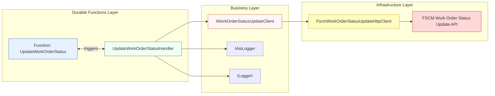
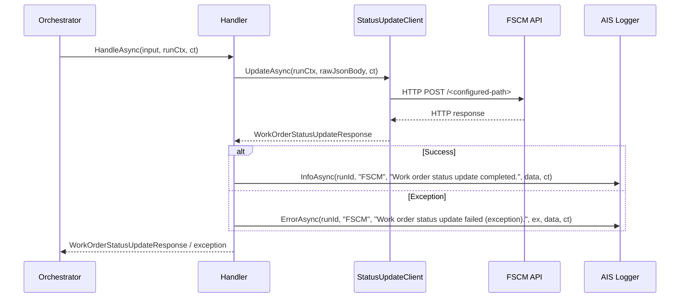

# Update Work Order Status Feature Documentation

## Overview

The **Update Work Order Status** feature handles the Durable Function activity that forwards a raw work-order status update payload to the FSCM system. It logs activity metrics, propagates correlation identifiers, and captures success or failure details for monitoring and retry. This ensures that downstream orchestrations reliably update work-order status in FSCM and report outcomes in AIS logging.

This handler sits within the accrual orchestrator pipeline. It is invoked by the durable orchestration function, measures request latency, delegates the HTTP call to an injected client abstraction, and emits structured logs and AIS events for both success and exception cases .

## Architecture Overview



## Component Structure

### Durable Function Activity

#### **UpdateWorkOrderStatus**

 `src/Rpc.AIS.Accrual.Orchestrator.Functions/Functions/Activities.cs`

- Decorated with `[Function(nameof(UpdateWorkOrderStatus))]`.
- Deserializes `WorkOrderStatusUpdateInputDto` and builds a `RunContext`.
- Delegates to `ActivitiesUseCase.UpdateWorkOrderStatusAsync`.

### Handler

#### **UpdateWorkOrderStatusHandler**

 `src/Rpc.AIS.Accrual.Orchestrator.Functions/Durable/Activities/Handlers/UpdateWorkOrderStatusHandler.cs`

- **Purpose:** Executes the work-order status update activity within an orchestration.
- **Dependencies:**- `IWorkOrderStatusUpdateClient _woStatus`
- `IAisLogger _ais`
- `ILogger<UpdateWorkOrderStatusHandler> _logger`
- **Key Method:**

```csharp
  public async Task<WorkOrderStatusUpdateResponse> HandleAsync(
      DurableAccrualOrchestration.WorkOrderStatusUpdateInputDto input,
      RunContext runCtx,
      CancellationToken ct)
```

- Begins a structured logging scope with `BeginScope`.
- Logs payload size and invocation start.
- Starts a `Stopwatch`, invokes `_woStatus.UpdateAsync(runCtx, body, ct)`, then stops timing.
- Logs execution metrics (`ElapsedMs`, `StatusCode`, `IsSuccess`).
- Emits an AIS **Info** event on success or **Error** event on exception, then rethrows to trigger Durable retry.

### Domain Model

#### **WorkOrderStatusUpdateResponse**

 `src/Rpc.AIS.Accrual.Orchestrator.Core/Domain/WorkOrderStatusUpdateResponse.cs`

| Property | Type | Description |
| --- | --- | --- |
| IsSuccess | bool | Indicates if FSCM responded with a success status. |
| StatusCode | int | HTTP status code returned by FSCM. |
| ResponseBody | string? | Raw JSON response body or error message. |


#### **WorkOrderStatusUpdateInputDto**

- `string RawJsonBody`
- `string DurableInstanceId`
- `string RunId`
- `string CorrelationId`

## Feature Flow

### Sequence: Updating Work Order Status



## Error Handling

- Catches all exceptions in `HandleAsync`.
- Logs an AIS **Error** event with exception details and correlation ID.
- Rethrows the exception to allow the Durable retry policy to manage retries.

## Dependencies

- **ActivitiesHandlerBase**: Provides `BeginScope` for structured logging scopes.
- **IWorkOrderStatusUpdateClient**: Abstraction over FSCM HTTP client.
- **IAisLogger**: Sends structured logs to AIS for monitoring.
- **ILogger\<T\>**: Standard .NET logger for local diagnostics.
- **RunContext**: Carries `RunId`, `CorrelationId`, trigger metadata.
- **WorkOrderStatusUpdateResponse**: Domain record for status update result.

## Key Classes Reference

| Class | Location | Responsibility |
| --- | --- | --- |
| UpdateWorkOrderStatusHandler | `Functions/Durable/Activities/Handlers/UpdateWorkOrderStatusHandler.cs` | Orchestrates the FSCM work-order status update. |
| IWorkOrderStatusUpdateClient | `Core/Abstractions/IWorkOrderStatusUpdateClient.cs` | Defines contract for sending status update payload. |
| FscmWorkOrderStatusUpdateHttpClient | `Infrastructure/Adapters/Fscm/Clients/FscmWorkOrderStatusUpdateHttpClient.cs` | Concrete HTTP client for FSCM status endpoint. |
| WorkOrderStatusUpdateResponse | `Core/Domain/WorkOrderStatusUpdateResponse.cs` | Represents FSCM HTTP response. |
| Activities | `Functions/Functions/Activities.cs` | Azure Function adapter for durable activities. |


## Testing Considerations

- **Success Path:**- Mock `IWorkOrderStatusUpdateClient.UpdateAsync` to return a successful `WorkOrderStatusUpdateResponse`.
- Verify that `IAisLogger.InfoAsync` is called with correct status code and correlation ID.

- **Null Response Path:**- Mock `UpdateAsync` to return `null`.
- Expect a default 500 response wrapped in fallback `WorkOrderStatusUpdateResponse`.

- **Exception Path:**- Configure `UpdateAsync` to throw.
- Assert that `IAisLogger.ErrorAsync` is invoked and exception bubbles up.

- **Logging Scopes:**- Validate that `BeginScope` includes `RunId`, `CorrelationId`, and the activity name.