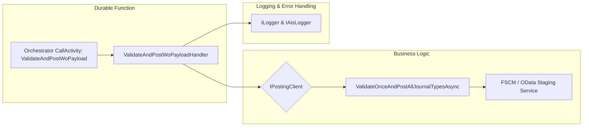

# ValidateAndPostWoPayloadHandler 🚀

## Overview

The **ValidateAndPostWoPayloadHandler** is a Durable Functions activity handler that executes a one-time validation and posting of a work order (WO) payload. It receives the raw WO JSON, logs its size, selects the posting mode (OData staging vs. asynchronous journal), and delegates to the shared **IPostingClient** to validate and post all journal types in one call. Upon completion, it logs timing and failure counts, returning a group of **PostResult** objects. In case of unexpected errors, it synthesizes standardized failure responses for **Item**, **Expense**, and **Hour** journal types.

## Architecture Overview



## Component Structure

### **ValidateAndPostWoPayloadHandler**

`src/Rpc.AIS.Accrual.Orchestrator.Functions/Durable/Activities/Handlers/ValidateAndPostWoPayloadHandler.cs`

- **Purpose**- Orchestrates the “validate once + post all journal types” flow for a WO payload.
- Measures and logs payload size, execution time, and failure counts.
- Ensures durable orchestration scope and consistent error reporting.

- **Dependencies**

| Dependency | Role |
| --- | --- |
| IPostingClient | Validates & posts WO payloads |
| FscmODataStagingOptions | Toggles between OData staging and JournalAsync |
| IAisLogger | Structured AIS telemetry logging |
| ILogger\<ValidateAndPostWoPayloadHandler> | Standard .NET logging |


- **Constructor**

```csharp
  public ValidateAndPostWoPayloadHandler(
      IPostingClient posting,
      FscmODataStagingOptions odataOpt,
      IAisLogger ais,
      ILogger<ValidateAndPostWoPayloadHandler> logger)
```

| Parameter | Type | Description |
| --- | --- | --- |
| posting | IPostingClient | Client for validation & posting |
| odataOpt | FscmODataStagingOptions | Configuration for staging mode |
| ais | IAisLogger | AIS-specific telemetry logger |
| logger | ILogger\<ValidateAndPostWoPayloadHandler> | Activity logger |


- **HandleAsync**

```csharp
  public async Task<List<PostResult>> HandleAsync(
      DurableAccrualOrchestration.WoPayloadPostingInputDto input,
      RunContext runCtx,
      CancellationToken ct)
```

- **Scope**: Starts a scoped logger via `BeginScope` tied to `input.DurableInstanceId`.
- **Payload Logging**: Logs raw payload size in bytes.
- **Mode Selection**:- `"ODataStaging"` when `_odataOpt.Enabled` is `true`.
- `"JournalAsync"` otherwise.
- **Execution**: Invokes

```csharp
    _posting.ValidateOnceAndPostAllJournalTypesAsync(runCtx, woPayloadJson, ct)
```

- **Timing**: Measures elapsed time with `Stopwatch`.
- **Result Processing**:- Ensures a non-null `List<PostResult>`.
- Counts failure groups (`!r.IsSuccess`).
- Logs end time, mode, and failure count.
- **Return**: The list of **PostResult** groups.

- **Error Handling**

On exception, constructs a single **PostError** and returns three identical failure **PostResult** entries for journal types **Item**, **Expense**, and **Hour**:

```csharp
  var err = new PostError(
      Code: "POST_EXCEPTION",
      Message: $"Posting exception (single-validation): {ex.Message}",
      StagingId: null,
      JournalId: null,
      JournalDeleted: false,
      DeleteMessage: ex.ToString()
  );
```

Each **PostResult** is created with `IsSuccess = false` and the single error .

---

## Data Models Reference

```csharp
// Represents the outcome of posting one journal group.
public sealed record PostResult(
    JournalType JournalType,
    bool IsSuccess,
    string? JournalId,
    string? SuccessMessage,
    IReadOnlyList<PostError> Errors,
    int WorkOrdersBefore = 0,
    int WorkOrdersPosted = 0,
    int WorkOrdersFiltered = 0,
    string? ValidationResponseRaw = null,
    int RetryableWorkOrders = 0,
    int RetryableLines = 0,
    string? RetryablePayloadJson = null
);

// Describes a single error encountered during posting.
public sealed record PostError(
    string Code,
    string Message,
    string? StagingId,
    string? JournalId,
    bool JournalDeleted,
    string? DeleteMessage
);
```

| Property | Type | Description |
| --- | --- | --- |
| JournalType | `JournalType` | Enum: Item, Expense, Hour |
| IsSuccess | `bool` | Indicates overall posting success |
| JournalId | `string?` | Identifier of the created FSCM journal |
| SuccessMessage | `string?` | Human-readable success description |
| Errors | `IReadOnlyList<PostError>` | Collection of encountered errors |
| WorkOrdersBefore | `int` | Count of work orders before posting |
| WorkOrdersPosted | `int` | Number of work orders successfully posted |
| WorkOrdersFiltered | `int` | Number of work orders filtered out due to validation/pre-errors |
| ValidationResponseRaw | `string?` | Raw JSON from remote validation endpoint |
| RetryableWorkOrders | `int` | Number of work orders marked retryable |
| RetryableLines | `int` | Number of individual lines marked retryable |
| RetryablePayloadJson | `string?` | Filtered JSON payload containing only retryable entries |


---

## Key Class

| Class | Location | Responsibility |
| --- | --- | --- |
| ValidateAndPostWoPayloadHandler | Functions/Durable/Activities/Handlers/ValidateAndPostWoPayloadHandler.cs | Coordinates WO payload validation + posting for all journal types |
| PostResult | Core/Domain/PostResult.cs | Captures results of a journal posting attempt |
| PostError | Core/Domain/PostResult.cs | Represents an individual posting error |
| IPostingClient | Core/Abstractions/IPostingClient.cs | Defines posting API (ValidateOnceAndPostAllJournalTypesAsync etc.) |
| FscmODataStagingOptions | Infrastructure/Options/FscmODataStagingOptions.cs | Controls staging vs. direct journal posting mode |
| IAisLogger | Core/Abstractions/IAisLogger.cs | Provides structured AIS telemetry logging |


---

## Important Notes 📌

```card
{
    "title": "Error Policy",
    "content": "In case of any exception, all journal types return a standardized POST_EXCEPTION error result."
}
```

- **Scope Management**: Uses `BeginScope` to tie logs to a durable instance ID.
- **Mode Toggle**: Driven entirely by `FscmODataStagingOptions.Enabled`.
- **Failure Groups**: Returns one group per `JournalType`, ensuring orchestration continues even on total failure.

---

*All content strictly reflects existing code; no additional methods or sections are introduced.*