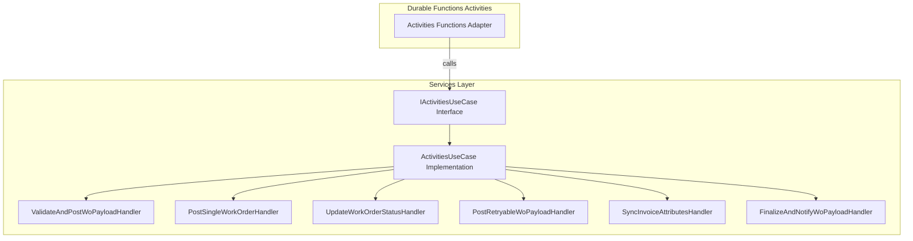
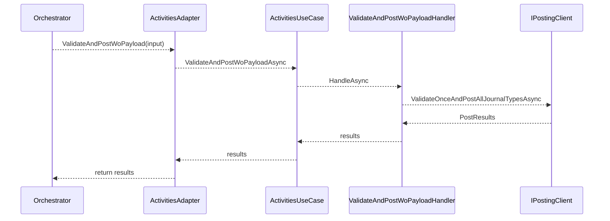

# Activities Use Case Feature Documentation

## Overview

The **Activities Use Case** defines a contract for durable function activities in the accrual orchestrator. It encapsulates all business logic related to posting work-order payloads, updating work-order status, syncing invoice attributes, and finalizing notifications. By defining an interface, the orchestrator’s activity adapters remain thin, delegating behavior to implementations that can be unit-tested and swapped independently.

This feature sits in the **Services** layer of the Functions project. Durable Functions activities (in `Activities.cs`) call the interface’s methods, and the concrete implementation (`ActivitiesUseCase`) forwards requests to specialized handlers. This separation improves maintainability, testability, and adheres to SOLID principles.

## Architecture Overview



## Interface Definition

### **IActivitiesUseCase**

`src/Rpc.AIS.Accrual.Orchestrator.Functions/Durable/Activities/IActivitiesUseCase.cs`

```csharp
public interface IActivitiesUseCase
{
    Task<List<PostResult>> ValidateAndPostWoPayloadAsync(
        DurableAccrualOrchestration.WoPayloadPostingInputDto input,
        RunContext runCtx,
        CancellationToken ct);

    Task<PostSingleWorkOrderResponse> PostSingleWorkOrderAsync(
        DurableAccrualOrchestration.SingleWoPostingInputDto input,
        RunContext runCtx,
        CancellationToken ct);

    Task<WorkOrderStatusUpdateResponse> UpdateWorkOrderStatusAsync(
        DurableAccrualOrchestration.WorkOrderStatusUpdateInputDto input,
        RunContext runCtx,
        CancellationToken ct);

    Task<PostResult> PostRetryableWoPayloadAsync(
        DurableAccrualOrchestration.RetryableWoPayloadPostingInputDto input,
        RunContext runCtx,
        CancellationToken ct);

    Task<DurableAccrualOrchestration.InvoiceAttributesSyncResultDto> SyncInvoiceAttributesAsync(
        DurableAccrualOrchestration.InvoiceAttributesSyncInputDto input,
        RunContext runCtx,
        CancellationToken ct);

    Task<DurableAccrualOrchestration.RunOutcomeDto> FinalizeAndNotifyWoPayloadAsync(
        DurableAccrualOrchestration.FinalizeWoPayloadInputDto input,
        RunContext runCtx,
        CancellationToken ct);
}
```

This interface defines six asynchronous operations, each corresponding to a durable activity.

## Method Details

| Method | Input DTO | Return Type | Responsibility |
| --- | --- | --- | --- |
| ValidateAndPostWoPayloadAsync | WoPayloadPostingInputDto | List<PostResult> | Validate payload and post all journal types |
| PostSingleWorkOrderAsync | SingleWoPostingInputDto | PostSingleWorkOrderResponse | Post a single work order |
| UpdateWorkOrderStatusAsync | WorkOrderStatusUpdateInputDto | WorkOrderStatusUpdateResponse | Update status of a work order |
| PostRetryableWoPayloadAsync | RetryableWoPayloadPostingInputDto | PostResult | Retry posting for retryable subsets |
| SyncInvoiceAttributesAsync | InvoiceAttributesSyncInputDto | InvoiceAttributesSyncResultDto | Sync invoice attributes after posting |
| FinalizeAndNotifyWoPayloadAsync | FinalizeWoPayloadInputDto | RunOutcomeDto | Aggregate results, log completion, send notifications if errors |


## Dependencies

- **RunContext**: Carries run-level metadata (RunId, CorrelationId, Trigger, SourceSystem).
- **DurableAccrualOrchestration.\***: Activity input and output DTOs defined in the orchestrator functions.
- **Domain Types**:- `PostResult`
- `PostSingleWorkOrderResponse`
- `WorkOrderStatusUpdateResponse`
- `InvoiceAttributesSyncResultDto`
- `RunOutcomeDto`

## Implementation Mapping

The concrete class **ActivitiesUseCase** implements `IActivitiesUseCase` by delegating each operation to a corresponding handler. Handlers encapsulate single responsibilities and invoke core services or clients.

```csharp
public sealed class ActivitiesUseCase : IActivitiesUseCase
{
    // Handler dependencies injected via constructor
    // ...

    public async Task<List<PostResult>> ValidateAndPostWoPayloadAsync(...) 
        => await _validateAndPost.HandleAsync(input, runCtx, ct);

    // Other methods follow same pattern
}
```

(src/Rpc.AIS.Accrual.Orchestrator.Functions/Durable/Activities/ActivitiesUseCase.cs)

## Activity Flow



This diagram illustrates the call chain for the `ValidateAndPostWoPayload` activity. Other activities follow similar flows with their specific handlers and service calls.

## Key Classes Reference

| Class | Location | Responsibility |
| --- | --- | --- |
| IActivitiesUseCase | src/.../Durable/Activities/IActivitiesUseCase.cs | Defines contract for durable function activities |
| ActivitiesUseCase | src/.../Durable/Activities/ActivitiesUseCase.cs | Implements business logic by delegating to handlers |
| Activities | src/.../Durable/Activities/Activities.cs | Durable Functions adapter; creates RunContext and invokes use case |
| ValidateAndPostWoPayloadHandler | src/.../Handlers/ValidateAndPostWoPayloadHandler.cs | Handles validation and initial posting of work-order payload |
| PostSingleWorkOrderHandler | src/.../Handlers/PostSingleWorkOrderHandler.cs | Handles posting a single work order |
| UpdateWorkOrderStatusHandler | src/.../Handlers/UpdateWorkOrderStatusHandler.cs | Handles updating work-order status |
| PostRetryableWoPayloadHandler | src/.../Handlers/PostRetryableWoPayloadHandler.cs | Handles retryable payload posting |
| SyncInvoiceAttributesHandler | src/.../Handlers/SyncInvoiceAttributesHandler.cs | Handles invoice attribute synchronization |
| FinalizeAndNotifyWoPayloadHandler | src/.../Handlers/FinalizeAndNotifyWoPayloadHandler.cs | Aggregates results, logs completion, sends notifications |


This documentation covers the contract, its role in the orchestration, method responsibilities, and how it integrates with handlers and core services.